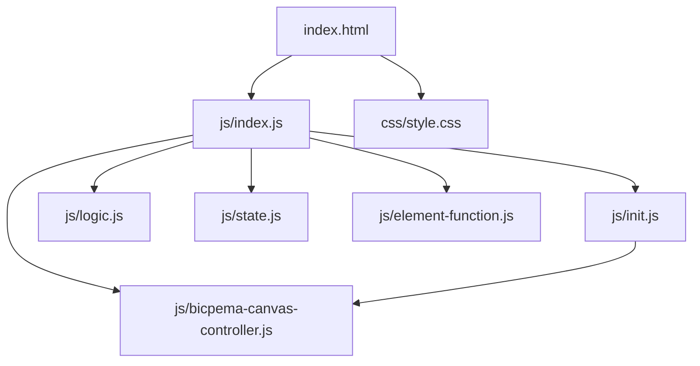
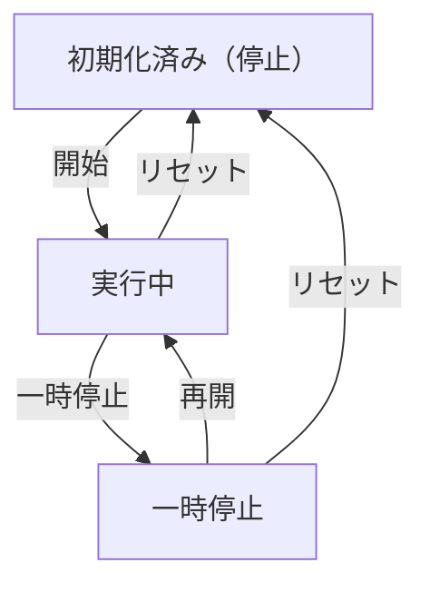

# シミュレーション設計書テンプレート（〇〇シミュレーション設計書）

## 1. 概要

- 対象: シミュレーションのテーマ（例: 物理現象名）を可視化するp5.jsシミュレーション。
- 想定利用者: 対象のユーザー（例: 物理基礎の学習者（中学〜高校程度））。
- 確定事項:
  - 右上のモーダルで〇〇、〇〇を変更できる。
  - 左下の操作ボタンで〇〇できる。
- 推定事項:
  - …

## 2. 画面設計

画面の概要は以下です。（画面設計図を貼る: drawioのsvg形式推奨、またはスクリーンショット）

- 画面構成:
  - 上部バー（タイトル、ホーム、情報アイコン、設定ボタン）。
  - 中央〜下部にp5キャンバス（ウィンドウ幅、画面高の約90%）。
  - 左下に操作ボタン群。
  - 右上に設定モーダル起動ボタン。
- UI要素:
  - 選択肢: 〇〇選択（例: 選択肢A / 選択肢B）。
  - 数値入力: 〇〇の値、〇〇の値。
  - 操作: 〇〇の開始、一時停止、再開、リセット。
- 確定事項:
  - 右クリックのコンテキストメニューは無効化。
  - bodyは固定レイアウトでスクロール不可。

## 3. 機能仕様

- 〇〇の開始:
  - 「〇〇」ボタン押下で `state.〇〇` を更新し、`state.moveIs=true` にする。
- 一時停止/再開:
  - 「一時停止」ボタンで `state.moveIs=false`、「再開」ボタンで `state.moveIs=true`。
- リセット:
  - 「リセット」ボタンで `initValue(p)` を呼び、状態を初期化し `state.moveIs=false` とする。
- 設定反映:
  - 〇〇の変更: 〇〇に即時反映。
  - 数値変更: 〇〇に反映。
- 境界条件:
  - 〇〇はHTML `min=0`。
  - 〇〇の入力制限の有無と振る舞い。

## 4. ロジック仕様

- 実行モデル:
  - p5.jsインスタンスモード（setup/draw/windowResized）を利用。
  - ESModule（`import`）ベースで実装し、`window`グローバル公開は行わない。
- 状態管理:
  - moveIs: シミュレーション進行ON/OFF。
  - 主要な状態変数の説明（例: 〇〇Arr, 〇〇Is）。
- 描画処理:
  - 背景・格子・軸の描画。
  - moveIsが真のとき、速度入力値ぶん更新ループを回す。
  - 全要素の変位を合成して折れ線/図形で描画。
- 計算モデル:
  - シミュレーションの計算モデルやアルゴリズムの概要。
- 推定事項:
  - …

## 5. ファイル構成と責務

- vite/simulations/\<slug\>/index.html
  - 画面のDOM（ナビバー、設定モーダル、操作ボタン）と `js/index.js` / `css/style.css` の参照を保持。
- vite/simulations/\<slug\>/css/style.css
  - 全体レイアウト、キャンバス配置、スクロール無効化、ボタン UI をスタイリング。
- vite/simulations/\<slug\>/js/index.js
  - p5 インスタンス起動 (`new p5(sketch)`) と各ライフサイクル（setup/draw/windowResized）を紐付け。
  - `BicpemaCanvasController` で16:9固定アスペクトの表示領域を制御。
- vite/simulations/\<slug\>/js/state.js
  - `state` オブジェクト（状態変数の定義）。
- vite/simulations/\<slug\>/js/init.js
  - `initValue(p)` で状態初期化。
  - `elCreate(p)` でUI要素を `state` に紐付けし、ボタンイベントをセット。
- vite/simulations/\<slug\>/js/logic.js
  - `drawSimulation(p)` で `state.moveIs` 判定後、更新ループを回す。
- vite/simulations/\<slug\>/js/element-function.js
  - ボタンクリック処理（start/stop/restart/reset）。
- vite/simulations/\<slug\>/js/bicpema-canvas-controller.js
  - 16:9 固定比率のキャンバスサイズ設定とリサイズ処理を実装。

## 6. 状態遷移

- 初期化済み（停止）: setup実行後。状態は初期値、moveIs=false。
- 実行中: 〇〇ボタン押下でmoveIs=true。
- 一時停止: 一時停止ボタン押下でmoveIs=false。
- 再開: 再開ボタン押下でmoveIs=true。
- リセット: リセット押下で初期化済み（停止）へ戻る。

## 7. 既知の制約

- 〇〇が非常に大きい場合、1フレーム内更新回数増加により負荷が上がる。
- 〇〇操作に上限がなく、オブジェクト数増加で描画コストが増える。
- リサイズ時は再初期化され、進行中の状態は保持されない。

## 8. 未確定事項

- 情報アイコンの挙動（リンクやモーダル）が未実装かどうか。
- 〇〇の推奨入力範囲（教材設計上の想定値）。
