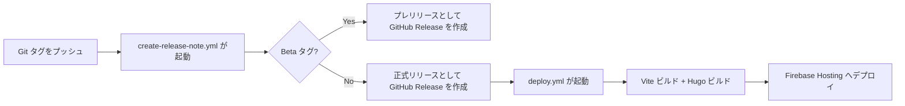

# リリースフロー

## 概要

Bicpema のリリースは **Git タグ** をトリガーとして自動化されています。



## バージョンタグの種類

| タグパターン | 用途 |
|------------|------|
| `v*.*.*` | 正式リリース（例: `v1.2.0`） |
| `v*.*.*-Beta*` | プレリリース（例: `v1.2.0-Beta1`） |

タグ形式の詳細は [バージョニング規約](./versioning.md) を参照してください。

## リリース手順

### 1. `main` ブランチを最新化する

```bash
git checkout main
git pull origin main
```

### 2. タグを作成してプッシュする

```bash
# 正式リリース
git tag v1.2.0
git push origin v1.2.0

# プレリリース
git tag v1.2.0-Beta1
git push origin v1.2.0-Beta1
```

### 3. GitHub Actions の完了を確認する

[Actions タブ](https://github.com/Bicpema/bicpema/actions) で以下のワークフローが正常終了したことを確認します。

1. `create-release-note.yml` — GitHub Release の作成
2. `deploy.yml`（正式リリースのみ） — Firebase Hosting へのデプロイ

### 4. デプロイを確認する

<https://bicpema.web.app/> にアクセスして、変更が反映されていることを確認します。

## リリースノートの自動生成

`.github/release.yml` に定義されたラベルとカテゴリに基づいて、PR・コミット履歴からリリースノートが自動生成されます。

| カテゴリ | 対象ラベル |
|---------|-----------|
| 🆕 シミュレーションの新規作成 | `シミュレーションの新規作成` |
| 🔧 シミュレーションのメンテナンス | `シミュレーションのメンテナンス` |
| 📝 記事の新規作成 | `記事の新規作成` |
| ✏️ 記事のメンテナンス | `記事のメンテナンス` |
| 📦 依存関係の更新 | `依存関係`, `npm` |
| 🛠️ 開発環境改善 | `開発環境改善`, `github actions`, `Agent Skills` |
| 🎨 Hugo テンプレート | `Hugo` |

!!! tip
    `not triaged` ラベルと `リリース` ラベルはリリースノートから除外されます。

## 手動デプロイ

緊急時など、タグを使わずに手動でデプロイしたい場合は GitHub Actions の `deploy.yml` を手動実行できます。

1. [Actions タブ](https://github.com/Bicpema/bicpema/actions/workflows/deploy.yml) を開く
2. 「Run workflow」ボタンをクリックする
3. ブランチ（通常は `main`）を選択して実行する
