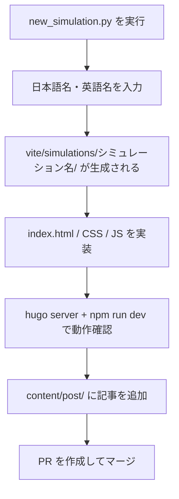

# シミュレーション実装方法

## 実装の流れ



## 雛形の生成

リポジトリルートで以下を実行します。

```bash
python new_simulation.py
```

対話形式で以下を入力します。

| 項目                     | 例               |
| ------------------------ | ---------------- |
| 日本語名                 | `ドップラー効果` |
| 英語名（ハイフン区切り） | `doppler`        |

実行後、`vite/simulations/doppler/` に基本テンプレートが生成されます。

## 実装パターン

シミュレーションには **2 つの実装パターン** があります。

### パターン A — ES モジュール + p5 インスタンスモード（推奨）

モダンなシミュレーションで採用している構成です。

```txt
vite/simulations/{name}/
├── index.html
├── css/
│   └── style.css
└── js/
    ├── index.js               # エントリーポイント（p5 スケッチの定義）
    ├── state.js               # 共有状態の管理
    ├── init.js                # 初期化処理
    ├── element-function.js    # UI コントロールのイベントハンドラー
    └── bicpema-canvas-controller.js  # キャンバスサイズ制御
```

`index.js` の基本構造:

```js
import p5 from "p5";
import "bootstrap";

const sketch = (p) => {
    p.setup = () => {
        // セットアップ処理
    };

    p.draw = () => {
        // 毎フレームの描画処理
    };

    p.windowResized = () => {
        // ウィンドウリサイズ時の処理
    };
};

new p5(sketch);
```

### パターン B — グローバルモード（旧実装）

古いシミュレーションで採用している構成です。

```txt
vite/simulations/{name}/
├── index.html
├── style.css
└── sketch.js    # p5 グローバルモードのスケッチ
```

## 実装上の注意

- スクロールが発生しないよう、`html, body { overflow: hidden; height: 100%; }` を設定する
- 再生・停止ボタンは左下に配置する
- 設定表示ボタンは右上に配置する
- 重いファイル（フォント、画像等）は [Firebase Storage](https://console.firebase.google.com/project/bicpema/storage) にアップロードし、URL で参照する
- フォントは `setup()` 内で `loadFont()` を使って非同期ロードし、Firebase Storage が到達不能でもスケッチ起動をブロックしないようにする

## パフォーマンス方針

[Issue #406](https://github.com/Bicpema/bicpema/issues/406) の調査で、`frameRate`・`pixelDensity`の扱いがシミュレーションごとにバラバラで、不要な描画・計算負荷につながっていることが分かりました。新規実装・既存実装の改善では以下の方針に従ってください。

### frameRate

- 動きが連続的な物理アニメーション（自由落下・振り子・波動など、ほとんどのシミュレーション）は **60fps** を標準とします。
- 温度変化やグラフの推移など、変化がゆっくりで60fpsの滑らかさが不要な場合に限り、**20〜30fps** への引き下げを許容します。その場合は該当箇所にコメントで理由を残してください（例: `conservation-of-heat-and-specific-heat/js/init.js`）。
- `p.frameRate(...)` は **`setup()`内で一度だけ** 呼び出してください。`draw()`内で毎フレーム呼び出すと無駄な処理になるうえ、他の設定を意図せず上書きする原因になります。
- フレームレートの値は他のロジックからも参照できるよう、マジックナンバーではなく`FPS`のような名前付き定数として定義してください。

### pixelDensity

- 高DPI環境（`displayDensity()`が3以上の端末等）でそのまま追従すると、キャンバスの実ピクセル数が過大になり描画負荷が急増します。
- `BicpemaCanvasController.fullScreen(p)`を使うシミュレーション（標準構成）では、内部で自動的に`p.pixelDensity(Math.min(p.displayDensity(), 2))`が適用されるため、個別対応は不要です。
- `BicpemaCanvasController`を使わず独自に`p.createCanvas(...)`するシミュレーション（レガシー実装等）では、同様の上限を自前で設定してください。

### 一時停止・アイドル時の負荷削減

- 一時停止中や、開始前の待機状態でも`draw()`は呼ばれ続けます。動きが止まっている間は物理演算や重い再描画を省略できないか検討してください。
- 入力欄の値をライブ反映する目的などで、`draw()`内で状態を作り直す実装が散見されますが、`new`によるオブジェクトの再生成は避け、既存インスタンスのフィールド更新に留めてください（例: `projectile-motion/js/logic.js`の待機状態描画）。
- 完全に静止させられる場面（グラフや説明パネルのみを表示する等）では`p.noLoop()` / `p.loop()`の利用も検討してください。

### 毎フレームの生成物を避ける

- 配列・オブジェクト・画像・フォント・`p.createGraphics()`によるオフスクリーンキャンバスなどは、可能な限り`preload()`/`setup()`で一度だけ生成し、`draw()`内での再生成は避けてください。
- リサイズなどキャンバスサイズに依存する生成物は、`windowResized`のタイミングでのみ再生成してください。

### 計測方法

代表シミュレーションの実効frameRateとJSヒープ使用量は、以下のコマンドで計測できます。

```bash
npm run build
npm run benchmark:performance -- --filter=free-fall,projectile-motion
```

`--device-scale=3`のように`deviceScaleFactor`を上げると、高DPI環境を模したcanvasの実ピクセルサイズ（pixelDensityの上限が効いているか）も確認できます。

なお、ペイント頻度は`requestAnimationFrame`ベースで計測しているため、`p.frameRate(...)`で間引いているシミュレーションでは実際の`draw()`実行頻度より高い値が出ます（p5内部では間引き中も画面更新のたびに`requestAnimationFrame`は呼ばれ続けるため）。低frameRateの効果を確認したい場合は、JSヒープ使用量の推移など他の指標と合わせて判断してください。

## 記事の追加

シミュレーションを公開するには、対応する Hugo 記事も追加します。

```bash
hugo new post/{記事名}/index.md
# 例
hugo new post/ドップラー効果/index.md
```

生成されたファイルのフロントマターを編集して、タイトル・説明・サムネイル画像 URL などを設定します。

```yaml
---
title: "ドップラー効果"
description: "音源や観測者が動くときに音の高さが変わる現象を体験できます。"
image: "https://storage.googleapis.com/..."
categories:
    - 波動
tags:
    - 音波
---
```
