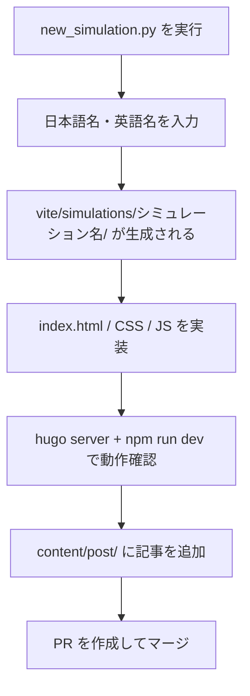

# シミュレーション実装方法

## 実装の流れ



## 雛形の生成

リポジトリルートで以下を実行します。

```bash
python new_simulation.py
```

対話形式で以下を入力します。

| 項目 | 例 |
|------|-----|
| 日本語名 | `ドップラー効果` |
| 英語名（ハイフン区切り） | `doppler` |

実行後、`vite/simulations/doppler/` に基本テンプレートが生成されます。

## 実装パターン

シミュレーションには **2 つの実装パターン** があります。

### パターン A — ES モジュール + p5 インスタンスモード（推奨）

モダンなシミュレーションで採用している構成です。

```
vite/simulations/{name}/
├── index.html
├── css/
│   └── style.css
└── js/
    ├── index.js               # エントリーポイント（p5 スケッチの定義）
    ├── state.js               # 共有状態の管理
    ├── init.js                # 初期化処理
    ├── element-function.js    # UI コントロールのイベントハンドラー
    └── bicpema-canvas-controller.js  # キャンバスサイズ制御
```

`index.js` の基本構造:

```js
import p5 from "p5";
import "bootstrap";

const sketch = (p) => {
  p.setup = () => {
    // セットアップ処理
  };

  p.draw = () => {
    // 毎フレームの描画処理
  };

  p.windowResized = () => {
    // ウィンドウリサイズ時の処理
  };
};

new p5(sketch);
```

### パターン B — グローバルモード（旧実装）

古いシミュレーションで採用している構成です。

```
vite/simulations/{name}/
├── index.html
├── style.css
└── sketch.js    # p5 グローバルモードのスケッチ
```

## 実装上の注意

- スクロールが発生しないよう、`html, body { overflow: hidden; height: 100%; }` を設定する
- 再生・停止ボタンは左下に配置する
- 設定表示ボタンは右上に配置する
- 重いファイル（フォント、画像等）は [Firebase Storage](https://console.firebase.google.com/project/bicpema/storage) にアップロードし、URL で参照する
- フォントは `setup()` 内で `loadFont()` を使って非同期ロードし、Firebase Storage が到達不能でもスケッチ起動をブロックしないようにする

## 記事の追加

シミュレーションを公開するには、対応する Hugo 記事も追加します。

```bash
hugo new post/{記事名}/index.md
# 例
hugo new post/ドップラー効果/index.md
```

生成されたファイルのフロントマターを編集して、タイトル・説明・サムネイル画像 URL などを設定します。

```yaml
---
title: "ドップラー効果"
description: "音源や観測者が動くときに音の高さが変わる現象を体験できます。"
image: "https://storage.googleapis.com/..."
categories:
  - 波動
tags:
  - 音波
---
```
