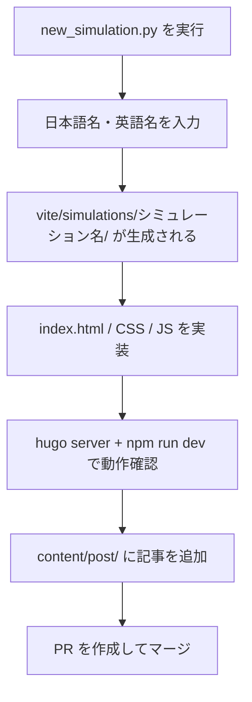

# シミュレーション実装方法

## 実装の流れ



## 雛形の生成

リポジトリルートで以下を実行します。

```bash
python new_simulation.py
```

対話形式で以下を入力します。

| 項目                     | 例               |
| ------------------------ | ---------------- |
| 日本語名                 | `ドップラー効果` |
| 英語名（ハイフン区切り） | `doppler`        |

実行後、`vite/simulations/doppler/` に基本テンプレートが生成されます。

## 実装パターン

シミュレーションには **2 つの実装パターン** がありますが、[Issue #512](https://github.com/Bicpema/bicpema/issues/512) により **パターン A（p5 インスタンスモード）に統一する方針** が決定しています。新規シミュレーションは必ずパターン A で実装してください。

パターン B（グローバルモード）はp5.jsのAPIを`window`のグローバル関数として直接定義するため、TypeScript化（[#424](https://github.com/Bicpema/bicpema/issues/424)）で導入した型チェック（`checkJs`/`.ts`）との相性が悪く、新規実装では使用しません。既存のパターン B 実装は、[#511](https://github.com/Bicpema/bicpema/issues/511) の段階移行の中でパターン A へ書き換えたうえで`.ts`化します。

### パターン A — ES モジュール + p5 インスタンスモード（標準）

採用しているシミュレーションの標準構成です。新規シミュレーションは`new_simulation.py`が生成するひな形（`templates/`配下）がこの構成に沿っているため、そのまま実装を進めてください。

```txt
vite/simulations/{name}/
├── index.html
├── css/
│   └── style.css
└── js/
    ├── index.ts               # エントリーポイント（p5 スケッチの定義）
    ├── init.ts                # 初期化処理
    ├── state.ts               # 共有状態の管理
    ├── logic.ts               # シミュレーションのロジック
    ├── element-function.ts    # UI コントロールのイベントハンドラー
    ├── class.ts               # クラス定義
    └── graph.ts               # グラフ描画処理
```

キャンバスサイズ制御（`BicpemaCanvasController`）やローディングスピナー制御は`vite/js/`配下の共通モジュールとして提供されており、各シミュレーションからimportして利用します。

`index.ts` の基本構造:

```ts
import p5 from "p5";
import "../../../css/tailwind.css";
import { BicpemaCanvasController } from "../../../js/bicpema-canvas-controller.js";
import { hideLoadingSpinner } from "../../../js/bicpema-loading-spinner.js";
import { settingInit, elementSelectInit, elementPositionInit, valueInit } from "./init.js";

const sketch = (p: p5) => {
    const canvasController = new BicpemaCanvasController(true, false, 1.0, 1.0);
    let isFirstDraw = true;

    p.setup = () => {
        canvasController.fullScreen(p);
        settingInit(p);
        elementSelectInit(p);
        elementPositionInit(p);
        valueInit(p);
    };

    p.draw = () => {
        // 毎フレームの描画処理

        if (isFirstDraw) {
            isFirstDraw = false;
            hideLoadingSpinner();
        }
    };

    p.windowResized = () => {
        canvasController.resizeScreen(p);
        elementPositionInit(p);
    };
};

new p5(sketch);
```

### パターン B — グローバルモード（旧実装・移行対象）

古いシミュレーションで採用していた構成です。新規作成では使用せず、既存実装は順次パターン A へ移行します。

```txt
vite/simulations/{name}/
├── index.html
├── style.css
└── sketch.js    # p5 グローバルモードのスケッチ
```

## 実装上の注意

- スクロールが発生しないよう、`html, body { overflow: hidden; height: 100%; }` を設定する
- 再生・停止ボタンは左下に配置する
- 設定表示ボタンは右上に配置する
- 重いファイル（フォント、画像等）は [Firebase Storage](https://console.firebase.google.com/project/bicpema/storage) にアップロードし、URL で参照する
- フォントは `setup()` 内で `loadFont()` を使って非同期ロードし、Firebase Storage が到達不能でもスケッチ起動をブロックしないようにする

## 記事の追加

シミュレーションを公開するには、対応する Hugo 記事も追加します。

```bash
hugo new post/{記事名}/index.md
# 例
hugo new post/ドップラー効果/index.md
```

生成されたファイルのフロントマターを編集して、タイトル・説明・サムネイル画像 URL などを設定します。

```yaml
---
title: "ドップラー効果"
description: "音源や観測者が動くときに音の高さが変わる現象を体験できます。"
image: "https://storage.googleapis.com/..."
categories:
    - 波動
tags:
    - 音波
---
```
