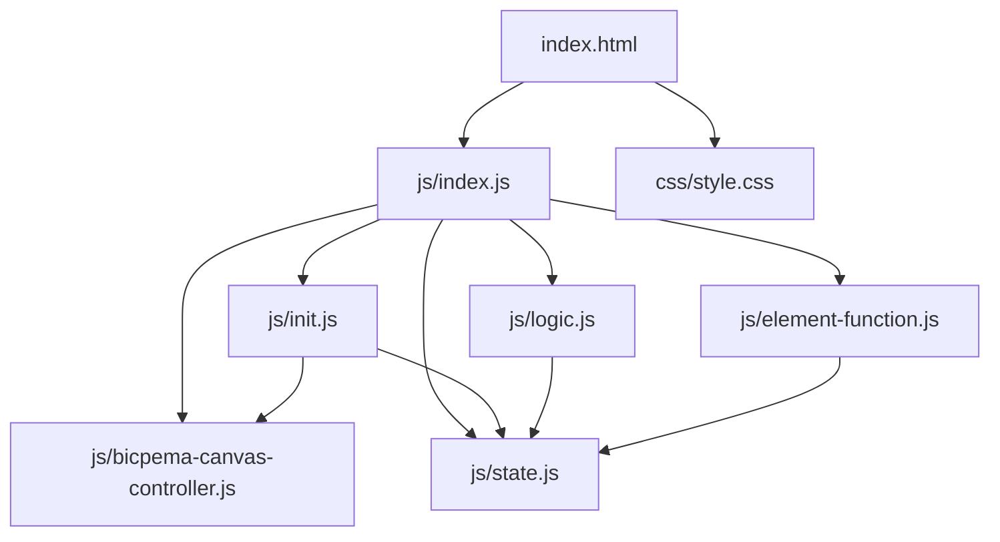
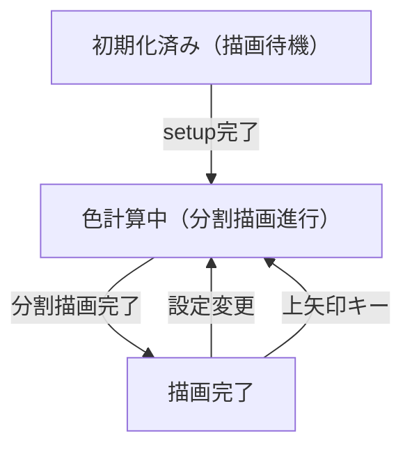

# 偏光色シミュレーション ELK版（2025_DGI_cellophane-color2_ELK）設計書

## 1. 概要

- 対象: セロハンテープの偏光色（干渉色）をCIE等色関数ベースで計算・可視化するp5.jsシミュレーション（ELK版）。cellophane_displayのBicpemaCanvasController対応版。
- 想定利用者: 物理・光学の学習者、研究者（高校〜大学程度）。
- 確定事項:
  - 設定モーダルで偏光板配置（平行/直交ニコル）・光路差・セロハン組の追加削除ができる。
  - BicpemaCanvasControllerで高さ優先のWEBGLキャンバス管理を行う。
  - スクリーンショットボタンで画面を保存できる。
- 推定事項:
  - cellophane_displayと同一の光学計算ロジックを使用するが、キャンバス管理方式が異なる。

## 2. 画面設計

- 画面構成:
  - 上部バー（ホームアイコン、タイトル「偏光色を再現するシミュレーション」、情報アイコン）。
  - p5キャンバス（WEBGL、BicpemaCanvasControllerによる高さ優先フルスクリーン）。
  - 左下に「シミュレーションの設定」ボタン・スクリーンショットボタン。
  - 設定モーダル（偏光板配置、光路差入力、セロハン組設定）。
- UI要素:
  - 設定モーダル:
    - 偏光板の重ね方選択（平行ニコル配置 / 直交ニコル配置）。
    - 光路差入力（opdInput、min=0）。
    - セロハンテープ組の追加・削除ボタン。
    - セロハンテープ組の設定（各組の枚数・角度スライダー）。
  - 操作: 設定ボタン、スクリーンショットボタン。
- 確定事項:
  - 右クリックのコンテキストメニューは無効化（`oncontextmenu="return false"`）。
  - 再生/停止ボタンなし（インタラクティブ設定変更型）。
  - cellophane_displayと異なりスペクトルグラフの右側パネルは非搭載（推定）。

## 3. 機能仕様

- 設定変更時の再計算:
  - polarizerSelect変更・opdInput変更・セロハン設定変更で色を再計算し即時反映。
- セロハン組の追加:
  - 「追加」ボタンで `state.cellophaneNum` を増加し、設定UIを動的追加。
- セロハン組の削除:
  - 「削除」ボタンで `state.cellophaneNum` を減少し、設定UIを削除。
- スクリーンショット:
  - 「スクリーンショット」ボタンでキャンバスをpng保存。
- 上矢印キー:
  - 描画状態フラグ（BisDead, CisDead等）をリセットし再描画をトリガー。
- 境界条件:
  - opdInputはmin=0。

## 4. ロジック仕様

- 実行モデル:
  - p5.jsインスタンスモード（preload/setup/draw/windowResized/keyPressed）を利用。
  - ESModule（`import`）ベースで実装。
  - WEBGLモードを `BicpemaCanvasController(false, true, 1.0, 1.0)` で管理。
- 状態管理:
  - cellophane_displayと同一のstate構造（cmfTable/osTable/dTable等）。
  - BisDead/CisDead/DrawisDead/Cluster1isDead/changeisDead: 分割描画・クラスター計算の進行フラグ。
  - last_opt1: cellophane_displayにないELK固有の状態変数。
- 描画処理:
  - `beforeColorCalculate()` でpreload後に色計算の事前処理を実行。
  - `createStartimg()` で初期画像を生成。
  - draw内で `drawSimulation(p)` を呼び分割描画を進行。
  - `p.camera(0, 0, 300, 0, 0, 0, 0, 1, 0)` でWEBGLカメラを正面配置。
- 計算モデル:
  - CIE等色関数（cmfTable）と光学系データ（osTable/dTable/rTable）を用いてXYZ刺激値を計算。
  - XYZ→RGB変換でセロハン透過後の色を算出。
  - cellophane_displayと同一の光学計算モデルを使用（推定）。
- 推定事項:
  - BicpemaCanvasControllerによりwindowResizedでのキャンバスリサイズが統一管理される。

## 5. ファイル構成と責務

- vite/simulations/2025_DGI_cellophane-color2_ELK/index.html
  - 画面のDOM（上部バー、設定モーダル）と `js/index.js` の参照を保持。
- vite/simulations/2025_DGI_cellophane-color2_ELK/css/style.css
  - 全体レイアウト、スクロール無効化をスタイリング。
- vite/simulations/2025_DGI_cellophane-color2_ELK/js/index.js
  - p5インスタンス起動・preload（CSVテーブル/画像ロード）・setup/draw/keyPressed/windowResizedを定義。BicpemaCanvasControllerを使用。
- vite/simulations/2025_DGI_cellophane-color2_ELK/js/state.js
  - `state` オブジェクト（テーブルデータ・RGB値・セロハン設定・描画フラグ・クラスター・Chart参照等）。
- vite/simulations/2025_DGI_cellophane-color2_ELK/js/init.js
  - `initValue(p)` で状態初期化。`elCreate(p)` でUI要素をstateに紐付けしボタンイベントをセット。
- vite/simulations/2025_DGI_cellophane-color2_ELK/js/logic.js
  - `drawSimulation(p)` で描画処理。`beforeColorCalculate()` で事前計算。`createStartimg()` で初期画像生成。
- vite/simulations/2025_DGI_cellophane-color2_ELK/js/element-function.js
  - セロハン追加・削除・設定変更ハンドラとスクリーンショット処理。
- vite/simulations/2025_DGI_cellophane-color2_ELK/js/bicpema-canvas-controller.js
  - WEBGLキャンバスサイズ設定とリサイズ処理（高さ優先モード）。

## 6. 状態遷移

- 本シミュレーションは再生/停止の概念を持たず、設定変更に即時反応するインタラクティブ型。

## 7. 既知の制約

- Firebase StorageからのCSVロードに失敗すると描画が正常に行われない。
- セロハン組が増えると計算量が増大し描画が重くなる。
- WEBGLモードのため一部p5.js 2D描画関数の挙動が異なる場合がある。
- BicpemaCanvasControllerを使用するため、cellophane_displayとリサイズ挙動が異なる。

## 8. 未確定事項

- cellophane_displayとの機能差分（ELK版固有の機能）の詳細。
- 情報アイコンの挙動（リンクやモーダル）が未実装かどうか。
- last_opt1 (ELK版固有のstate変数) の用途。
- スペクトルグラフの右側パネルが本バージョンに存在するかどうか。
