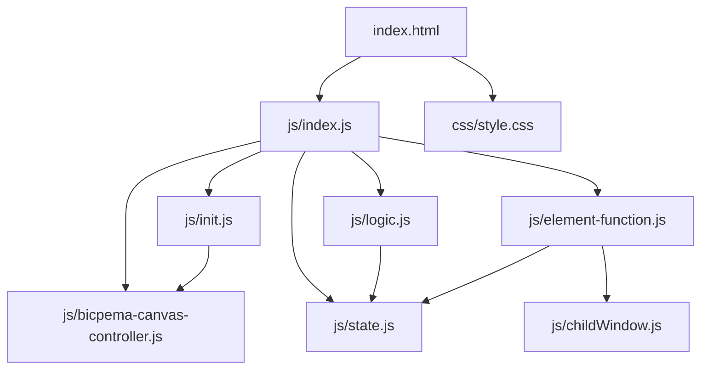
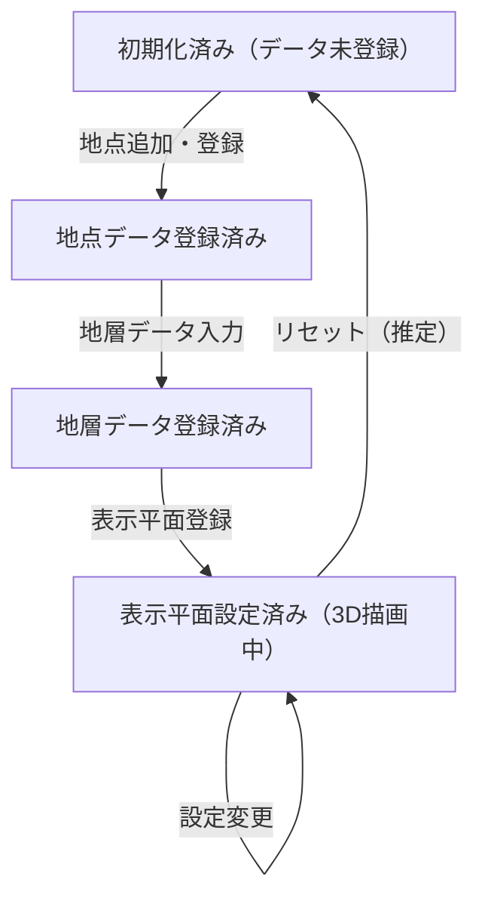

# 3D地層観察 シミュレーション設計書

## 1. 概要

- 対象: 複数の地点データを手入力し、3D空間で地層を可視化するp5.jsシミュレーション（基本版）。
- 想定利用者: 地学の学習者（中学〜高校程度）。
- 確定事項:
  - データ登録モーダルで地点データ・地層データ・表示平面を登録できる。
  - 凡例ボタン（オフキャンバス）で地層種別の色を確認できる。
  - スクリーンショットボタンで画面を保存できる。
  - WEBGLによる3D描画とオービットカメラ操作を使用する。
  - html2canvasを使用したスクリーンショット機能を持つ。
- 推定事項:
  - 子ウィンドウ（childWindow.js）経由で地層データを登録する。

## 2. 画面設計

- 画面構成:
  - 上部ナビバー（タイトル「3D地層観察」、Bicpemaホームリンク）。
  - 中央にp5キャンバス（WEBGL、BicpemaCanvasControllerによる全画面）。
  - ボタン群（凡例の表示、スクリーンショット、データの登録）。
  - 凡例表示オフキャンバス（Bootstrap Offcanvas、左からスライドイン）。
  - データ登録モーダル（地点データ・地層データ・表示平面の3タブ）。
- UI要素:
  - 地点データ登録: 地点追加・削除ボタン、地点名・座標入力フィールド。
  - 地層データ登録: 各地点の地層データ入力（子ウィンドウ経由、推定）。
  - 表示平面登録: 3地点選択セレクト（1つめ・2つめ・3つめ）、地層組み合わせ追加・削除テーブル。
  - 凡例: 砂岩・泥岩・れき岩・石灰岩・凝灰岩・ローム・その他の色見本。
- 確定事項:
  - bodyは固定レイアウトでスクロール不可。
  - 再生/停止ボタンなし（データ登録後に自動描画する型）。
  - jQueryとhtml2canvasを外部依存として使用。

## 3. 機能仕様

- データ登録:
  - 地点追加/削除ボタンで地点の入力フィールドを動的に追加・削除。
  - 地層データ登録で子ウィンドウを開き、各地点の地層種別・深さを入力。
  - `window.submit(arr)` 経由で子ウィンドウからデータを受け取る。
  - 表示平面登録で3地点を選択し、地層の組み合わせを追加・削除。
- 地点セレクト連動:
  - firstPlaceSelectFunction/secondPlaceSelectFunction/thirdPlaceSelectFunction で選択地点変更時に描画を更新。
- 凡例表示:
  - 「凡例の表示」ボタンでBootstrap Offcanvasを左からスライドイン表示。
- スクリーンショット:
  - html2canvasを使用してページ全体をpng保存（`screenshot.png`）。
- 子ウィンドウ連携:
  - `window.submit`, `window.loadLayers`, `window.placeRefreshFunction` 等をグローバル公開。
- 境界条件:
  - 地点数・地層組み合わせ数の上限は推定（UIにより可変）。

## 4. ロジック仕様

- 実行モデル:
  - p5.jsインスタンスモード（preload/setup/draw/windowResized）を利用。
  - ESModule（`import`）ベースで実装。
  - WEBGLモードで3D描画。`BicpemaCanvasController(false, true, 1.0, 1.0)` で管理。
  - jQueryとhtml2canvasを追加依存として使用。
- 状態管理:
  - font: p5フォント（ZenMaruGothic、Firebase Storageからロード）。
  - dataInputArr: 地点データの入力連想配列。
  - rotateTime: 地点名ラベルの回転時間。
  - coordinateData: calculateValueの結果（3D座標データ）。
  - setRadioButton/unitSelect/buttonParent/strataFileInput: UI要素参照。
- 描画処理:
  - `p.camera(800, -500, 800, 0, 0, 0, 0, 1, 0)` でsetup時にカメラを斜め上から設定。
  - draw内で `drawSimulation(p)` を呼び3D地層ブロックを描画。
- 計算モデル:
  - 3地点の座標から平面方程式を計算し、各地層の3D境界面を生成（推定）。
  - 地層種別ごとに色を割り当て（css/style.cssの地層色クラスに基づく）。
- 推定事項:
  - 3d-strata-csvとの主な差異: スケール設定タブ有り、CSVインポート機能の有無。

## 5. ファイル構成と責務

- vite/simulations/3d-strata/index.html
  - 画面のDOM（ナビバー、オフキャンバス凡例、データ登録モーダル）と `js/index.js` の参照を保持。
- vite/simulations/3d-strata/css/style.css
  - 全体レイアウト、地層色定義、スクロール無効化をスタイリング。
- vite/simulations/3d-strata/js/index.js
  - p5インスタンス起動・preload（フォントロード）・setup/draw/windowResizedを定義。子ウィンドウ用グローバル関数を公開。
- vite/simulations/3d-strata/js/state.js
  - `state` オブジェクト（フォント・地点データ・座標データ・UI要素参照）。
- vite/simulations/3d-strata/js/init.js
  - `initValue(p)` で状態初期化。`elCreate(p)` でUI要素をstateに紐付けしボタンイベントをセット。
- vite/simulations/3d-strata/js/logic.js
  - `drawSimulation(p)` で3D地層ブロックの描画処理。
- vite/simulations/3d-strata/js/element-function.js
  - ボタンクリック処理（地点追加・削除・地層追加・削除・セレクト変更）。`submit`/`loadLayers`等を公開。
- vite/simulations/3d-strata/js/childWindow.js
  - 地層データ入力用子ウィンドウの管理（推定）。
- vite/simulations/3d-strata/js/bicpema-canvas-controller.js
  - WEBGLキャンバスサイズ設定とリサイズ処理（高さ優先モード）。

## 6. 状態遷移

- 本シミュレーションは再生/停止の概念を持たず、データ登録・設定変更に応じて描画を更新する型。

## 7. 既知の制約

- 子ウィンドウ経由のデータ入力はポップアップブロッカーにより開かない場合がある。
- WEBGLモードのためオービットカメラ制御はp5.jsのデフォルト挙動に依存する。
- html2canvasによるスクリーンショットはWEBGLキャンバスの内容を正確に取得できない場合がある。
- リサイズ時はキャンバスサイズのみ変更され、登録データは保持される。
- jQueryへの依存があるため、他のシミュレーションとのバンドル分離が必要。

## 8. 未確定事項

- 子ウィンドウ（childWindow.js）の具体的なURL・仕様。
- 3d-strata-csvとの機能差分の詳細（スケール設定の有無等）。
- データ登録後の自動再描画タイミング。
- 地点数・地層組み合わせ数の上限。
- strataFileInputの用途（CSVファイル入力の可能性）。
