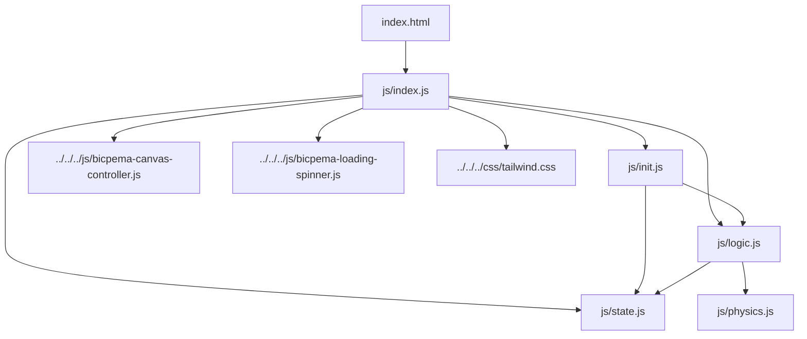
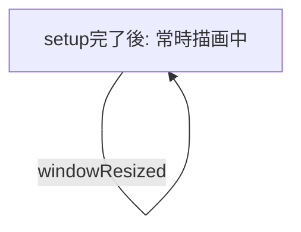

# 空気柱の共鳴シミュレーション設計書

## 1. 概要

- 対象: 閉管・開管における気柱の定常波（共鳴）を可視化するp5.jsシミュレーション。
- 想定利用者: 中学校・高校で物理（波動）を学ぶ学習者（`content/post/空気柱/index.md` の対象記述より）。
- 確定事項:
    - 右上の設定テーブルで「管の種類（閉管/開管）」「倍振動数（m/n）」「管の長さ（L）」を変更できる。
    - 設定変更は即時に波形（実線の定常波、および半透明の振動包絡線）へ反映される。
    - 波のアニメーションは常時進行しており、再生/停止ボタンやリセットボタンは実装に存在しない。
- 推定事項:
    - なし（実装から読み取れる範囲は確定事項として記載）。

## 2. 画面設計

画面構成は以下の通り（drawio図は未作成。実装から読み取れる構成をテキストで記述）。

- 画面構成:
    - 上部ナビバー（高さ60px、`#navBar`）: 「Bicpema」ロゴリンクとタイトル「空気柱の共鳴」。
    - `#p5Container`（`mt-[60px]`）配下の `#p5Canvas` に p5 キャンバスを配置。`BicpemaCanvasController(true, false, 1.0, 1.0)` により16:9固定比率でフルスクリーン化。
    - `#p5Canvas` 右上に絶対配置（`absolute end-0 m-2`）の設定テーブルを常時表示（開閉トグルや設定モーダルの起動ボタンは存在しない）。
    - 初回描画完了まで表示される全画面ローディングスピナー（`#loadingSpinner`）。p5の初回`draw()`実行時に`hideLoadingSpinner()`で非表示化。
    - 左下の再生/停止ボタン、操作ボタン群は実装されていない（既知の制約・未確定事項を参照）。
- UI要素:
    - 選択肢: 「管の種類」セレクトボックス（`#typeSelect`、`closed`=閉管 / `open`=開管、初期値は`closed`）。
    - 数値調整: 「倍振動数」の＋/－ボタン（`#mnPlusBtn` / `#mnMinusBtn`、表示は`#mnDisplay`）。
    - 数値調整: 「管の長さ」の＋/－ボタン（`#lplusBtn` / `#lminusBtn`、表示は`#lDisplay`、単位は仮想キャンバス座標系のピクセル値）。
- 確定事項:
    - `<body oncontextmenu="return false;">` により右クリックのコンテキストメニューは無効化。
    - `body`はナビバー固定・キャンバス領域固定のレイアウトで、シミュレーション自体はスクロール不可な構成。
    - 設定UIは常時表示のテーブルであり、開閉制御用の設定ボタン・モーダルは持たない（テンプレート標準構成「右上に設定表示ボタン」とは異なる実装）。

## 3. 機能仕様

- 管の種類の変更:
    - `typeSelect`の`change`イベントで`state.type`を更新。
    - 閉管に切り替えた際、現在の`state.m_n`が偶数であれば`state.m_n = Math.max(1, state.m_n - 1)`で奇数に丸める（閉管はm=1,3,5,...のみ有効なため）。
    - 変更後、表示更新（`updateDisplays()`）と波形レイヤー再生成（`updateWaveLayer(p)`）を実行。
- 倍振動数（m/n）の増減:
    - 「＋」ボタン: 閉管時は+2（奇数を維持）、開管時は+1。上限`MN_MAX=9`でクランプ。
    - 「－」ボタン: 閉管時は-2、開管時は-1。下限`MN_MIN=1`でクランプ。
    - 変更後、表示更新と波形レイヤー再生成を実行。
- 管の長さ（L）の増減:
    - 「＋」/「－」ボタンで`PIPE_LENGTH_STEP=50`単位に増減。
    - 範囲は`PIPE_LENGTH_MIN=200`〜`PIPE_LENGTH_MAX=600`でクランプ。
    - 変更後、表示更新と波形レイヤー再生成を実行。
- 常時アニメーション:
    - `draw()`毎フレームで`state.time += 0.05`し、`Math.sin(state.time)`を時間項として定常波（実線）を再描画する。
    - 開始/一時停止/再開/リセットの概念（`state.moveIs`相当のフラグ）は存在せず、`setup()`完了後は常に時間発展する。
- リサイズ時の挙動:
    - `windowResized()`で`canvasController.resizeScreen(p)`後に`elementPositionInit(p)`を再実行し、`state.waveLayer`を破棄・再生成して`updateWaveLayer(p)`を呼び直す。
    - `state`のパラメータ（type/m_n/pipeL/time等）自体はリサイズで初期化されない。
- 境界条件:
    - 倍振動数: `MN_MIN=1`〜`MN_MAX=9`。閉管では奇数のみ許容（偶数への到達を防ぐstep=2運用、および種別切替時の丸め処理）。
    - 管の長さ: `PIPE_LENGTH_MIN=200`〜`PIPE_LENGTH_MAX=600`、`PIPE_LENGTH_STEP=50`刻み。
    - HTML側の`<input type=number>`のような`min`/`max`属性は使用しておらず、境界値はJavaScript側（`init.js`）のクランプ処理でのみ担保されている。

## 4. ロジック仕様

- 実行モデル:
    - p5.jsインスタンスモード（`new p5(sketch)`、`setup`/`draw`/`windowResized`）を利用。
    - ESModule（`import`）ベースで実装し、`window`グローバル公開は行わない。
- 状態管理（`js/state.js`）:
    - `type`: 管の種類（`"closed"` | `"open"`）。初期値`"closed"`。
    - `m_n`: 振動次数。初期値`1`。
    - `pipeL`: 管の長さ（仮想座標系のピクセル値）。初期値`400`。
    - `pipeY`: 管の描画基準Y座標。初期値`200`固定（UI操作対象外）。
    - `Amp`: 振幅。初期値`40`固定（UI操作対象外）。
    - `time`: 波のアニメーション時間パラメータ。`draw()`毎に`+0.05`加算され続ける（一時停止機構なし）。
    - `waveLayer`: `p.createGraphics`で生成するオフスクリーンレイヤー。振動の包絡線（10本の位相違いの波形）を保持し、`p.image()`で背景として毎フレーム描画される。
- 描画処理（`draw()`の順序、`js/index.js`）:
    1. `p.scale(p.width / 1000)`で仮想キャンバス（幅1000基準）に座標系を合わせる。
    2. `p.background(255)`で白背景クリア。
    3. `p.image(state.waveLayer, 0, 0)`で振動包絡線レイヤーを描画。
    4. `drawUIContext(p)`で寸法線・管の輪郭・腹/節ラベルを描画。
    5. `drawWave(p)`で現在時刻における定常波の実線を描画（`state.time`を進める）。
    6. `drawFormula(p)`で波長・固有振動数の公式テキストを描画。
- 波形レイヤー生成（`updateWaveLayer(p)`、`js/logic.js`）:
    - 設定変更時（`setupControls`内の各イベント）と`elementPositionInit(p)`（setup/resize時）に再計算。
    - 位相`phase`を`-HALF_PI`〜`HALF_PI`の範囲で`steps=10`分割し、各位相ごとに振幅`Amp * sin(phase)`で1本の波形を`waveLayer`に描画（半透明の包絡線群として重ね描き）。
- 定常波描画（`drawWave(p)`、`js/logic.js`）:
    - `computeFreqConst(type, m_n, pipeL)`で波数相当の定数を算出。
    - `x=0`〜`pipeL`の各点で`computeStandingWaveDisplacement(Amp, freqConst, x, sin(time))`により変位を計算し、折れ線として描画。
- 計算モデル（`js/physics.js`）:
    - `computeFreqConst`: 閉管は`(mn・π)/(2L)`、開管は`(n・π)/L`（波数に相当する定数）。
    - `computeStandingWaveDisplacement`: `y = A・cos(x・freqConst)・timeSinValue`（定常波の位置依存項と時間依存項の積）。
    - 音速や周波数の数値そのものは計算・表示せず、`drawFormula`で波長・固有振動数の「式」（記号表現）のみをテキスト描画している（数値代入計算は行っていない）。
- 推定事項:
    - `steps=10`（包絡線の重ね描き本数）や`Amp=40`、`pipeY=200`は教材上の見た目調整のための固定値であり、物理的な意味（音速V等の具体値）とは直接紐付いていないと推定される。

## 5. ファイル構成と責務

- `vite/simulations/air-column/index.html`
    - 画面のDOM（ナビバー、常時表示の設定テーブル、ローディングスピナー）と`js/index.js`の読み込みを保持。専用のCSSファイルは持たず、共通の`css/tailwind.css`をJS側からimportして利用。
- `vite/simulations/air-column/js/index.js`
    - p5インスタンス起動（`new p5(sketch)`）と各ライフサイクル（`setup`/`draw`/`windowResized`）の紐付け。
    - `BicpemaCanvasController`で16:9固定アスペクトの表示領域を制御し、初回`draw()`でローディングスピナーを非表示化。
    - 描画順序の統括（波形レイヤー→UI/寸法線→定常波→公式テキスト）。
- `vite/simulations/air-column/js/state.js`
    - `state`オブジェクト（`type`/`m_n`/`pipeL`/`pipeY`/`Amp`/`time`/`waveLayer`）の定義。
- `vite/simulations/air-column/js/init.js`
    - `elementPositionInit(p)`で`waveLayer`（`createGraphics`）の生成・再生成と初回波形計算。
    - `setupControls(p)`でUI要素（種別セレクト、倍振動数±、管の長さ±）にイベントリスナーを設定し、`state`更新・表示更新・波形レイヤー再計算を行う。
    - 倍振動数・管の長さの範囲定数（`MN_MIN`/`MN_MAX`/`PIPE_LENGTH_MIN`/`PIPE_LENGTH_MAX`/`PIPE_LENGTH_STEP`）を保持。
- `vite/simulations/air-column/js/logic.js`
    - `updateWaveLayer(p)`で振動包絡線レイヤーを再描画。
    - `drawWave(p)`で現在時刻の定常波実線を描画し`state.time`を進行。
    - `drawUIContext(p)`で寸法線・管の輪郭・腹/節ラベルを描画。
    - `drawFormula(p)`で波長・固有振動数の公式テキストを描画。
- `vite/simulations/air-column/js/physics.js`
    - `computeFreqConst`（波数相当の定数計算）、`computeStandingWaveDisplacement`（定常波の変位計算）という純粋関数群。
- 共通資産依存（対象外・参照のみ）:
    - `vite/js/bicpema-canvas-controller.js`（`BicpemaCanvasController`、16:9固定比率でのキャンバス生成・リサイズ）。
    - `vite/js/bicpema-loading-spinner.js`（`hideLoadingSpinner`、初回描画完了通知）。
    - `vite/css/tailwind.css`（全体レイアウト・UIスタイリングの共通CSS）。

## 6. 状態遷移

- 確定事項:
    - このシミュレーションには「再生中/一時停止」のような明示的な実行状態フラグ（`state.moveIs`相当）が存在しない。
    - `setup()`完了後、`draw()`は常時実行され続け、`state.time`は毎フレーム単調増加する。
    - ユーザー操作は「パラメータ変更（種別・倍振動数・管の長さ）」のみであり、いずれも波形の即時再計算（`updateWaveLayer`）を伴うが、アニメーションの進行状態そのものには影響しない。
    - `windowResized()`によるレイヤー再生成はあるが、`type`/`m_n`/`pipeL`/`time`はリセットされない（初期化済み状態へは戻らない）。

## 7. 既知の制約

- 再生/停止・リセット機能が実装されていないため、AGENTS.mdが定める「基本的には左下に再生・停止ボタンを配置」という標準構成とは異なる（本シミュレーション固有の実装判断）。
- 設定UIが開閉トグルを持たない常時表示テーブルであり、「右上に設定表示ボタン」という標準構成とも異なる。
- `draw()`が停止条件を持たないため、パフォーマンス方針が挙げる「一時停止中の描画抑制」は本シミュレーションでは適用されていない（そもそも一時停止状態が存在しない）。
- `frameRate()`の明示指定は行われておらず、p5.jsのデフォルト（60fps相当）に依存している。
- `waveLayer`は`elementPositionInit`実行のたびに`remove()`→`createGraphics`で再生成されるため、頻繁なリサイズ操作はオフスクリーングラフィックス再生成コストを伴う。
- `state.pipeY`・`state.Amp`はUIから変更する手段がなく、コード変更なしに調整できない。

## 8. 未確定事項

- `content/post/空気柱/index.md`の「使用方法」節には「▶ 開始」ボタン・「⚙ 設定」・「🔄 リセット」ボタンの操作手順が記載されているが、現行の実装（`vite/simulations/air-column`）にはこれらのUI要素が存在しない。記事側の記述が別バージョンの実装を指しているか、記事の更新漏れかは実装からは確定できない。
- `steps=10`（包絡線本数）、`Amp=40`、`pipeY=200`、`pipeH=100`、`formulaY=400`/`centerX=500`といった描画用マジックナンバーの教材設計上の意図（見た目調整のためか、特定の物理的縮尺を意図したものか）は実装コメントからは読み取れない。
- 音速`V`の具体的な数値表示（例: 340m/s等の代入計算）を今後追加する想定があるかどうかは実装からは不明（現状は記号式のみの表示）。
- 波形の色（`WAVE_COLOR = [0, 100, 255]`）や管の線の色分け（黒線+グレー線の二重描画）が意図的な質感表現か、実装上の暫定処理かは確認が必要。
