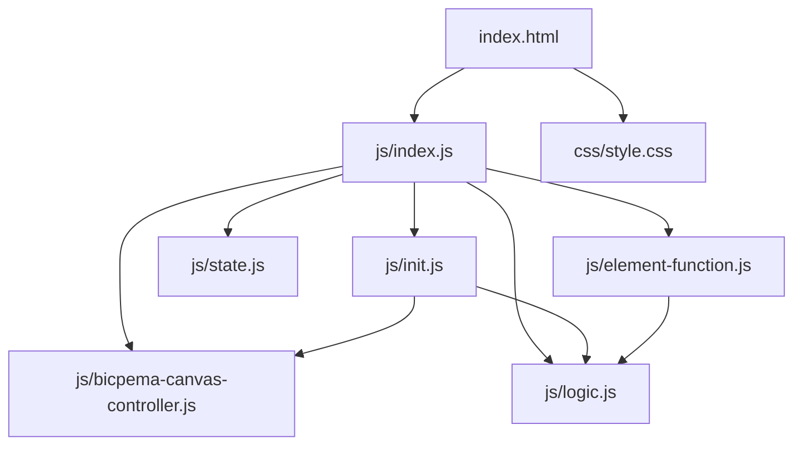
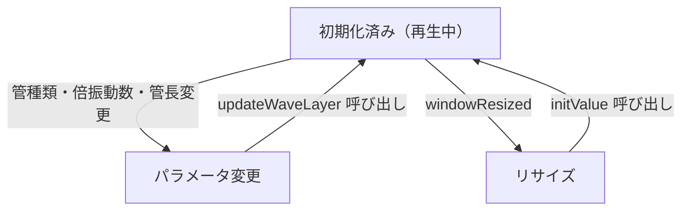

# 気柱共鳴 シミュレーション設計書

## 1. 概要

- 対象: 気柱共鳴（閉管・開管の定常波）を可視化する p5.js シミュレーション。
- 想定利用者: 高校物理の学習者。閉管・開管それぞれの共鳴条件と固有振動を直感的に理解する用途。
- 確定事項:
  - ナビバーのセレクトで管の種類（閉管/開管）を切り替えられる。
  - ナビバーの ＋/ー ボタンで倍振動数・管の長さを変更できる。
  - アニメーションは常時再生（停止ボタンなし）。
  - 管内に 10 本の半透明スナップショット波形（残像）と 1 本の動く波を重ねて表示する。
  - 下部に波長・固有振動数の式を表示する。

---

## 2. 画面設計

- 画面構成:
  - 上部ナビバー（タイトル「気柱共鳴」、管の種類セレクト、倍振動数 ＋/ー、管の長さ ＋/ー）。
  - 中央〜下部に p5 キャンバス（ウィンドウ幅・高さに対してフル表示）。
  - 再生/停止ボタン・設定モーダルは存在しない。
- UI 要素:
  - セレクト: `#typeSelect`（閉管 / 開管）。
  - 倍振動数: `#minusBtn` / `#plusBtn`、現在値表示 `#mnDisplay`。
  - 管の長さ: `#L_minusBtn` / `#L_plusBtn`、現在値表示 `#pipeLDisplay`。
- キャンバス内描画:
  - 管の上下壁と閉管時の右端壁。
  - 左右端に腹/節ラベル。
  - 寸法線（破線）と L ラベル。
  - 10 本の半透明スナップショット波形（残像レイヤー）。
  - 1 本のアニメーション波形（青実線）。
  - 波長・固有振動数の数式テキスト。
- 確定事項:
  - 右クリックのコンテキストメニューは無効化。
  - body は固定レイアウトでスクロール不可（`margin-top: 60px`）。

---

## 3. 機能仕様

- 管の種類切り替え:
  - `#typeSelect` 変更で `state.type` を更新し `updateWaveLayer(p)` を呼ぶ。
  - 閉管に切り替えた際 `m_n` が偶数なら 1 減算して奇数に補正する。
- 倍振動数変更:
  - 閉管: `m_n += 2`（奇数のみ, 範囲 1〜9）。
  - 開管: `m_n += 1`（範囲 1〜9）。
  - 変更後 `#mnDisplay` を更新し `updateWaveLayer(p)` を呼ぶ。
- 管の長さ変更:
  - `pipeL += 50`（範囲 200〜600 px）。
  - 変更後 `#pipeLDisplay` を更新し `updateWaveLayer(p)` を呼ぶ。
- ウィンドウリサイズ:
  - `canvasController.resizeScreen(p)` 後に `initValue(p)` を呼び `waveLayer` を再生成する。

---

## 4. ロジック仕様

- 実行モデル:
  - p5.js インスタンスモード（setup / draw / windowResized）。
  - ES Modules (`import`) ベース。`window` グローバル公開なし。
- 状態管理 (`state.js`):
  - `type`: 管種別 `'closed'` / `'open'`。
  - `m_n`: 倍振動数（閉管奇数 1〜9、開管 1〜9）。
  - `pipeL`: 管の長さ (px, 200〜600)。
  - `startX`: 管左端の x 座標 (固定 100 px)。
  - `pipeY`: 管中心の y 座標 (= `p.height / 3`、リサイズ時再計算)。
  - `Amp`: 振幅 (固定 40 px)。
  - `time`: アニメーション時刻（毎フレーム +0.05）。
  - `waveLayer`: `p5.Graphics` オフスクリーンバッファ。
- 残像レイヤー (`updateWaveLayer`):
  - `freqConst` = 閉管: `m_n * PI / (2 * pipeL)`, 開管: `m_n * PI / pipeL`。
  - 位相を `-HALF_PI` 〜 `HALF_PI` に 10 等分し `Amp * sin(phase)` の振幅で `cos` 曲線を描画。
- アニメーション波形:
  - `Amp * cos(x * freqConst) * sin(time)` で毎フレーム 1 本描画。
- 描画順: `background` → `image(waveLayer)` → `drawUIContext` → アニメーション波形 → `drawFormula`。

---

## 5. ファイル構成と責務

| ファイル | 役割 |
|---|---|
| `vite/simulations/air-column/index.html` | ナビバー UI と `js/index.js` / `css/style.css` の参照 |
| `vite/simulations/air-column/css/style.css` | `#p5Container` マージン・レイアウト |
| `vite/simulations/air-column/js/index.js` | p5 インスタンス起動・ライフサイクル配線 |
| `vite/simulations/air-column/js/state.js` | 共有状態オブジェクト定義 |
| `vite/simulations/air-column/js/init.js` | `initValue` / `elCreate` |
| `vite/simulations/air-column/js/logic.js` | `updateWaveLayer` / `drawSimulation` / `drawUIContext` / `drawFormula` |
| `vite/simulations/air-column/js/element-function.js` | ボタンクリックハンドラ |
| `vite/simulations/air-column/js/bicpema-canvas-controller.js` | フルスクリーン・リサイズ制御 |

---

## 6. 状態遷移

- 本シミュレーションは常時アニメーション再生であり、停止状態は存在しない。
- リセットは「ウィンドウリサイズ」のみで発生し `initValue` が再呼ばれる。

---

## 7. 既知の制約

- `pipeY` は `p.height / 3` 固定のため、非常に低解像度では管が上部に偏る。
- 倍振動数の最大値は 9 に固定（奇数のみの閉管では実質 1,3,5,7,9 の 5 段階）。
- `startX` は 100 px 固定のため、`pipeL=600` 時に右端が 700 px を超える場合は右端がキャンバス外にはみ出す可能性がある。
- ウィンドウリサイズ時にアニメーション時刻がリセットされる。

---

## 8. 未確定事項

- 教材上で想定する `pipeL` の物理単位換算（px → cm 等の表示対応）は未実装。
- 音速 V の数値入力対応は未検討。
- スマートフォンでのナビバーが折り返した場合のレイアウト調整は未検討。
