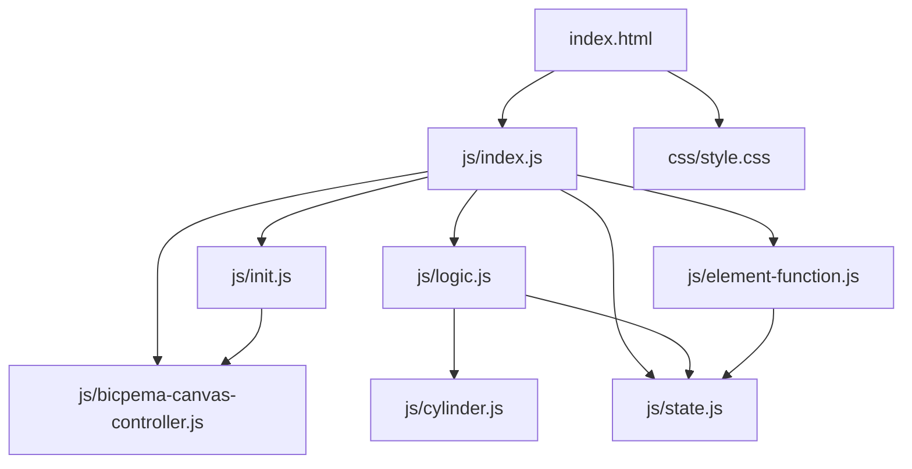
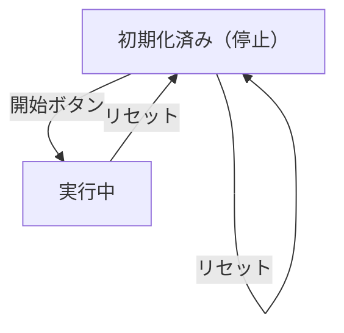

# アルキメデスの原理 シミュレーション設計書

## 1. 概要

- 対象: アルキメデスの原理（浮力）を可視化するp5.jsシミュレーション。円柱を水中に沈め浮力と重力のつり合いを表現する。
- 想定利用者: 物理基礎の学習者（中学〜高校程度）。
- 確定事項:
  - 右上の設定パネルで円柱の密度をスライダーで変更できる。
  - 左下の操作ボタンで開始・リセットができる。
  - 円柱の密度に応じた水中体積比が設定パネルに表示される。
- 推定事項:
  - マウス操作（drag）で円柱を移動できる可能性がある（mousePressed/mouseReleased実装あり）。

## 2. 画面設計

- 画面構成:
  - 上部ナビバー（タイトル「アルキメデスの原理」、Bicpemaホームリンク）。
  - 中央にp5キャンバス（ウィンドウ全体）。
  - 左下に操作ボタン群（▶ 開始、🔄 リセット）。
  - 右上に設定パネルトグルボタン（⚙ 設定）。
  - 右上に折りたたみ式設定パネル（密度スライダー、水中体積比表示）。
- UI要素:
  - スライダー: 円柱の密度 (0.1〜2.0 g/cm³、step=0.05)。
  - 表示ラベル: 現在の密度値、水の密度（固定1.0）、水中体積比(%)。
  - 操作: 開始ボタン、リセットボタン。
- 確定事項:
  - 設定パネルはBootstrap Collapseで折りたたみ可能。
  - bodyは固定レイアウトでスクロール不可。

## 3. 機能仕様

- 開始:
  - 「▶ 開始」ボタン押下で `state.running=true`、アニメーションループ開始。
- リセット:
  - 「🔄 リセット」ボタンで `initValue(p)` を呼び、`state.running=false`・円柱を初期位置に戻す。
- 設定反映:
  - densitySlider変更で円柱の密度を即時反映し、浮力・沈み込み量を再計算して再描画。
  - submergedRatioLabelに水中体積比(%)を更新表示。
- マウス操作:
  - mousePressed: 円柱をつかむ操作（推定）。
  - mouseReleased: 円柱を離す操作（推定）。
- 境界条件:
  - 密度 > 1.0 g/cm³: 円柱は沈む（水中体積比100%）。
  - 密度 < 1.0 g/cm³: 円柱は一部水面上に出て浮く。
  - 密度 = 1.0 g/cm³: 円柱全体が水面と面一で浮く。

## 4. ロジック仕様

- 実行モデル:
  - p5.jsインスタンスモード（setup/draw/windowResized/mousePressed/mouseReleased）を利用。
  - ESModule（`import`）ベースで実装。
  - `p.noLoop()` で初期停止、開始ボタンで `p.loop()` を呼ぶ（推定）。
- 状態管理:
  - running: シミュレーション進行ON/OFF。
  - cylinder: 円柱オブジェクト（Cylinderクラスインスタンス）。
  - waterSurfaceY: 水面のY座標（基準座標系）。
- 描画処理:
  - 背景（水槽・水面）を描画。
  - 円柱を現在のY座標に描画。
  - 浮力・重力ベクトルを矢印で描画（推定）。
- 計算モデル:
  - 浮力 F_b = ρ_water × V_submerged × g。
  - 重力 F_g = ρ_cylinder × V_total × g。
  - 平衡条件: submergedRatio = ρ_cylinder / ρ_water（ρ_cylinder < ρ_water の場合）。
  - アニメーション: 円柱を平衡位置に向けて徐々に移動（推定）。
- 推定事項:
  - Cylinderクラス（cylinder.js）が浮力計算とアニメーション更新を担う。
  - FPSはinit.jsのFPS定数で制御。

## 5. ファイル構成と責務

- vite/simulations/archimedes-principle/index.html
  - 画面のDOM（ナビバー、設定パネル、操作ボタン）と `js/index.js` / `css/style.css` の参照を保持。
- vite/simulations/archimedes-principle/css/style.css
  - 全体レイアウト、キャンバス配置、スクロール無効化をスタイリング。
- vite/simulations/archimedes-principle/js/index.js
  - p5インスタンス起動・setup/draw/mousePressed/mouseReleased/windowResizedを定義。
- vite/simulations/archimedes-principle/js/state.js
  - `state` オブジェクト（cylinder、waterSurfaceY、running）。
- vite/simulations/archimedes-principle/js/init.js
  - `initValue(p)` で状態初期化。`elCreate(p)` でUI要素をstateに紐付けしボタンイベントをセット。FPS定数を公開。
- vite/simulations/archimedes-principle/js/logic.js
  - `drawSimulation(p)` で描画処理。`handleMousePressed(p)` / `handleMouseReleased(p)` でマウス処理。
- vite/simulations/archimedes-principle/js/cylinder.js
  - `Cylinder` クラス。浮力計算・位置更新・描画メソッドを持つ。
- vite/simulations/archimedes-principle/js/element-function.js
  - ボタンクリック処理（開始/リセット）とスライダー変更ハンドラ。
- vite/simulations/archimedes-principle/js/bicpema-canvas-controller.js
  - キャンバスサイズ設定とリサイズ処理。

## 6. 状態遷移

- 初期化済み（停止）: setup実行後。円柱は初期位置、running=false。
- 実行中: 開始ボタン押下でrunning=true。円柱が平衡位置へアニメーション。
- リセット: リセットボタン押下で初期化済みへ戻る。

## 7. 既知の制約

- 一時停止機能は実装されていない。
- リサイズ時はキャンバスサイズのみ変更され、円柱位置は再初期化される可能性がある。
- 密度スライダーの変更は実行中でも即時反映されるため、アニメーション中に円柱が飛ぶことがある（推定）。

## 8. 未確定事項

- mousePressed/mouseReleased の具体的な操作内容（ドラッグ移動か、単なる再開トリガーか）。
- 開始ボタン押下後に `p.loop()` を呼ぶか、drawループ内でrunningフラグを参照するか。
- 浮力矢印・重力矢印・数値表示の有無と配置。
- 円柱が完全に沈む（密度>1）場合のアニメーション挙動。
