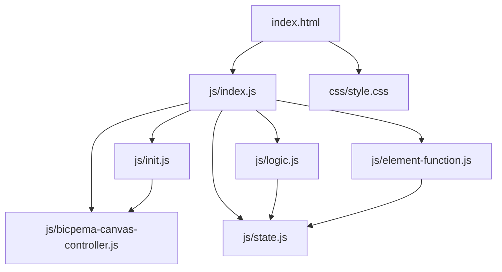
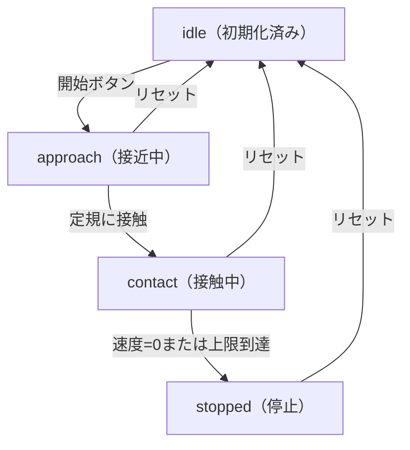

# 力学台車が定規にする仕事 シミュレーション設計書

## 1. 概要

- 対象: 力学台車が定規を押し込み「仕事と運動エネルギーの定理」を可視化するp5.jsシミュレーション。
- 想定利用者: 物理基礎の学習者（高校程度）。
- 確定事項:
  - 右上の設定モーダルで台車の質量・初速度・抵抗力を変更できる。
  - 左下の操作ボタンで開始・リセットができる。
  - 台車が静止すると「仕事 = 初期運動エネルギー」が確認メッセージとして表示される。
- 推定事項:
  - 仮想座標系1000×562でスケーリングし、実世界単位(m, N, kg)で物理計算を行う教材意図。

## 2. 画面設計

- 画面構成:
  - 上部ナビバー（タイトル「力学台車が定規にする仕事」、Bicpemaホームリンク）。
  - 中央〜下部にp5キャンバス（ウィンドウ全体）。
  - 左下に操作ボタン群（リセット・開始/終了）。
  - 右上に設定モーダル起動ボタン（⚙ 設定）。
  - 左上に情報パネル（質量・初速度・抵抗力・KE・めり込み距離・仕事）。
- UI要素:
  - 数値入力: 台車の質量 m (kg)、初速度 v₀ (m/s)、抵抗力 F (N)。
  - 操作: 開始ボタン、リセットボタン。
  - 設定モーダル: 閉じるボタン付き。
- 確定事項:
  - bodyは固定レイアウトでスクロール不可。
  - 読み込み中スピナーをpreloadで表示し、setup完了後に除去する。
  - 本の画像はFirebase Storageから動的ロード。

## 3. 機能仕様

- 開始:
  - 「▶ 開始」ボタン押下で `state.isRunning=true`、`state.phase='approach'` に遷移。
- 一時停止/終了:
  - 台車停止時に自動で `state.isRunning=false`、ボタンに「終了」表示・disabled。
- リセット:
  - 「🔄 リセット」ボタンで `initValue(p)` を呼び、`state.phase='idle'`、`state.isRunning=false` に戻す。
- 設定反映:
  - massInput: 台車の質量(kg)を `state.mass_kg` に反映。
  - velocityInput: 初速度(m/s)を `state.v0_ms` / `state.velocity_ms` に反映。
  - forceInput: 抵抗力(N)を `state.force_N` に反映。
- 境界条件:
  - massInput: min=0.1, max=2.0。
  - velocityInput: min=0.5, max=3.0。
  - forceInput: min=1, max=50。
  - めり込み距離が定規の初期長さを超えた場合も停止する。

## 4. ロジック仕様

- 実行モデル:
  - p5.jsインスタンスモード（preload/setup/draw/windowResized）を利用。
  - ESModule（`import`）ベースで実装。
- 状態管理:
  - isRunning: シミュレーション進行ON/OFF。
  - phase: `'idle'` | `'approach'` | `'contact'` | `'stopped'`。
  - approachX_px: 接近フェーズでの台車左端x座標(px)。
  - velocity_ms: 現在の速度(m/s)。
  - penetration_m: 定規へのめり込み距離(m)。
- 描画処理:
  - `p.scale(p.width / V_W)` で仮想座標系(1000×562)にスケーリング。
  - 地面・本・定規・台車・速度矢印・抵抗力矢印・めり込みラインを順に描画。
  - 左上に情報パネルをオーバーレイ描画。
- 計算モデル:
  - 接近フェーズ: `approachX_px += v0 * PM * dt`（PM=400px/m）。
  - 接触フェーズ: `decel = F/m`、速度を毎フレーム `v - decel*dt` で更新。`penetration_m += 0.5*(v_old+v_new)*dt`。
  - v≦0 または penetration_m が上限に達したら停止。
  - FPS=60固定。
- 推定事項:
  - `BicpemaCanvasController(true, false, 1.0, 1.0)` によりWEBGLなしの2D全画面描画。

## 5. ファイル構成と責務

- vite/simulations/cart-work-ruler/index.html
  - 画面のDOM（ナビバー、設定モーダル、操作ボタン）と `js/index.js` / `css/style.css` の参照を保持。
- vite/simulations/cart-work-ruler/css/style.css
  - 全体レイアウト、キャンバス配置、スクロール無効化、ボタンUIをスタイリング。
- vite/simulations/cart-work-ruler/js/index.js
  - p5インスタンス起動・preload（フォント/本画像ロード）・setup/draw/windowResizedを定義。
- vite/simulations/cart-work-ruler/js/state.js
  - `state` オブジェクト（ロードアセット・DOM要素・パラメータ・シミュレーション状態変数）。
- vite/simulations/cart-work-ruler/js/init.js
  - `initValue(p)` で状態初期化。`elCreate(p)` でUI要素をstateに紐付けしボタンイベントをセット。
- vite/simulations/cart-work-ruler/js/logic.js
  - `drawSimulation(p)` でスケーリング・背景描画・物理更新（update）・シーン描画（drawScene）を実行。
- vite/simulations/cart-work-ruler/js/element-function.js
  - ボタンクリック処理（開始/リセット）と設定モーダル開閉。
- vite/simulations/cart-work-ruler/js/bicpema-canvas-controller.js
  - 16:9固定比率のキャンバスサイズ設定とリサイズ処理。

## 6. 状態遷移

- 初期化済み（idle）: setup実行後。台車は左端、isRunning=false。
- 接近中（approach）: 開始ボタン押下。台車が定規に向かって移動。
- 接触中（contact）: 台車が定規に接触。抵抗力により減速中。
- 停止（stopped）: 速度が0になった。isRunning=false、仕事=初期KEを表示。
- リセット: リセットボタン押下でidleへ戻る。

## 7. 既知の制約

- 一時停止機能は実装されておらず、開始後はリセットのみで状態を戻せる。
- forceInputが小さく massInputが大きい場合、長時間シミュレーションが継続する。
- リサイズ時はキャンバスサイズのみ変更され、シミュレーション状態は保持される。
- bookImageロードに失敗した場合はフォールバックとして塗りつぶし矩形で代替描画する。

## 8. 未確定事項

- 情報アイコンの挙動（リンクやモーダル）が未実装かどうか。
- massInput/velocityInput/forceInputの変更がシミュレーション実行中にリアルタイム反映されるかどうか。
- フォントロード失敗時のフォールバック挙動。
