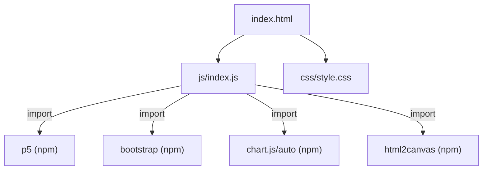
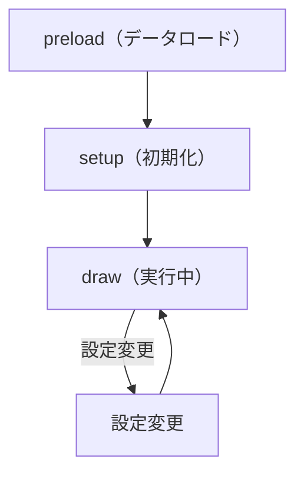

# セロハンによる偏光色シミュレーション 設計書

## 1. 概要

- 対象: セロハンテープ（複屈折材料）による偏光色を再現する p5.js + Chart.js シミュレーション。
- 想定利用者: 物理・光学の学習者（高校〜大学程度）。
- 確定事項:
  - 偏光板の配置（平行ニコル/直交ニコル）と光路差を変更できる。
  - セロハンテープの組を追加・削除できる（最大 14 組）。
  - 透過色（RGB）をキャンバス + カラー表示パネルで確認できる。
  - スペクトルグラフと HSV 色空間グラフを切り替えて表示できる。
  - スクリーンショット機能あり（html2canvas を使用）。

## 2. 画面設計

- 画面構成:
  - 上部バー（ホームアイコン、タイトル「偏光色を再現するシミュレーション」、情報アイコン）。
  - 左半分: p5 キャンバス（`#p5Canvas`）にセロハン・偏光板の 2D アニメーション。
  - 右半分:
    - カラー表示行（1枚目の偏光板透過色 / 2枚目の偏光板透過色）。
    - Chart.js グラフ（スペクトル or HSV 色空間、どちらかを切り替え表示）。
  - 左下: 「シミュレーションの設定」ボタン（Bootstrap モーダル起動） + スクリーンショットボタン。
- 設定モーダル（Bootstrap modal fade）:
  - 偏光板配置選択: 平行ニコル/直交ニコル（`#polarizerSelect`）。
  - 光路差入力: `#opdInput`（数値, min=0, デフォルト 250）。
  - セロハン追加/削除ボタン（`#cellophaneAddButton` / `#cellophaneRemoveButton`）。
  - セロハン組の詳細設定エリア（`#cellophaneColabNum`、動的生成）。
  - 「閉じる」ボタン。
- 確定事項:
  - 右クリックのコンテキストメニューは無効化（body の oncontextmenu="return false;"）。

## 3. 機能仕様

- 偏光板配置変更: `polarizerSelect` 変更時に透過色を再計算。
- 光路差変更: `opdInput` 変更時に各層の位相差を再計算。
- セロハン追加: `cellophaneAddButton` クリックで組数 +1。
- セロハン削除: `cellophaneRemoveButton` クリックで組数 -1（最小 1）。
- スクリーンショット: `screenshotButton` クリックで `html2canvas` による PNG ダウンロード。
- グラフ切り替え: スペクトルグラフ / HSV 色空間グラフを表示。
- 境界条件:
  - セロハン最大 14 組（`last_otherCellophaneNums` 配列サイズ）。
  - 光路差 min=0（HTML input の min 属性）。

## 4. ロジック仕様

- 実行モデル:
  - p5.js グローバルモード（`window.setup/draw/preload/windowResized` を割り当て後 `new p5()` 呼び出し）。
  - ES Module（`import`）ベースで実装（p5, Bootstrap, Chart.js, html2canvas をインポート）。
- 状態管理（グローバル変数、`js/index.js` 内）:
  - `cmfTable`, `osTable`: 等色関数・強度分布データ（Firebase Storage から preload でロード）。
  - `waveLengthArr`, `xLambda`, `yLambda`, `zLambda`: XYZ 等色関数配列。
  - `cellophaneNum`, `cellophaneArr`: セロハンの組数と各組のデータ。
  - `rBefore/gBefore/bBefore`, `rAfter/gAfter/bAfter`: 偏光板透過後の RGB 値。
  - `tape_array`, `clusters`, `labels`, `edgePixels`: クラスター分類用変数。
- 描画処理（`draw` 関数）:
  - p5 キャンバスにセロハンテープの 2D アニメーションを描画。
  - 透過色を計算し `#beforeColor` / `#afterColor` の背景色を更新。
  - グラフを `drawGraph()` / `drawGraph2()` / `drawGraph2_1()` で描画。
- 計算モデル（偏光光学）:
  - XYZ 等色関数と光源強度分布から RGB を計算。
  - 各セロハン層の位相差（光路差）を考慮した透過強度を計算。
  - HSV 色空間への変換と色座標の可視化。

## 5. ファイル構成と責務

- `vite/simulations/cellophane-color-2D_animation/index.html`
  - 上部バー、p5Canvas、カラー表示パネル、グラフキャンバス。
  - Bootstrap 設定モーダル（偏光板/光路差/セロハン設定）。
  - `./js/index.js` を `<script type="module">` で参照（`/js/common.js` 依存を解消）。
- `vite/simulations/cellophane-color-2D_animation/css/style.css`
  - レイアウト、カラー表示、グラフエリア、スクロール制御。
- `vite/simulations/cellophane-color-2D_animation/js/index.js`
  - ES Module の入口: p5, Bootstrap, Chart.js, html2canvas をインポート。
  - グローバル変数の宣言と全関数の定義（setup/draw/preload/windowResized 等）。
  - 末尾で `window.preload/setup/draw/windowResized` を割り当て、`new p5()` を呼び出し。

## 6. 状態遷移

- 初期化: `preload` でデータテーブル・画像を Firebase Storage からロード。
- セットアップ: `setup` でキャンバス生成、DOM イベント登録。
- 実行中: `draw` ループでアニメーションと色計算を継続。
- 設定変更: モーダルの入力変更で透過色・グラフをリアルタイム更新。

## 7. 既知の制約

- `js/index.js` が 1677 行のモノリシック実装（責務分離の余地あり）。
- クラスター分析 (k-means) をフレームごとに実行するため、セロハン組数が多い場合は重い。
- `drawingContext.setLineDash` 等の Canvas 2D API 直接呼び出しは p5 インスタンスモード非対応。
- リサイズ時に `windowResized` が呼ばれるが、グラフデータは保持される。

## 8. 未確定事項

- `js/index.js` を state/init/logic 等の複数ファイルに分割する将来対応の必要性。
- スクリーンショット機能の `html2canvas` がキャンバス外要素もキャプチャする動作の仕様確認。
- Chart.js グラフの表示切り替えロジック（スペクトル vs HSV）のトリガー条件。
