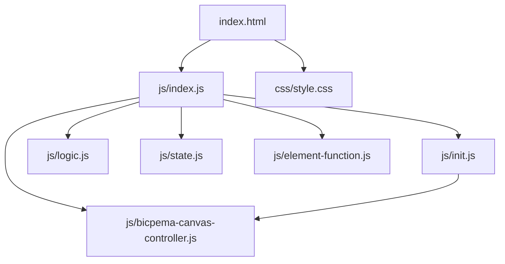
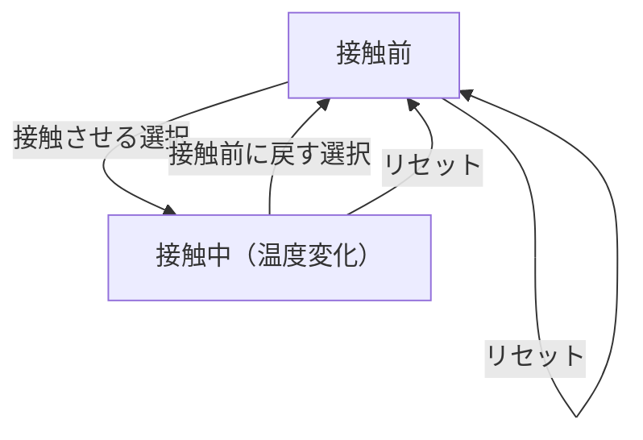

# 熱量の保存と比熱 シミュレーション設計書

## 1. 概要

- 対象: 熱量の保存と比熱（熱平衡・比熱の測定）を可視化する p5.js シミュレーション。
- 想定利用者: 物理基礎の学習者（高校程度）。
- 確定事項:
  - 右上の設定モーダルで物質 A の種類（Al/Fe/Cu/Ag）と質量（50g/100g）、接触状態を変更できる。
  - 温度-時間グラフで平衡温度への収束をリアルタイム確認できる。
  - リセットボタンで初期状態に戻せる。
- 推定事項:
  - 比熱の値は文献値（Al=0.901, Fe=0.448, Cu=0.386, Ag=0.236 J/(g·K)）を使用。

## 2. 画面設計

- 画面構成:
  - 上部ナビバー（Bicpema リンク、タイトル「熱量の保存と比熱」）。
  - 中央に p5 キャンバス（16:9 固定比率）。
  - 左下に「リセット」ボタン。
  - 右上に「設定」ボタン（モーダル起動）。
- 設定モーダル（右上起動）:
  - 物質 A 選択ラジオ: アルミニウム/鉄/銅/銀。
  - 質量 A 選択ラジオ: 50g / 100g。
  - 接触状態選択: 接触させる / 接触前に戻す。
  - 「閉じる」ボタン。
- キャンバス内 UI:
  - 容器（Firebase 画像 stirringVessel.png）。
  - 金属球（材質に応じたグラデーション）。
  - 温度-時間グラフ（青=低温, 赤=高温、平衡温度点線）。
  - 現在温度の移動点とラベル。
- 確定事項:
  - body は固定レイアウトでスクロール不可。
  - 接触前: 金属球は容器外に表示。接触後: 温度が指数的に変化。

## 3. 機能仕様

- 物質 A 選択:
  - `state.selectedMaterial` 更新 → `c_now` を対応する比熱に設定。
- 質量選択:
  - `state.selectedMass` 更新 → `m_now` を 50g または 100g に設定。
- 接触状態変更:
  - '0'=接触: `updateTemperature` で t をインクリメント、指数関数的な温度変化。
  - '1'=接触前: `resetState` で t=0, Thot=Thot0, Tcold=Tcold0 に戻す。
- リセット:
  - 全設定を初期値に戻し `initValue(p)` を呼び出す。
- 境界条件:
  - `t` は 0〜tMax=300 でグラフに表示（それ以降は現在温度点のみ更新）。

## 4. ロジック仕様

- 実行モデル:
  - p5.js インスタンスモード（`const sketch = (p) => { ... }; new p5(sketch)`）。
  - ES Module（`import`）ベースで実装。
- 状態管理（`state.js`）:
  - `Thot0=368K`, `Tcold0=288K`, `Thot`, `Tcold`, `Teq`, `t=0`
  - 各比熱定数: c_Al, c_Fe, c_Cu, c_Ag, c_w=4.2
  - `C_hot`, `C_cold`, `m_now`, `c_now`
  - `selectedMaterial`, `selectedMass`, `contactState`
  - `boxImg`
- 描画処理（`logic.js`）:
  - 毎フレーム: `scale(p.width/1600)` → 温度更新 → 容器描画 → 金属球描画 → グラフ描画 → パラメータ表示。
  - 仮想座標系 W=1600 × H=800。
- 計算モデル（指数的温度変化）:
  - `Teq = (C_hot * Thot0 + C_cold * Tcold0) / (C_hot + C_cold)`
  - `k_eff = G / C_hot`（G=1.8 は接触条件定数）
  - `Thot = Teq + (Thot0 - Teq) × exp(-k_eff × t)`
  - `Tcold = Teq + (Tcold0 - Teq) × exp(-k_eff × t)`

## 5. ファイル構成と責務

- `vite/simulations/conservation-of-heat-and-specific-heat/index.html`
  - ナビバー、設定モーダル（物質/質量/接触状態）、左下リセットボタン、右上設定ボタン。
  - `./js/index.js` を `<script type="module">` で参照。
- `vite/simulations/conservation-of-heat-and-specific-heat/css/style.css`
  - 全体レイアウト、p5Container/navBar、モーダル、スクロール無効化。
- `vite/simulations/conservation-of-heat-and-specific-heat/js/index.js`
  - p5 インスタンス起動、preload/setup/draw/windowResized の配線。
- `vite/simulations/conservation-of-heat-and-specific-heat/js/state.js`
  - `state` オブジェクト（全温度変数・比熱・boxImg 等）。
- `vite/simulations/conservation-of-heat-and-specific-heat/js/init.js`
  - `initValue(p)`: 状態初期化。`elCreate(p)`: DOM 要素にイベントを紐付け。
- `vite/simulations/conservation-of-heat-and-specific-heat/js/logic.js`
  - `drawSimulation(p)`: 温度更新 + 全描画処理 + グラフ描画。
  - 座標変換ヘルパー `tx(t)`, `ty(T)` を含む。
- `vite/simulations/conservation-of-heat-and-specific-heat/js/element-function.js`
  - 物質/質量/接触状態の変更ハンドラ、リセットハンドラ。
- `vite/simulations/conservation-of-heat-and-specific-heat/js/bicpema-canvas-controller.js`
  - 16:9 固定比率キャンバス制御（`fullScreen(p)` / `resizeScreen(p)`）。

## 6. 状態遷移

- 接触前（初期）: contactState='1', t=0, 温度は初期値のまま。
- 接触中: contactState='0', t がインクリメント、温度が指数的に変化。
- リセット: 初期状態に戻る（contactState='1', t=0）。

## 7. 既知の制約

- 接触条件定数 G=1.8 は固定（物理的な現実の値とは異なる）。
- 物質は Al/Fe/Cu/Ag の 4 種類のみ。
- 水の質量 m_Water=150g は固定（設定で変更不可）。
- リサイズ時は `initValue(p)` 再実行で進行中の状態がリセットされる。

## 8. 未確定事項

- 情報アイコンの挙動（リンクやモーダル）が未実装の可能性あり。
- 水の質量を可変にする拡張の必要性。
- グラフの Y 軸範囲（Tmin=250K, Tmax=400K）が固定なため、変更が必要なケースへの対応。
