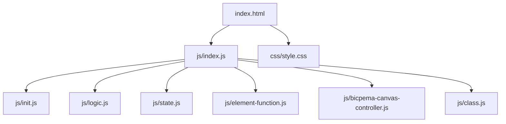
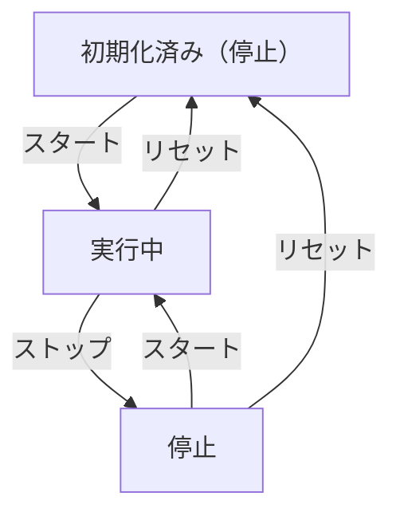

# ドップラー効果 シミュレーション設計書

## 1. 概要

- 対象: ドップラー効果（移動音源による波面の変化）を可視化する p5.js シミュレーション。
- 想定利用者: 物理基礎の学習者（高校程度）。
- 確定事項:
  - 右上の設定モーダルで音源の速度を変更できる。
  - 左下のスタート/ストップ/リセットボタンで操作できる。
  - 音源は左から右へ移動し、音波（円）が発射される。
  - 音波の円は 340/FPS px/フレームで半径が拡大する。

## 2. 画面設計

- 画面構成:
  - 上部ナビバー（Bicpema リンク、タイトル「ドップラー効果」）。
  - 中央に p5 キャンバス（16:9 固定比率）。
  - 左下に「スタート」「ストップ」「リセット」ボタン。
  - 右上に「設定」ボタン（モーダル起動）。
- 設定モーダル（右上起動）:
  - 音源の速度（m/s）入力欄（`#speedInput`、デフォルト 340）。
  - 「閉じる」ボタン。
- キャンバス内 UI:
  - 格子線（縦横 10px 間隔、100px 毎に太線）。
  - 音源（黒い円、直径 20px）と速度ラベル。
  - 音波（黒い円、半径が時間とともに拡大）。
- 確定事項:
  - body は固定レイアウトでスクロール不可。

## 3. 機能仕様

- スタート:
  - `state.clickedCount = true`。音源移動・音波発射を開始。
- ストップ:
  - `state.clickedCount = false`。音源停止・音波拡大停止。
- リセット:
  - `posx=50`, `count=0`, `sounds=[]`, `clickedCount=false` に初期化。
- 音波発射:
  - `count % (FPS/10) === 0` かつ clickedCount=true のとき `SOUND` オブジェクトを追加。
- 音源位置:
  - `posx = (speedValue × count) / FPS + 50`。
- 音波拡大:
  - 各フレームで clickedCount=true のとき `radi += 340/FPS`。
- 境界条件:
  - 音源速度の入力制限なし（負値も可能）。

## 4. ロジック仕様

- 実行モデル:
  - p5.js インスタンスモード（`const sketch = (p) => { ... }; new p5(sketch)`）。
  - ES Module（`import`）ベースで実装。
- 状態管理（`state.js`）:
  - `posx=50`, `posy=H/2`, `count=0`, `sounds=[]`, `clickedCount=false`, `speedValue=340`
- 描画処理（`logic.js`）:
  - 毎フレーム: `scale(width/1000)` → 背景消去 → 格子背景 → count 更新 → 音波発射判定 → 全音波描画 → 音源位置更新・描画。
  - 仮想座標系 W=1000 × H=(1000×9/16×0.9)。
- 計算モデル:
  - 音波は発射時の音源位置を中心に円形拡大（音速 340 m/s 固定）。
  - 音源速度によって波面が前後に密集・疎になる（ドップラー効果の可視化）。

## 5. ファイル構成と責務

- `vite/simulations/doppler/index.html`
  - ナビバー、設定モーダル（速度入力）、左下操作ボタン、右上設定ボタン。
  - `./js/index.js` を `<script type="module">` で参照。
- `vite/simulations/doppler/css/style.css`
  - 全体レイアウト、p5Container/navBar、モーダル、操作ボタン、スクロール無効化。
- `vite/simulations/doppler/js/index.js`
  - p5 インスタンス起動、setup/draw/windowResized の配線。
- `vite/simulations/doppler/js/state.js`
  - `state` オブジェクト（posx, posy, count, sounds, clickedCount, speedValue）。
- `vite/simulations/doppler/js/class.js`
  - `SOUND` クラス（`_draw(p)` メソッド）。
- `vite/simulations/doppler/js/init.js`
  - `FPS`, `W`, `H` 定数。`settingInit(p)`, `elCreate(p)`, `initValue(p)` のエクスポート。
- `vite/simulations/doppler/js/logic.js`
  - `drawSimulation(p)`: 格子背景 + count 更新 + 音波処理 + 音源描画。
- `vite/simulations/doppler/js/element-function.js`
  - `startButtonFunction`, `stopButtonFunction`, `resetButtonAction`, `onSpeedInputChange`, `onToggleModalClick`, `onCloseModalClick` ハンドラ。
- `vite/simulations/doppler/js/bicpema-canvas-controller.js`
  - 16:9 固定比率キャンバス制御（`fullScreen(p)` / `resizeScreen(p)`）。

## 6. 状態遷移

- 初期化済み（停止）: setup 実行後。posx=50, count=0, sounds=[], clickedCount=false。
- 実行中: スタートボタン押下で clickedCount=true、音源移動・音波発射。
- 停止: ストップボタン押下で clickedCount=false。
- リセット: リセット押下で初期化済みへ戻る。

## 7. 既知の制約

- 音源速度に上限がなく、非常に速い設定では音源が画面外に出る。
- 音波の本数上限がなく、長時間実行で描画コストが増大する。
- 音波は画面外でも計算継続（最適化の余地あり）。
- リサイズ時は `initValue(p)` 再実行により進行中の状態はリセットされる。

## 8. 未確定事項

- 音波数の上限（メモリ・描画パフォーマンス観点での推奨値）。
- 観測者位置の追加（ドップラー効果の周波数変化の数値表示）。
- 音源が画面外に出た場合のループ処理の有無。
