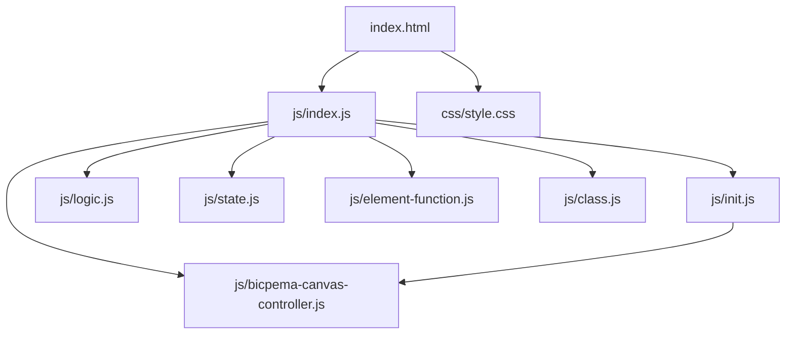
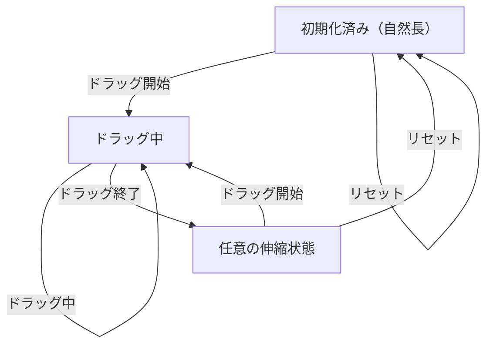

# 弾性力 シミュレーション設計書

## 1. 概要

- 対象: 弾性力（フックの法則 F = kx）を可視化する p5.js シミュレーション。
- 想定利用者: 物理基礎の学習者（中学〜高校程度）。
- 確定事項:
  - 右上の設定モーダルでばね定数 k を変更できる。
  - ハンドル（「手」楕円）をドラッグしてバネを伸縮させ、弾性力を体験できる。
  - 変位 x と弾性力 F がキャンバス上にリアルタイム表示される。
  - リセットボタンで全バネを自然長に戻せる。

## 2. 画面設計

- 画面構成:
  - 上部ナビバー（Bicpema リンク、タイトル「弾性力」）。
  - 中央に p5 キャンバス（16:9 固定比率）。
  - 右上に「設定」ボタン（モーダル起動）。
- 設定モーダル（右上起動）:
  - ばね定数 k スライダー（5〜100 N/m、デフォルト 20 N/m）。
  - 現在値表示 `#springConstantDisplay`。
  - 「リセット」ボタン。
  - 「閉じる」ボタン。
- キャンバス内 UI:
  - 壁（左側、グレーの矩形）に「壁」ラベル。
  - バネ 3 本（上・中・下の Y 位置）。
  - 各バネに: コイル描画・自然長点線・ハンドル楕円（「手」テキスト）。
  - 変位値 `x = ±xx.x cm`（バネ上部）・弾性力 `F = x.xx N`（バネ下部）。
  - 弾性力の矢印（ハンドルから自然長方向）。
- 確定事項:
  - 右クリックのコンテキストメニューは無効化。
  - body は固定レイアウトでスクロール不可。
  - 左下に再生/停止ボタンなし（ドラッグ操作のみ）。

## 3. 機能仕様

- ドラッグ:
  - マウスがハンドル上にある場合、カーソルを "grab" に変更。
  - `mousePressed` でドラッグ開始 (`spring.startDrag(vmx)`)。
  - `draw` ループ中ドラッグ中のバネを `spring.drag(vmx)` で更新。
  - `mouseReleased` でドラッグ終了 (`spring.stopDrag()`)。
  - ドラッグ範囲: `MIN_SPRING_LENGTH=50` 〜 `MAX_SPRING_LENGTH=680` px。
- ばね定数変更:
  - スライダー変更時に全バネの `.updateK(k)` を呼び出す。
- リセット:
  - 「リセット」ボタン押下で全バネの `.reset()` を呼び出し、自然長に戻す。
- 境界条件:
  - 変位が `DISPLACEMENT_THRESHOLD=0.001 m` 未満の場合、変位・弾性力ラベルを非表示。

## 4. ロジック仕様

- 実行モデル:
  - p5.js インスタンスモード（`const sketch = (p) => { ... }; new p5(sketch)`）。
  - ES Module（`import`）ベースで実装。
- 状態管理（`state.js`）:
  - `state.springs` (Spring 配列 3 本)
  - 各定数: `V_W=1000`, `V_H=562`, `PX_PER_M=400`, `ATTACH_X`, `NATURAL_LENGTH=280`, `SPRING_Y_POSITIONS=[175,281,387]` 等
- 描画処理（`logic.js`）:
  - 毎フレーム: 仮想マウス座標計算 → ドラッグ更新 → 壁描画 → 各バネ描画 → カーソル変更。
  - 仮想座標系 1000×562 に `p.scale(p.width/1000)` で変換。
- 計算モデル（フックの法則）:
  - `displacement = (currentLength - naturalLength) / PX_PER_M` (m)
  - `forceMagnitude = k × |displacement|` (N)
  - `currentLength = endX - attachX` (px)

## 5. ファイル構成と責務

- `vite/simulations/elastic-force/index.html`
  - ナビバー、設定モーダル（k スライダー、リセット）、右上設定ボタン。
  - `./js/index.js` を `<script type="module">` で参照（vite-ignore なし）。
- `vite/simulations/elastic-force/css/style.css`
  - 全体レイアウト、p5Container/navBar、モーダル、スクロール無効化。
- `vite/simulations/elastic-force/js/index.js`
  - p5 インスタンス起動、setup/draw/mousePressed/mouseReleased/windowResized の配線。
- `vite/simulations/elastic-force/js/state.js`
  - `state` オブジェクト（springs 配列）と各定数のエクスポート。
- `vite/simulations/elastic-force/js/class.js`
  - `Spring` クラス（isOverHandle, startDrag, drag, stopDrag, display, reset, updateK 等）。
- `vite/simulations/elastic-force/js/init.js`
  - `initValue(p)`: Spring 配列の生成。`elCreate(p)`: DOM 要素にイベントを紐付け。
- `vite/simulations/elastic-force/js/logic.js`
  - `drawSimulation(p)`: ドラッグ処理 + 壁描画 + 各バネ描画 + カーソル制御。
  - `drawWall(p)`: 壁の描画処理。
- `vite/simulations/elastic-force/js/element-function.js`
  - `onSpringConstantChange(p)`, `onReset(p)`, `onToggleModal()`, `onCloseModal()` ハンドラ。
- `vite/simulations/elastic-force/js/bicpema-canvas-controller.js`
  - 16:9 固定比率キャンバス制御（`fullScreen(p)` / `resizeScreen(p)`）。

## 6. 状態遷移

- 初期化済み（停止）: setup 実行後。全バネは自然長、isDragging=false。
- ドラッグ中: mousePressed でバネをドラッグ中。
- ドラッグ終了: mouseReleased でドラッグ解除、バネは任意の伸縮状態を維持。
- リセット: リセット押下で全バネを自然長に戻す。

## 7. 既知の制約

- バネの本数は 3 本固定（UI で変更不可）。
- 複数バネの同時ドラッグは不可（最初にヒットしたバネのみドラッグ）。
- リサイズ時は `initValue(p)` が再実行され、伸縮状態はリセットされる。
- `PX_PER_M=400` は固定スケール（変更不可）。

## 8. 未確定事項

- 情報アイコンの挙動（リンクやモーダル）が未実装の可能性あり。
- バネ本数や自然長を設定パネルで変更できる拡張の必要性。
- タッチデバイス対応（現在はマウスイベントのみ）。
