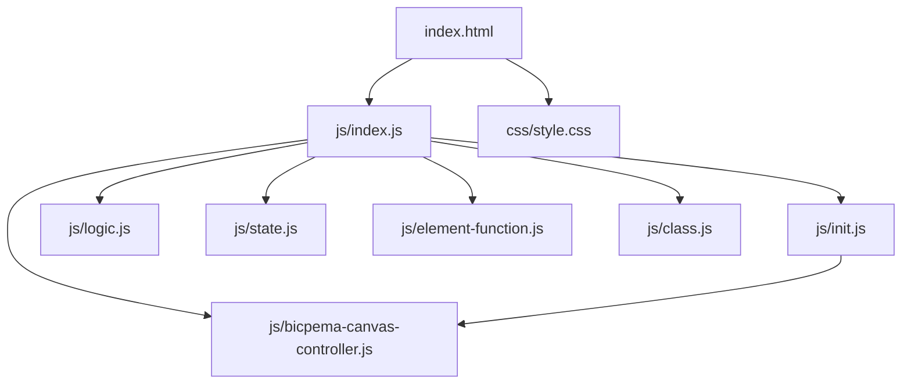
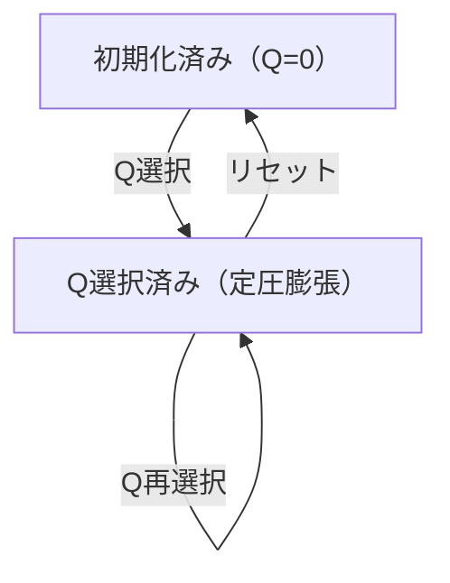

# 熱力学第一法則 シミュレーション設計書

## 1. 概要

- 対象: 熱力学第一法則（定圧膨張 ΔU = Q + Win）を可視化する p5.js シミュレーション。
- 想定利用者: 物理基礎の学習者（高校程度）。
- 確定事項:
  - 右上の設定モーダルで加える熱量 Q を選択できる。
  - 左下のリセットボタンで初期状態に戻せる。
  - ピストンが Q に応じてなめらかに移動し、分子運動速度も変化する。
  - 炎の画像は Q > 0 のとき表示される。
- 推定事項:
  - キャンバス上の数値表示は教育用の概念単位（実際の SI 単位ではない）。

## 2. 画面設計

- 画面構成:
  - 上部ナビバー（Bicpema リンク、タイトル「熱力学第一法則」）。
  - 中央に p5 キャンバス（16:9 固定比率、ウィンドウに合わせてリサイズ）。
  - 左下に「リセット」ボタン。
  - 右上に「設定」ボタン（モーダル起動）。
- 設定モーダル（右上起動）:
  - 加えた熱量 Q のラジオ選択: 0[J], Q[J], 2Q[J], 3Q[J], 4Q[J], 5Q[J]。
  - 「閉じる」ボタン。
- キャンバス内 UI:
  - シリンダー（3D 風描画）・気体・ピストン。
  - ΔU = Q + Win の数式ラベル（上部）。
  - <結果> テキスト: Q, Win, ΔU の値を表示。
  - 分子アニメーション（気体領域内をランダム運動）。
  - 炎画像（Q > 0 のとき表示）。
- 確定事項:
  - 右クリックのコンテキストメニューは無効化（body の oncontextmenu="return false;"）。
  - body は固定レイアウトでスクロール不可。

## 3. 機能仕様

- Q 選択（設定モーダル内ラジオ）:
  - 選択変更時に `state.step` を更新、T・pistonX_target・Q・W・dU を再計算。
- リセット:
  - 「リセット」ボタン押下で Q=0 に戻し、`initValue(p)` を呼び出す。
- ピストン移動:
  - `pistonX` は毎フレーム `lerp(pistonX, pistonX_target, 0.05)` でなめらかに更新。
- 分子運動:
  - 温度 T に応じて速度が変化（`sqrt(T³)` に比例）。
  - ピストン壁と上下壁で反射。
- 境界条件:
  - step は 0〜5 の整数。
  - pistonX は 420〜570 の範囲にクランプ（step × 30 px オフセット）。

## 4. ロジック仕様

- 実行モデル:
  - p5.js インスタンスモード（`const sketch = (p) => { ... }; new p5(sketch)`）。
  - ES Module（`import`）ベースで実装。
- 状態管理（`state.js`）:
  - `pistonX`, `pistonX_target`, `gasWidth`
  - `molecules` (Molecule 配列, N=40)
  - `T0=1.5`, `T`, `step`, `Q`, `W`, `dU`
  - `img_flame`（Firebase Storage の炎画像）
- 描画処理（`logic.js`）:
  - 毎フレーム: `background → drawFormula → drawUI → drawCylinder3D → drawGas3D → drawPiston3D → updateMolecules → drawMolecules → drawArrows → drawFrame`。
  - 仮想座標系 1000×562 に `scale(p.width/1000)` で変換。
- 計算モデル（等圧膨張）:
  - `Q = step`, `W = step`, `dU = step`（概念単位）。
  - `T = T0 + step × dT_unit`（dT_unit = 0.3）。
  - `pistonX_target = 420 + step × dV_unit`（dV_unit = 30）。

## 5. ファイル構成と責務

- `vite/simulations/first-law-of-thermodynamics/index.html`
  - ナビバー、設定モーダル（Q ラジオ）、左下リセットボタン、右上設定ボタン。
  - `./js/index.js` を `<script type="module">` で参照。
- `vite/simulations/first-law-of-thermodynamics/css/style.css`
  - 全体レイアウト、p5Container/navBar 配置、モーダル、スクロール無効化。
- `vite/simulations/first-law-of-thermodynamics/js/index.js`
  - p5 インスタンス起動、preload/setup/draw/windowResized の配線。
- `vite/simulations/first-law-of-thermodynamics/js/state.js`
  - `state` オブジェクト（pistonX, T, molecules, img_flame 等）。
- `vite/simulations/first-law-of-thermodynamics/js/class.js`
  - `Molecule` クラス（move/draw メソッド）。
- `vite/simulations/first-law-of-thermodynamics/js/init.js`
  - `initValue(p)`: 状態初期化。`elCreate(p)`: DOM 要素にイベントを紐付け。
- `vite/simulations/first-law-of-thermodynamics/js/logic.js`
  - `drawSimulation(p)`: 全描画処理（シリンダー、気体、ピストン、分子、矢印、数式等）。
- `vite/simulations/first-law-of-thermodynamics/js/element-function.js`
  - `onQChange(p)`, `onReset(p)`, `onToggleModal()`, `onCloseModal()` 等のハンドラ。
- `vite/simulations/first-law-of-thermodynamics/js/bicpema-canvas-controller.js`
  - 16:9 固定比率キャンバス制御（`fullScreen(p)` / `resizeScreen(p)`）。

## 6. 状態遷移

- 初期化済み（Q=0）: setup 実行後。ピストンは自然長位置、分子は低速運動。
- Q 選択中: ラジオ変更でピストン移動・温度上昇・分子速度増加。
- リセット: リセット押下で Q=0 の初期化済みへ戻る。

## 7. 既知の制約

- 分子数 N=40 固定（UI で変更不可）。
- Q の値は 0〜5Q の 6 段階のみ。
- リサイズ時は `initValue(p)` が再実行され、進行中の状態（Q 選択）は保持されない。
- 熱量・仕事の単位は教育用の概念単位であり、実際の SI 単位ではない。

## 8. 未確定事項

- 情報アイコンの挙動（リンクやモーダル）が未実装の可能性あり。
- 分子数を可変にする拡張の必要性。
- 炎画像の代替（Firebase Storage の可用性）。
