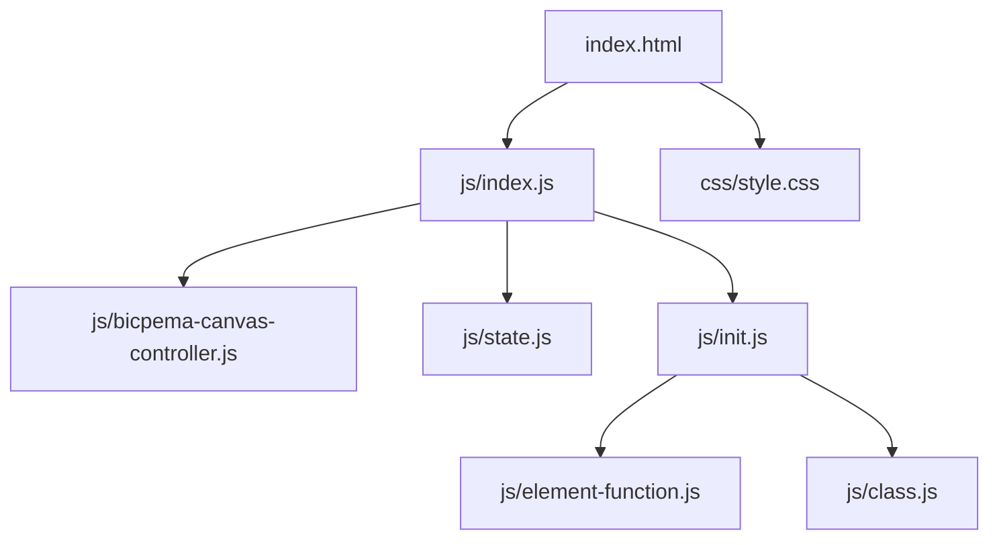
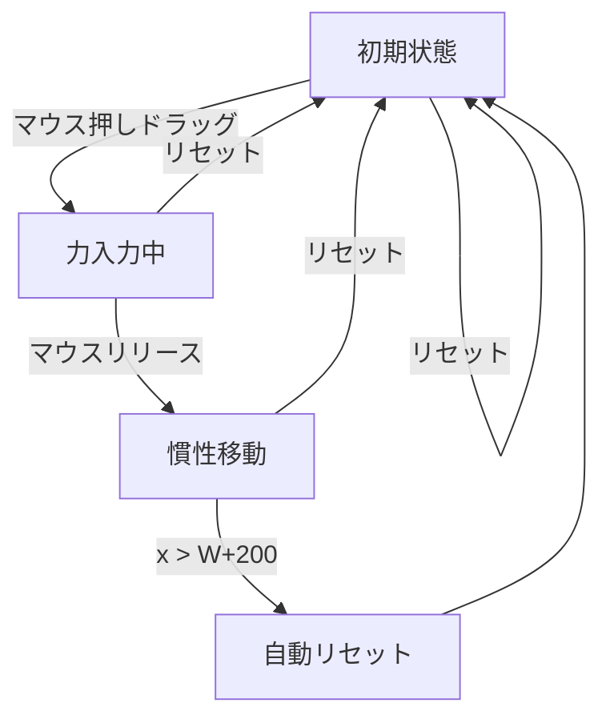

# 力と加速度の関係シミュレーション設計書

## 1. 概要

- 対象: ニュートンの第2法則（F=ma）を体験的に学ぶp5.jsシミュレーション。
- 想定利用者: 物理基礎の学習者（中学〜高校程度）。
- 確定事項:
  - 右上の設定ボタンで台車の質量 m (kg) を変更できる（0.5〜5.0 kg、ステップ0.5）。
  - マウスドラッグで台車に力を加える（台車右端より右でマウスを押し続ける）。
  - 左下のリセットボタンで台車を初期位置に戻す。
- 推定事項:
  - 力はマウスと台車右端の距離 × FORCE_SCALE(0.05) で計算。
  - 台車が右端（x > W+200）を超えると自動リセット。

## 2. 画面設計

- 画面構成:
  - 上部バー（タイトル "力と加速度の関係"、ホームリンク）。
  - p5キャンバス（16:9固定比率）に地面・台車・力の矢印・ドラッグヒント・情報パネルを描画。
  - 左下に操作ボタン（リセット）。
  - 右上に設定ボタン（設定）。
- UI要素:
  - 数値入力: 質量 m (kg)、min=0.5, max=5, step=0.5。
  - 操作: リセット。
  - インタラクション: マウス押し続けで力を加える（台車右端より右でドラッグ）。
- 確定事項:
  - 台車が停止中（velocity=0）かつ力がゼロのとき、ドラッグヒント（点線矢印）を表示。
  - bodyは固定レイアウトでスクロール不可。
  - 情報パネル（左上）: F, a, m, v を表示。

## 3. 機能仕様

- 力の入力:
  - `p.mouseIsPressed` が真かつ `logMX > cart.rightEdge` のとき、`cart.force = drag * FORCE_SCALE`。
  - マウスを離すと `cart.force = 0`（慣性のみで移動継続）。
- 台車の更新:
  - 毎フレーム `cart.update(1/FPS, PIXELS_PER_METER)` を呼ぶ。
  - 加速度: `a = F/m`、速度: `v += a*dt`（v<0の場合は0にクランプ）、位置: `x += v * pxPerMeter * dt`。
- 自動リセット:
  - `cart.x > W + 200` のとき `cart.reset()` を自動呼び出し。
- 質量変更:
  - 設定モーダルで変更すると `onMassChange()` が呼ばれ、`cart.mass` を更新し `cart.reset()`。
  - 入力検証: 0.5未満は0.5に、5超は5にクランプ。
- リセット:
  - 「リセット」ボタンで `cart.reset()`（x=initialX, velocity=0, force=0, acceleration=0）。
- 境界条件:
  - 質量: HTMLのmin=0.5, max=5 + onMassChange内でクランプ。

## 4. ロジック仕様

- 実行モデル:
  - p5.jsインスタンスモード（setup/draw/windowResized）を利用。
  - ESModule（`import`）ベースで実装。
- 座標系:
  - 仮想キャンバス幅 W=1000px、H=562.5px（16:9）。
  - GROUND_Y = H - 50 = 512.5。
  - FORCE_SCALE=0.05（N/px）。
  - PIXELS_PER_METER=60（px/m）。
  - draw() 冒頭で `p.scale(p.width / W)` を適用。
  - マウス座標変換: `logMX = mouseX * (W / width)`。
- 状態管理:
  - `state.cart`: Cartオブジェクト（x, mass, velocity, force, acceleration）。
  - `state.font`: 非同期読込フォント（失敗時はデフォルトフォント使用）。
  - `state.massInput`, `state.resetButton`, etc.: DOM要素参照。
- Cartクラス（`class.js`）:
  - `update(dt, pxPerMeter)`: F/m=a、v+=a*dt（0クランプ）、x+=v*pxPerMeter*dt。
  - `display(p, groundY)`: 車軸・シャーシ・荷台・車輪を描画。
  - `reset()`: 初期位置・速度0・力0。
  - プロパティ: `rightEdge`, `leftEdge`（getters）。
- 描画処理（index.js内）:
  - `drawTrack(p)`: 地面・レールライン。
  - `drawForceArrow(p, x1, y, x2)`: 赤い矢印＋「F」ラベル。
  - `drawDragHint(p, x, y)`: グレーの点線矢印＋ヒントテキスト。
  - `drawInfoPanel(p, F, a, m, v)`: 左上の情報パネル（半透明背景）。
- FPS: 60。フォント: 非同期ロード（失敗しても動作継続）。

## 5. ファイル構成と責務

- `vite/simulations/force-and-acceleration/index.html`
  - 画面DOM（ナビバー、設定モーダル、操作ボタン）と `js/index.js` / `css/style.css` の参照を保持。
- `vite/simulations/force-and-acceleration/css/style.css`
  - 全体レイアウト、キャンバス配置、スクロール無効化、ボタンUIをスタイリング。
- `vite/simulations/force-and-acceleration/js/index.js`
  - p5インスタンス起動（`new p5(sketch)`）と各ライフサイクル（setup/draw/windowResized）を紐付け。
  - `BicpemaCanvasController`（fixed=true, 9:16比率）でキャンバス領域を制御。
  - 描画関数（drawTrack, drawForceArrow, drawDragHint, drawInfoPanel）をファイル内に直接定義。
- `vite/simulations/force-and-acceleration/js/state.js`
  - `state`オブジェクト（cart, font, massInput, resetButton, toggleModal, closeModal, settingsModal）。
- `vite/simulations/force-and-acceleration/js/class.js`
  - `Cart`クラス: 物理更新・描画・リセット。`display(p, groundY)` でp5インスタンスを引数に取る。
- `vite/simulations/force-and-acceleration/js/init.js`
  - 定数（FPS）をexport。
  - `settingInit(p, canvasController)`: キャンバス生成・frameRate設定。
  - `elementSelectInit(p)`: DOM要素取得・イベント登録。
  - `elementPositionInit(p)`: イベント再登録（リサイズ時）。
  - `valueInit(p)`: Cart初期化。
- `vite/simulations/force-and-acceleration/js/element-function.js`
  - `onMassChange()`, `onReset()`, `onToggleModal()`, `onCloseModal()`。
- `vite/simulations/force-and-acceleration/js/bicpema-canvas-controller.js`
  - 9:16固定比率のキャンバスサイズ計算・生成・リサイズ処理。

## 6. 状態遷移

- 初期状態: setup実行後。cart.x=250, velocity=0, force=0。
- 力入力中: mouseIsPressed かつ logMX > cart.rightEdge。
- 加速中: force > 0、加速度 a > 0。
- 慣性移動: force=0 かつ velocity > 0。
- 自動リセット: cart.x > W+200 で自動的に初期状態に戻る。
- 手動リセット: リセットボタン押下で初期状態に戻る。

## 7. 既知の制約

- 台車の左方向への移動はない（velocity < 0 のときクランプ）。
- 台車が右端を超えると即座にリセットされるため、長時間の慣性移動の観察ができない場合がある。
- 摩擦なし・重力なし（水平面上の理想的な運動）。
- リサイズ時は `elementPositionInit(p)` が呼ばれるが、物理状態は保持される。

## 8. 未確定事項

- 力の入力方法（マウスドラッグ）がタッチデバイスで正しく動作するかどうか。
- 情報アイコンの挙動（リンクやモーダル）が未実装かどうか。
- 質量変更時の教材的な意図（F一定でmを変えてaを観察するか、m一定でFを変えるか）。
