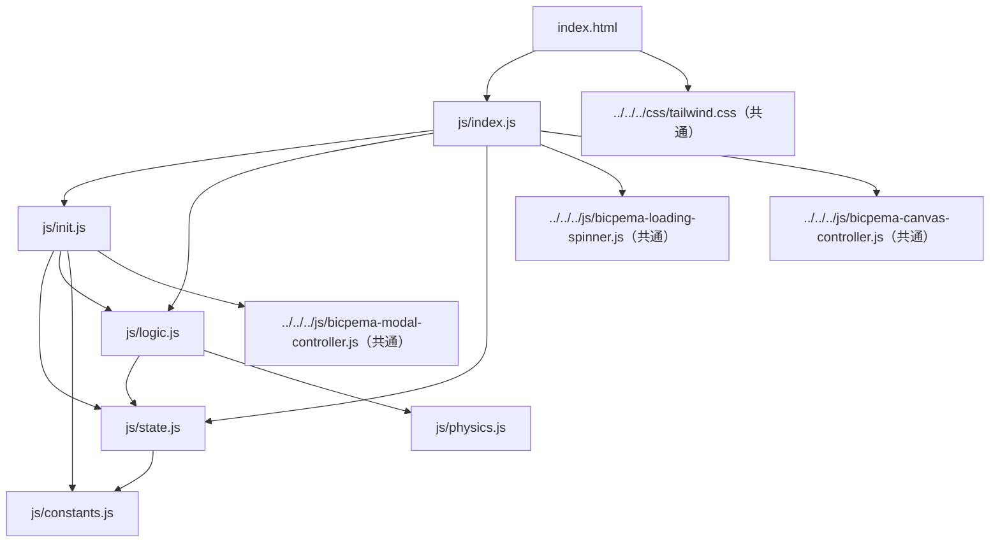
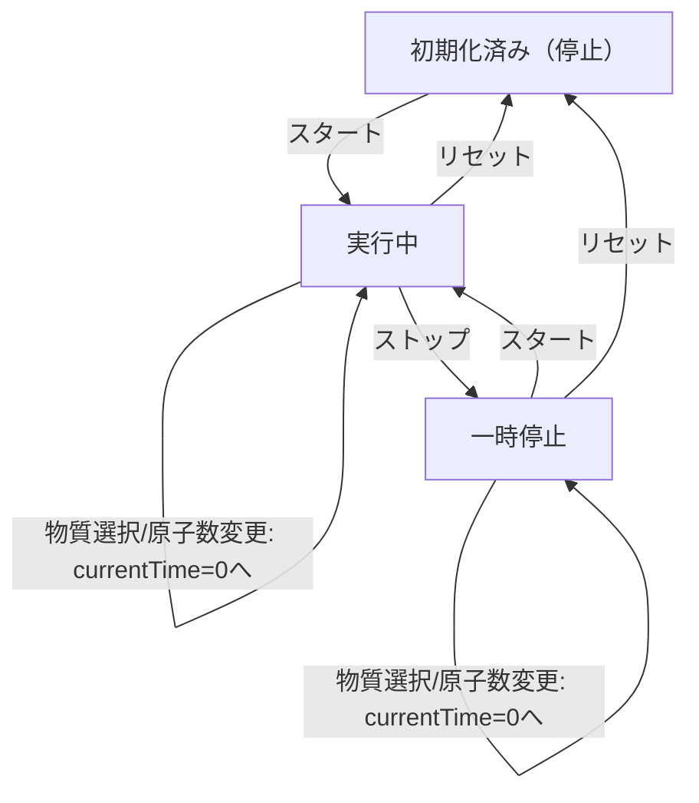

# 半減期シミュレーション設計書

## 1. 概要

- 対象: 放射性崩壊の半減期（炭素14 / ヨウ素131 / セシウム137）を可視化するp5.jsシミュレーション。放射性崩壊曲線グラフと、個々の原子の崩壊状況を表す原子グリッドを同時に表示する。
- 想定利用者: 物理・化学の学習者（放射性崩壊・半減期の概念を学ぶ中学〜高校程度）。
- 確定事項:
    - 右上の「⚙ 設定」ボタンで設定パネルを開閉し、崩壊物質（C-14 / I-131 / Cs-137）の選択と、原子グリッドの原子数（＋／－）を変更できる。
    - 左下の「スタート/ストップ」ボタンで時間経過のON/OFF、「リセット」ボタンで経過時間と原子状態の初期化ができる。
    - 崩壊モデルは `N(t) = N0 * (1/2)^(t/halfLife)` の指数関数曲線として実装されている（`js/physics.js`）。
    - 個々の原子の崩壊有無は、原子ごとに割り当てられたランダムしきい値（0〜1）と現在の崩壊率の比較によって決まる（確率的表現）。
- 推定事項:
    - 崩壊物質の選択肢（C-14=5730年、I-131=8日、Cs-137=30年）は教材として代表的な放射性同位体を採り上げたものと推定される（コード上はコメントに数値の意味の記載はあるが、選定理由の記載はない）。

## 2. 画面設計

画面の概要（実装から確認できる構成）:

- 画面構成:
    - 上部ナビバー（`#navBar`）: 高さ60px固定、Bicpemaロゴリンクとタイトル「半減期」を表示。
    - ナビバー直下（`margin-top: 60px`）にp5キャンバス（`#p5Canvas`）。`BicpemaCanvasController(true, false, 1.0, 1.0)` により、ウィンドウ幅・高さ（ナビバー分を除く）に収まる16:9固定アスペクト比で生成される。
    - 左下に操作ボタン群（`#toggleBtnWrapper`: スタート/ストップ、リセット）。位置はキャンバスの`getBoundingClientRect()`を基準に`elementPositionInit`が`fixed`配置で動的に算出する（ビューポート固定ではなくキャンバス左下基準）。
    - 右上に設定ボタン（`#settingsBtnWrapper`）。同様にキャンバス右上基準で`fixed`配置。
    - 設定ボタンの下に設定パネル（`#settingsPanel`）。既定では`hidden`クラスで非表示。
    - 画面全体を覆うローディングスピナー（`#loadingSpinner`）。p5の初回`draw()`実行時に`hideLoadingSpinner()`で非表示化される。
- UI要素:
    - 物質選択（ラジオボタン、`name="material"`）:
        - `#mat5730`「炭素 C-14」（value=5730、初期選択）
        - `#mat8`「ヨウ素 I-131」（value=8）
        - `#mat30`「セシウム Cs-137」（value=30）
    - 原子数調整: `#atomPlusBtn`（＋）、`#atomMinusBtn`（－）。グリッドの1辺の原子数`state.n`を1ずつ増減。
    - 操作: `#toggleBtn`（スタート/ストップ切替）、`#resetBtn`（リセット）。
- 確定事項:
    - 設定パネルの開閉は`initCollapse`（`vite/js/bicpema-modal-controller.js`）による単純なトグルであり、パネル外クリックやEscapeキーでは閉じない（設定ボタンの再クリックのみで閉じる）。
    - 右クリックのコンテキストメニュー無効化や、本シミュレーション固有のスクロール抑止CSS（`overflow:hidden`等）は、`half-life`ディレクトリ内・共通アセット（`tailwind.css`）内のいずれにも見当たらない（詳細は「8. 未確定事項」参照）。
    - 本シミュレーションは`css/style.css`を持たず、レイアウトは`index.html`内のTailwindユーティリティクラスと共通`vite/css/tailwind.css`のみで構成されている。

## 3. 機能仕様

- 開始/停止（トグル）:
    - `#toggleBtn`押下で`state.isRunning`を反転し、ボタン文言を「スタート」⇔「ストップ」に切り替える（`js/init.js` `valueInit`）。
    - 経過時間`state.currentTime`はトグルでは初期化されない（停止→再開で時間が継続する）。
- リセット:
    - `#resetBtn`押下で`state.isRunning=false`、`state.currentTime=0`とし、`initAtoms()`で原子配列を再生成する。ボタン文言も「スタート」に戻す。
    - 物質選択・原子数（`state.n`）はリセットの対象外（変更されない）。
- 原子数変更（＋／－）:
    - `#atomPlusBtn`/`#atomMinusBtn`押下で`state.n`を`p.constrain`により`MIN_GRID_SIDE(4)`〜`MAX_GRID_SIDE(30)`の範囲でクランプしつつ±1し、`state.N0 = state.n * state.n`を再計算。
    - `state.currentTime = 0`とし、`initAtoms()`で原子配列を再生成する（`isRunning`状態は変更しない＝実行中ならそのまま実行継続）。
- 物質選択変更:
    - ラジオボタンの`change`イベントで`state.halfLife`を選択値（8/30/5730）に更新し、`state.maxYears = state.halfLife * MAX_YEARS_MULTIPLIER(5)`、`state.T = state.halfLife / TIME_STEPS_PER_HALF_LIFE(150)`を再計算。
    - `state.currentTime = 0`とし、`initAtoms()`で原子配列を再生成する（`isRunning`状態は変更しない）。
- 自動ループ（実行中の暗黙リセット）:
    - `drawSimulation`内で毎フレーム、実行中なら`state.currentTime += state.T`し、`state.currentTime > state.maxYears`になった時点で`state.currentTime = 0`かつ`initAtoms()`を実行する（`isRunning`は維持されたまま、グラフ・原子グリッドの表示が最初から繰り返される）。
- 境界条件:
    - 原子グリッドの1辺の原子数`state.n`は`MIN_GRID_SIDE=4`〜`MAX_GRID_SIDE=30`（原子総数は16個〜900個）でクランプされる。範囲外への操作は無視（クランプ後の値で据え置き）。
    - 物質選択は3択のラジオボタンのみで、数値の自由入力欄は存在しない。
    - リサイズ時（`windowResized`）は`resizeScreen`＋`elementPositionInit`のみが呼ばれ、`state`（経過時間・原子配列・実行状態）は再初期化されない＝進行中のシミュレーションはリサイズをまたいで継続する。

## 4. ロジック仕様

- 実行モデル:
    - p5.jsインスタンスモード（`p.preload`/`p.setup`/`p.draw`/`p.windowResized`）を利用。
    - ESModule（`import`/`export`）ベースで実装され、`window`グローバル公開は行われていない。
    - `p.preload`で原子画像（Firebase Storage上のPNG）を`p.loadImage`によりロードする（画像URLはハードコード。読み込み完了前は`state.img`が未確定）。
    - `p.draw`内で毎フレーム`p.scale(p.width / 1000)`を適用し、論理座標系の幅を1000として`drawSimulation`内の絶対座標（padding=80, graphW=840等）を実キャンバス幅に合わせて拡縮している。
    - フレームレートは`FRAME_RATE=30`に固定（`settingInit`）。60fpsではなく30fpsに抑制されている（コメントによれば崩壊曲線・原子グリッドの状態更新中心のため、との理由付け）。
- 状態管理（`js/state.js`の`state`オブジェクト）:
    - `isRunning`: シミュレーション進行ON/OFF。
    - `currentTime`: 経過時間（`halfLife`と同一単位＝年 or 日）。
    - `halfLife`: 選択中物質の半減期（初期値は炭素14の5730）。
    - `maxYears`: グラフの表示上限時間（`halfLife * 5`）。到達すると自動的に`currentTime`が0へ巻き戻る。
    - `T`: 1フレームあたりの時間増分（`halfLife / 150`）。
    - `n`: 原子グリッドの1辺の個数（初期値8、範囲4〜30）。
    - `N0`: 原子の総数（`n * n`、初期値64）。
    - `atoms`: 各原子に割り当てたランダムしきい値（0〜1）の配列。長さは`N0`。
    - `count`: 直近の描画フレームで「崩壊後」と判定された原子数（`drawAtomGrid`内で毎フレーム再計算）。
    - `img`: プリロードした原子画像（`p5.Image`）。
- 描画処理（`js/logic.js` `drawSimulation`）:
    - 背景を白で塗りつぶす。
    - `isRunning`なら`currentTime`を`T`だけ加算し、`maxYears`超過で`currentTime`と`atoms`を初期化（自動ループ）。
    - `drawHalfLifeGuides`: 半減期0〜4倍（5本）のガイド線と、縦軸ラベル（1, 1/2, 1/4, 1/8, 1/16）、横軸の半減期倍数の目盛りを描画。
    - `drawAxes`: X軸・Y軸（矢印付き）と軸ラベル（横軸は物質により「経過日数(日)」/「経過年数(年)」、縦軸はヨウ素/炭素のみ物質名ラベルあり）を描画。
    - `drawDecayCurve`: `computeRemainingCount`を`0〜maxYears`の範囲で`T`刻みに評価し、折れ線（`beginShape`/`vertex`/`endShape`）として崩壊曲線を描画。
    - 現在時刻マーカー: `computeDecayFraction(halfLife, currentTime)`から求めた現在の残存率をもとに、グラフ上に赤い円（`ellipse`）で現在位置を表示。
    - `drawAtomGrid`: 原子をグリッド状（`state.n × state.n`）に円で描画。各原子について`decayRate < atoms[i]`なら「未崩壊」（青）、そうでなければ「崩壊後」（オレンジ）とし、`state.count`（崩壊後個数）を集計。あわせて、崩壊前後の元素画像（`state.img`）・元素名テキスト（物質ごとに炭素14→窒素14、ヨウ素131→キセノン131、セシウム137→バリウム137）・個数表示・タイトル文言「半減期シミュレーター」を描画。
- 計算モデル（`js/physics.js`）:
    - `computeDecayFraction(halfLife, t) = 0.5 ^ (t / halfLife)`（残存割合）。
    - `computeRemainingCount(n0, halfLife, t) = n0 * computeDecayFraction(halfLife, t)`（残存個数）。
    - グラフ曲線・現在マーカーはこの決定論的な指数関数に基づく一方、原子グリッド個々のセルの色（崩壊/未崩壊）は`atoms[i]`という原子ごとの乱数しきい値と`decayRate`の比較による確率的表現であり、グラフ上のマーカー位置（理論値）と原子グリッドの実際の崩壊数（`state.count`、乱数依存）は厳密には一致しない設計になっている。
- 推定事項:
    - 30fpsへの制限は主にCPU負荷軽減が目的と推定される（コード上のコメントに明記あり）が、具体的な負荷測定値の記載はない。
    - `drawHalfLifeGuides`が半減期0〜4倍（5本）のみを描画し、`maxYears`が半減期5倍まで表示される非対称性は意図的な仕様か実装上の単純化かは不明。

## 5. ファイル構成と責務

- `vite/simulations/half-life/index.html`
    - 画面のDOM（ナビバー、キャンバスコンテナ、左下操作ボタン、右上設定ボタン、設定パネル、ローディングスピナー）を保持し、`js/index.js`を`type="module"`で読み込む。専用の`css/style.css`は持たず、Tailwindユーティリティクラスのみでスタイリングしている。
- `vite/simulations/half-life/js/index.js`
    - p5インスタンス起動（`new p5(sketch)`）と各ライフサイクル（`preload`/`setup`/`draw`/`windowResized`）の紐付け。
    - `preload`で原子画像をロードし`state.img`へ格納。
    - `setup`で`BicpemaCanvasController(true, false, 1.0, 1.0)`によるキャンバス生成（16:9固定）、`settingInit`/`elementSelectInit`/`elementPositionInit`/`valueInit`の呼び出し。
    - `draw`で初回のみ`hideLoadingSpinner()`を呼び、毎フレーム`p.scale(p.width/1000)`後に`drawSimulation(p)`を実行。
    - `windowResized`で`canvasController.resizeScreen(p)`とボタン位置再計算（`elementPositionInit`）を実行（状態の再初期化はしない）。
- `vite/simulations/half-life/js/state.js`
    - `state`オブジェクト（`img`, `currentTime`, `halfLife`, `maxYears`, `T`, `n`, `N0`, `atoms`, `isRunning`, `count`）の定義と初期値。
- `vite/simulations/half-life/js/constants.js`
    - フレームレート、3物質の半減期定数、初期半減期、グラフ最大時間の倍率、時間刻みの分割数、グリッド原子数の初期値・最小値・最大値を定義。
- `vite/simulations/half-life/js/init.js`
    - `settingInit(p)`: `frameRate(FRAME_RATE)`設定。
    - `elementSelectInit(p)`: 各種DOM要素の参照を`state`に保持し、`initCollapse`で設定パネルの開閉を初期化。
    - `elementPositionInit(p)`: キャンバスの`getBoundingClientRect()`を基準に、操作ボタン群・設定ボタン・設定パネルの`fixed`位置とサイズを動的計算（`setup`時と`windowResized`時に呼ばれる）。
    - `valueInit(p)`: `initAtoms()`の初回呼び出しと、トグル/リセット/原子数±/物質選択ラジオの各イベントリスナー登録（機能仕様に記載の挙動を実装）。
- `vite/simulations/half-life/js/logic.js`
    - `initAtoms()`: `state.N0`個のランダムしきい値配列を再生成。
    - `drawSimulation(p)`: 背景描画・時間更新・自動ループ判定を行い、`drawHalfLifeGuides`/`drawAxes`/`drawDecayCurve`/現在マーカー/`drawAtomGrid`（いずれも本ファイル内の非公開関数）を呼び出して画面全体を描画。
- `vite/simulations/half-life/js/physics.js`
    - `computeDecayFraction`/`computeRemainingCount`: 放射性崩壊の指数関数モデルを実装する純粋関数（p5やDOMに非依存）。
- 共通資産依存:
    - `vite/js/bicpema-canvas-controller.js`（`BicpemaCanvasController`）: 16:9固定キャンバスサイズの生成・リサイズ。
    - `vite/js/bicpema-modal-controller.js`（`initCollapse`）: 設定パネルの表示/非表示トグル。
    - `vite/js/bicpema-loading-spinner.js`（`hideLoadingSpinner`）: 初回描画完了時のスピナー非表示化。
    - `vite/css/tailwind.css`: 全体のスタイリング基盤（本シミュレーション固有のCSSファイルはなし）。

## 6. 状態遷移

- 初期化済み（停止）: `setup`実行後。`isRunning=false`, `currentTime=0`, `atoms`は初期原子数（64個）分のランダムしきい値。
- 実行中: `#toggleBtn`押下で`isRunning=true`（文言「ストップ」）。`currentTime`が毎フレーム`T`ずつ加算される。
- 一時停止: 実行中に`#toggleBtn`を再度押下すると`isRunning=false`（文言「スタート」）。`currentTime`は保持される。
- 再開: 一時停止中に`#toggleBtn`押下で`isRunning=true`に戻り、保持していた`currentTime`から再開する。
- リセット: `#resetBtn`押下でどの状態からでも「初期化済み（停止）」へ戻る（`currentTime=0`、`atoms`再生成、`isRunning=false`）。
- 設定変更（物質選択／原子数±）: どの状態からでも`currentTime=0`・`atoms`再生成が発生するが、`isRunning`は変更前の値を維持する（実行中に設定変更すると、時間だけ0に戻って実行を継続する）。
- 自動ループ: 実行中に`currentTime`が`maxYears`を超えると、`isRunning`を維持したまま`currentTime=0`・`atoms`再生成が自動的に行われる（ユーザー操作なしで最初から繰り返す）。

## 7. 既知の制約

- 原子グリッドの原子数は最大900個（30×30）まで許容されており、毎フレーム`N0`個の`ellipse`描画が発生する。`MAX_GRID_SIDE=30`という上限はコード上で既に設けられているが、この上限値自体がどの端末でも十分に軽量かは実測されていない。
- 崩壊曲線グラフのマーカー位置（決定論的な理論値）と、原子グリッドの実際の崩壊個数（乱数依存）は一致しない場合がある。教材として意図された表現か、視認上の違和感になり得るかは要検討。
- 設定パネルは`initCollapse`によるトグルのみで、パネル外クリックやEscapeキーでは閉じない。ユーザーが設定ボタンを再度押さない限り開いたままになる。
- `windowResized`では`state`（経過時間・実行状態・原子配列）を再初期化しないため、リサイズ前後で見た目のレイアウトは追従するが、シミュレーションの進行状態はそのまま継続する（他シミュレーションでリサイズ時に再初期化する設計と異なる可能性がある）。
- 原子画像はFirebase Storageの外部URLからロードされる。ネットワーク不通・画像取得失敗時、`state.img`が利用できず、`drawAtomGrid`内の画像・元素名テキスト・個数テキスト部分（`if (state.img)`のブロック）が描画されない（グラフや原子グリッド本体の円描画自体には影響しない）。

## 8. 未確定事項

- 本シミュレーション固有のスクロール抑止（`overflow:hidden`等）や右クリックコンテキストメニュー無効化のCSS/JSは、`half-life`配下にも共通アセット（`vite/css/tailwind.css`、参照した共通JS）にも見当たらなかった。AGENTS.mdの実装方針「シミュレーションはスクロールができないように実装」との対応関係が実装上どう担保されているか（レイアウトが常に収まる前提なのか、対応漏れなのか）は未確認。
- 原子ごとのランダムしきい値による確率的な崩壊表現と、グラフ曲線側の決定論的な崩壊率表示との「ずれ」が、教材設計上意図されたもの（統計的性質の提示）か、単純化の結果かは実装コードからは判断できない。
- 原子グリッドの1辺の個数の範囲（`MIN_GRID_SIDE=4`〜`MAX_GRID_SIDE=30`）の教材設計上の推奨値・根拠は不明。
- `drawHalfLifeGuides`が半減期0〜4倍（5本）のみ描画し、`maxYears`（半減期5倍）まで表示範囲があることの非対称性が意図的な仕様かどうかは不明。
- テンプレート（`examples/シミュレーション設計書.md`）が言及する「情報アイコン」や右クリック無効化に相当するUI・処理が本シミュレーションには存在しない点について、意図的に不要と判断されたものか、他シミュレーションとの実装差異（未対応）かは不明。
