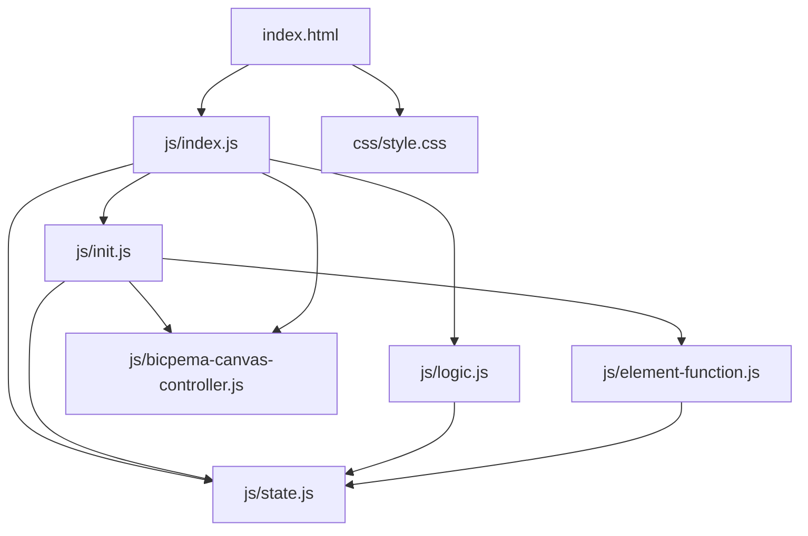
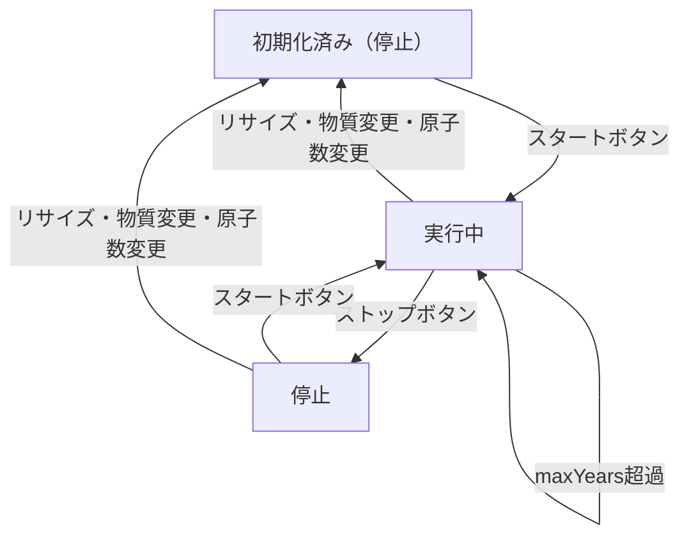

# 半減期シミュレーション設計書

## 1. 概要

- 対象: 放射性崩壊（半減期）を可視化する p5.js シミュレーション。
- 想定利用者: 中学〜高校の物理・化学学習者。半減期の概念と崩壊曲線を体験学習する用途。
- 確定事項:
  - ナビバーのラジオボタンで物質（炭素 C-14 / ヨウ素 I-131 / セシウム Cs-137）を選択できる。
  - ナビバーの +/- ボタンで原子グリッドの一辺の原子数 `n`（4〜30）を変更できる。
  - 左下のトグルボタンでシミュレーションの開始・停止を切り替える。
  - 崩壊曲線グラフ・原子グリッド・元素崩壊イメージ画像を同時表示する。
- 推定事項:
  - キャンバスはウィンドウ全体に広がるフルスクリーン表示。
  - ウィンドウリサイズ時はキャンバスをリサイズして状態をリセットする。

---

## 2. 画面設計

- 画面構成:
  - 上部ナビバー（タイトル「半減期シミュレーション」、物質ラジオボタン、原子数 +/- ボタン）。
  - 中央〜下部に p5 キャンバス（ウィンドウ幅・高さいっぱい）。
  - 左下にトグルボタン（スタート/ストップ）。
  - キャンバス内左側に崩壊曲線グラフ（X 軸: 経過時間、Y 軸: 物質の量）。
  - キャンバス内右上に原子グリッド（橙=未崩壊、青=崩壊）。
  - キャンバス内左下に元素崩壊イメージ画像と元素名ラベル。
- UI 要素:
  - 物質選択: ラジオボタン3択（炭素 C-14 / ヨウ素 I-131 / セシウム Cs-137）。
  - 原子数: ー/＋ ボタン、現在値スパン表示。
  - 操作: トグルボタン（スタート → ストップ → スタート）。
- 確定事項:
  - 右クリックのコンテキストメニューは無効化。
  - body は `overflow: hidden` でスクロール不可。

---

## 3. 機能仕様

- スタート/ストップ:
  - 「スタート」ボタン押下で `state.isRunning = true`、ボタンを「ストップ」（赤）に変更。
  - 「ストップ」ボタン押下で `state.isRunning = false`、ボタンを「スタート」（青）に変更。
- 原子数変更:
  - ＋ ボタン: `state.n` を `constrain(n+1, 4, 30)` で更新、`N0=n*n`、`currentTime=0`、原子再生成。
  - ー ボタン: `state.n` を `constrain(n-1, 4, 30)` で更新、同様の再初期化。
- 物質変更:
  - ラジオボタン変更時: `halfLife` を選択値（数値）に更新し、`maxYears=halfLife*5`、`T=halfLife/150`、`currentTime=0`、原子再生成。
- 時間経過のリセット:
  - `currentTime > maxYears` になったとき、自動的に `currentTime=0` にリセットし原子再生成。
- ウィンドウリサイズ:
  - キャンバスをリサイズし、`valueInit` でシミュレーションを停止・リセット（halfLife と n は保持）。
- 境界条件:
  - `n` の最小値は 4、最大値は 30（`p.constrain` で制限）。

---

## 4. ロジック仕様

- 実行モデル:
  - p5.js インスタンスモード（setup/draw/preload/windowResized）を利用。
  - ES Modules（`import`）ベースで実装し、`window` グローバル公開は行わない。
- 状態管理（`state.js`）:
  - `isRunning`: シミュレーション進行 ON/OFF。
  - `currentTime`: 現在の経過時間。
  - `halfLife`: 選択物質の半減期。
  - `maxYears`: 表示最大時間（`halfLife * 5`）。
  - `T`: 1 フレームあたりの経過時間（`halfLife / 150`）。
  - `n`: 原子グリッドの一辺の数。
  - `N0`: 初期原子数（`n * n`）。
  - `atoms`: 各原子の崩壊閾値ランダム値の配列（長さ `N0`）。
  - `count`: 現フレームで崩壊した原子数。
  - `img`: Firebase Storage から取得した原子崩壊イメージ画像。
- 描画処理（`logic.js` の `drawSimulation`）:
  1. `background(255)` で背景クリア。
  2. `isRunning` が真なら `currentTime += T`。
  3. `currentTime > maxYears` なら 0 にリセットし原子再生成。
  4. `drawHalfLifeGuides` → `drawAxes` → `drawDecayCurve` でグラフを描画。
  5. 現在地点のマーカー（赤丸）を描画。
  6. `drawAtomGrid` で原子グリッドを描画（崩壊判定: `decayRate < atoms[i]` で青）。
  7. `drawAtomImage` で元素崩壊イメージと個数ラベルを描画。
- 崩壊率の計算:
  - `currentDecayRate = 0.5 ^ (currentTime / halfLife)`
  - 各原子 i の崩壊判定: `currentDecayRate < atoms[i]` → 崩壊済み（青）

---

## 5. ファイル構成と責務

| ファイル                                                         | 役割                                                         |
| ---------------------------------------------------------------- | ------------------------------------------------------------ |
| `vite/simulations/half-life/index.html`                          | UI レイアウト（ナビバー、p5 コンテナ、ラジオ・ボタン群）    |
| `vite/simulations/half-life/css/style.css`                       | レイアウト・スクロール無効化                                 |
| `vite/simulations/half-life/js/index.js`                         | p5 初期化、preload/setup/draw/windowResized の橋渡し         |
| `vite/simulations/half-life/js/state.js`                         | 共有状態管理、`initAtoms` ユーティリティ                     |
| `vite/simulations/half-life/js/init.js`                          | 初期設定（FPS / 要素選択・イベント登録 / 値初期化）          |
| `vite/simulations/half-life/js/logic.js`                         | 描画ループ（グラフ・グリッド・画像）                         |
| `vite/simulations/half-life/js/element-function.js`              | 各操作ボタン・ラジオのイベントハンドラ                       |
| `vite/simulations/half-life/js/bicpema-canvas-controller.js`     | フルスクリーンキャンバスとリサイズ処理                       |

---

## 6. 状態遷移

- 初期化済み（停止）: setup 実行後。`isRunning=false`、`currentTime=0`。
- 実行中: スタートボタン押下で `isRunning=true`、時間が進む。
- 停止: ストップボタン押下で `isRunning=false`、時間は保持。
- リセット（自動）: `currentTime > maxYears` で自動的に `currentTime=0` に戻り実行継続。
- リセット（手動）: ウィンドウリサイズ、+/- ボタン、物質変更で `currentTime=0`、原子再生成。

---

## 7. 既知の制約

- キャンバス座標系は元の 800×700 ベースのレイアウトを踏襲しており、極端に小さいウィンドウでは崩壊イメージ画像とグラフが重なる場合がある。
- `atoms` 配列は `p.random` を使用するため、リセット毎に乱数パターンが変化する。
- `drawAtomImage` の座標は固定ピクセル値のため、大きなキャンバスでは左下に余白が生じる。
- ウィンドウリサイズで全状態がリセットされ、進行中のシミュレーションが停止する。
- 画像が Firebase Storage 依存のため、URL 変更や認証切れで表示不可になる。

---

## 8. 未確定事項

- 崩壊イメージ画像・グリッドの表示位置をキャンバスサイズに合わせてレスポンシブ化する改善の余地がある。
- 物質リストに他の放射性同位体（例: ウラン U-238）の追加可能性。
- ストップ後の「リセット」ボタン追加の検討。
