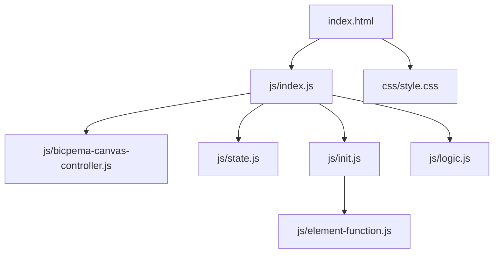
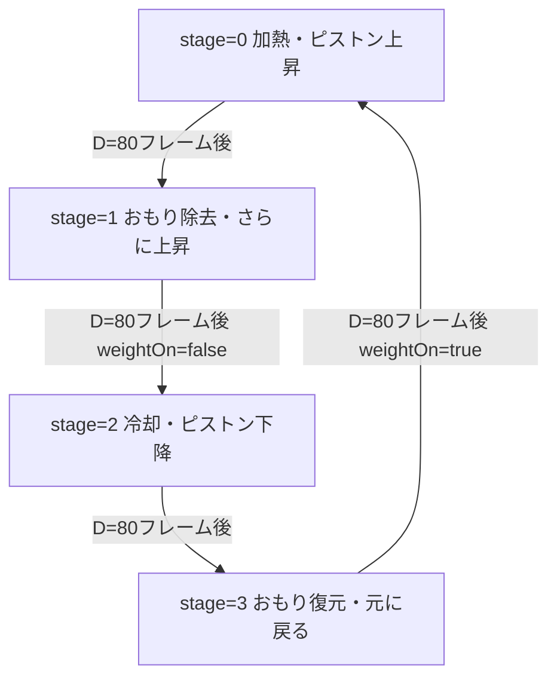
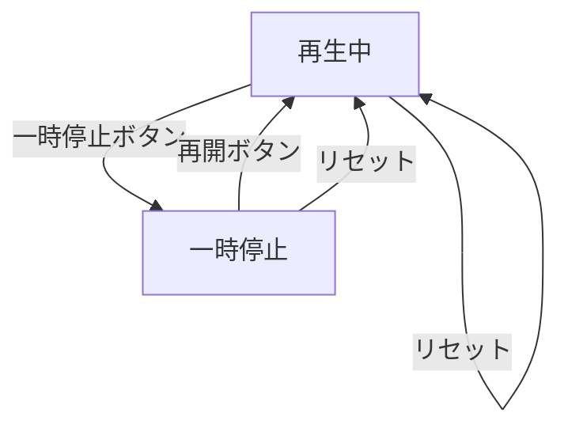

# 熱機関シミュレーション設計書

## 1. 概要

- 対象: 熱機関の4過程（等温膨張・等圧膨張・等温圧縮・等圧圧縮）を可視化するp5.jsシミュレーション。
- 想定利用者: 物理基礎の学習者（高校程度）。
- 確定事項:
  - 4つの熱力学的過程がアニメーションで自動サイクル表示される。
  - 左下の操作ボタンで一時停止・再開・リセットができる。
  - 加熱時は炎画像、冷却時は氷画像が表示される。
  - おもりは過程2（stage=1）で取り除かれ、過程4（stage=3）で戻る。
- 推定事項:
  - 各過程D=80フレームで遷移する。

## 2. 画面設計

- 画面構成:
  - 上部バー（タイトル "熱機関"、ホームリンク）。
  - p5キャンバス（フルウィンドウ、ナビバー分を除く）にピストン機構・説明テキスト・画像を描画。
  - 左下に操作ボタン群（⏸ 一時停止、🔄 リセット）。
  - 設定モーダルなし（設定変更なし）。
- UI要素:
  - 操作: 一時停止/再開（同一ボタン）、リセット。
- 確定事項:
  - アニメーションは自動再生（`state.isPlaying=true` で起動）。
  - bodyは固定レイアウトでスクロール不可。
  - 各ステージの説明テキストを左上に表示:
    - stage=0: "① 加熱しておもりを持ち上げる仕事をする"
    - stage=1: "② おもりを取り除く"
    - stage=2: "③ 残った熱を放出させて元の状態に戻す"
    - stage=3: "④ ①に戻る（繰り返し）"

## 3. 機能仕様

- 一時停止/再開:
  - 「⏸ 一時停止」ボタン押下で `state.isPlaying=false`、ボタンラベルを「▶ 再開」に変更。
  - 「▶ 再開」押下で `state.isPlaying=true`、ボタンラベルを「⏸ 一時停止」に戻す。
- リセット:
  - 「🔄 リセット」ボタンで `state.stage=0`、`state.weightOn=true`、`state.t=0`、`state.pistonY=160`、`state.isPlaying=true`、ボタンラベルを「⏸ 一時停止」に更新。
- アニメーションサイクル（`animateCycle(p)` 内）:
  - 各stage D=80フレームかけてpistonYをlerp補間で移動。
  - stage=0: pistonY 160→130（加熱・ピストン上昇）。
  - stage=1: pistonY 130→80（おもり除去・さらにピストン上昇）。
  - stage=2: pistonY 80→130（冷却・ピストン下降）。
  - stage=3: pistonY 130→160（おもり復元・元の状態へ）。
  - stage=1完了時: `state.weightOn=false`。
  - stage=3完了時: `state.weightOn=true`。
  - `state.pistonY = p.constrain(pistonY, 60, VH-300)`でクランプ。
- 境界条件:
  - stageは0〜3の循環（`stage = (stage + 1) % 4`）。
  - isPlayingがfalseのとき、animateCycleは呼ばれず静止表示。

## 4. ロジック仕様

- 実行モデル:
  - p5.jsインスタンスモード（preload/setup/draw/windowResized）を利用。
  - ESModule（`import`）ベースで実装。
- 座標系:
  - 仮想キャンバス VW=1200px, VH=800px（logic.js内定数）。
  - draw() 内で `p.scale(p.width / VW, p.height / VH)` を適用（非固定比率・フルウィンドウ）。
  - ピストン機構は `gx = VW/2 - 125`、`gy = VH/2 - 140` を中心に配置。
  - BicpemaCanvasController は `fixed=false` モード（ウィンドウ全体使用）。
- 状態管理:
  - `state.stage`: 現在の熱力学過程 (0-3)。
  - `state.weightOn`: おもりが乗っているか。
  - `state.t`: アニメーションカウンタ (0〜D)。
  - `state.pistonY`: ピストンY座標（仮想座標系）。
  - `state.isPlaying`: アニメーション進行ON/OFF。
  - `state.img_flame`, `state.img_weight`, `state.img_ice`: 読込済み画像。
  - `state.font`: ZenMaruGothicフォント。
- 描画処理（`logic.js`）:
  - `drawSimulation(p)`: background → drawChamber → animateCycle（isPlayingのとき）。
  - `drawChamber(p)`: 炎/氷画像・ピストン（エ型形状）・U字ガイド・おもり・ガス・説明テキストを描画。
  - `animateCycle(p)`: p.lerp でpistonYを補間、t++でカウンタ進行、D超過時にstage遷移。
- FPS: 60。

## 5. ファイル構成と責務

- `vite/simulations/heat-engine/index.html`
  - 画面DOM（ナビバー、左下操作ボタン群）と `js/index.js` / `css/style.css` の参照を保持。
- `vite/simulations/heat-engine/css/style.css`
  - 全体レイアウト（フルウィンドウ）、スクロール無効化、左下ボタンUIをスタイリング。
- `vite/simulations/heat-engine/js/index.js`
  - p5インスタンス起動（`new p5(sketch)`）と各ライフサイクル（preload/setup/draw/windowResized）を紐付け。
  - `BicpemaCanvasController`（fixed=false）でフルウィンドウキャンバスを制御。
  - preload内で炎・おもり・氷画像とフォントを読込。
- `vite/simulations/heat-engine/js/state.js`
  - `state`オブジェクト（stage, weightOn, t, pistonY, img_flame, img_weight, img_ice, font, isPlaying）。
- `vite/simulations/heat-engine/js/init.js`
  - 定数（FPS）をexport。
  - `settingInit(p, canvasController)`: キャンバス生成・frameRate設定。
  - `elCreate(p)`: 再生/停止ボタン・リセットボタンのイベント登録。
  - `initValue(p)`: stage/t/pistonY/weightOn/isPlayingを初期化。
- `vite/simulations/heat-engine/js/logic.js`
  - `drawSimulation(p)`: 全描画処理を統括。
  - `drawChamber(p)`: ピストン機構描画。
  - `animateCycle(p)`: アニメーション更新処理。
- `vite/simulations/heat-engine/js/element-function.js`
  - `onPlayPause()`: isPlayingトグル・ボタンラベル更新。
  - `onReset()`: state全体を初期化・ボタンラベルリセット。
- `vite/simulations/heat-engine/js/bicpema-canvas-controller.js`
  - フルウィンドウ（fixed=false）のキャンバスサイズ計算・生成・リサイズ処理。

## 6. 状態遷移

- 自動サイクル（isPlaying=true 時）:

- ユーザー操作:

## 7. 既知の制約

- キャンバスは非固定比率（fixed=false）のため、ウィンドウ形状によってはピストン機構の見た目が変形する。
- 仮想座標系（VW=1200, VH=800）はX/Y軸を独立にスケーリングするため、正円が楕円に見える場合がある。
- リサイズ時は `canvasController.resizeScreen(p)` のみ呼ばれ、アニメーション状態は保持される。
- 画像（炎・おもり・氷）のサイズは仮想座標系固定のため、小さいウィンドウでは小さく表示される。

## 8. 未確定事項

- 情報アイコンの挙動（リンクやモーダル）が未実装かどうか。
- 各熱力学過程の物理的な厳密性（カルノーサイクルとの対応関係）。
- 元のsketch.jsにあったクリックでフルスクリーン切替（mousePressed）の機能は削除済み。
