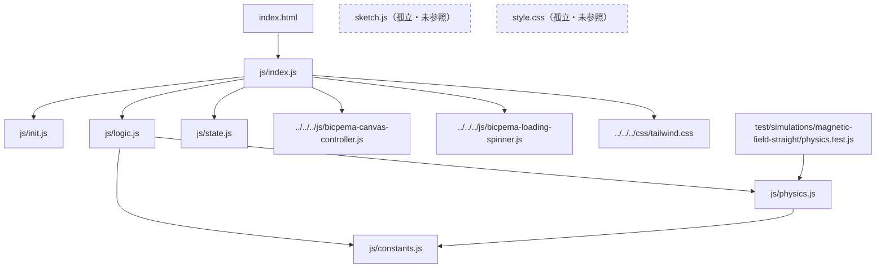
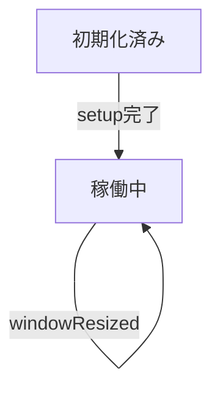

# 直線電流の磁場シミュレーション設計書

## 1. 概要

- 対象: 直線電流のまわりにできる磁場（アンペールの法則・右ねじの法則）を3D表示で可視化するp5.jsシミュレーション。
- 想定利用者: 中学校・高校で物理（電磁気）を学ぶ学習者（`content/post/直線電流の磁場/index.md` より）。
- 確定事項:
    - 左上の常時表示パネルで「電流の強さ（スライダー、-4〜4A、整数刻み）」を変更できる。
    - 電流値の変化に応じて、導線を流れる電流の向き（矢印）と、同心円状の磁力線・その向き・色・太さ（磁場の強さの目安）がリアルタイムに再計算・再描画される。
    - マウスドラッグによる3D視点操作（`orbitControl`）が可能。
    - 一時停止/再開・リセットの操作ボタンは存在せず、`draw`ループは常時実行される（アニメーションのON/OFFを切り替える概念がない）。
- 推定事項:
    - 記事（`content/post/直線電流の磁場/index.md`）の「使用方法」には「▶ 開始」「⚙ 設定」「🔄 リセット」ボタンの説明があるが、これは他シミュレーション向けの共通テンプレート文言が流用されたままで、本シミュレーションの実装には対応するUIが存在しない（記事と実装の不整合）。

## 2. 画面設計

- 画面構成:
    - 上部ナビバー（高さ60px固定、`#navBar`）: 「Bicpema」ロゴリンクと「直線電流の磁場」というタイトル表示のみ。ホームアイコンや情報アイコンは無し。
    - ナビバー下、`#p5Container` 内の `#p5Canvas` にp5キャンバスを中央寄せで配置（WEBGL、`BicpemaCanvasController(false, true, 1.0, 1.0)` により16:9固定なしでウィンドウ幅・高さいっぱいに描画）。
    - 左上（`top: 4.5rem` 付近）に半透明白背景の設定パネルを常時表示。右上への設定ボタン・モーダル起動の仕組みは無い。
    - 左下の再生/停止ボタンは無い（AGENTS.mdの標準UI規約に反する構成 — 本シミュレーションは共通UIパターン導入前の実装のまま）。
    - 初回`draw()`実行時に`#loadingSpinner`（画面全面のスピナー）を非表示にする。
- UI要素（左上パネル内）:
    - 電流スライダー: `#currentSlider`（`min=-4`, `max=4`, `step=1`, 初期値`1`）。
    - 電流値ラベル: `#currentLabel`（「電流の強さ: 〇〇 A」、小数第1位表示）。
    - 公式表示: `B = μ0I/(2πr)` の固定テキストと μ0・I の説明。
    - 向きの関係説明: `#directionRelationLabel`（固定テキスト。「電流 +（正方向）→ 磁場 反時計回り（右ねじ）」等）。
    - 現在の磁場の向き表示: `#fieldDirectionLabel`（電流値に応じて動的更新）。
    - 相対磁場強度表示: `#bValueDisplay`（観測半径r=50における B=|I|/r の値を動的更新）。
- 確定事項:
    - `<body oncontextmenu="return false;">` により右クリックのコンテキストメニューは無効化。
    - `html, body { margin: 0; padding: 0; }` かつ `canvas { display: block; }`（`style.css`）でスクロールしない前提のレイアウト。ただし、この`style.css`は`index.html`から参照されておらず、実際のグローバルスタイルは共通の`vite/css/tailwind.css`（`js/index.js`が`import`）に依存している（後述「未確定事項」参照）。
    - 3D視点は`p.camera(0, -300, 600, 0, 0, 0, 0, 1, 0)`で初期化され、`orbitControl()`によりユーザーがドラッグで視点変更できる。

## 3. 機能仕様

- 電流強度の変更:
    - `#currentSlider`の`input`イベント（`init.js`の`elementPositionInit`で登録）で`#currentLabel`の表示テキストを即時更新。
    - `logic.js`の`drawSimulation`は毎フレーム`getCurrentVal()`でDOMから直接スライダー値を読み取り、導線の矢印アニメーションと磁力線の再描画に反映する（`state`オブジェクトへの値の保持は行わない）。
- 導線の電流向き表示:
    - `|currentVal| > CURRENT_THRESHOLD(0.1)`のとき、オレンジ色の矢印（円錐+円柱）を`ARROW_SPACING(40)`間隔で12個配置し、`frameCount * speed`でY軸方向にスクロールさせることで電流の流れる向きを表現する。
    - 電流が正のときは上向き、負のときは矢印を180度回転させ下向きに見せる。速度（見た目のスクロール速度）は電流値`currentVal`に比例するが、記事の注記通り「矢印は向きの表示で、回転速度は一定」という説明とは裏腹に、実装上は電流値が大きいほどスクロール速度が上がる（推定: `ARROW_SPACING`単位の`%`演算により見た目のループ速度が変化する。UIラベルの説明文言と実装の速度依存性に差異がある）。
    - `|currentVal| <= CURRENT_THRESHOLD`の場合は矢印を描画せず、半透明のグレー円柱（導線本体）のみ描画する。
- 磁力線の表示:
    - `|currentVal| <= 0.01`の場合は磁力線を描画しない。
    - 半径`[30, 50, 70, 90, 110, 130, 150, 170]`の8本の同心円を描画し、各半径`r`について`computeMagneticFieldStrength(currentVal, r) = |currentVal| / r`で相対磁場強度`b`を計算する。
    - `maxB = maxCurrent / rMin`（`maxCurrent`はスライダーの`min`/`max`属性から取得した絶対値の最大、`rMin=30`）を基準に`b`を`[0,1]`へ正規化し、円の色（薄い水色→濃い青の`lerpColor`）と線の太さ（`0.8〜5`の`lerp`）に反映する。磁場が強いほど濃く・太く表示される。
    - 各円上に、電流の向きに応じて回転方向（正: 反時計回り相当、負: 時計回り）に周回する矢印（コーン）を1つずつ描画。矢印サイズは`p.map(b, 0, maxB, 3, 12, true)`でその半径における磁場強度に比例。矢印の色は所属する円と同じ`strokeCol`。
- 情報パネルの更新:
    - `drawSimulation`内で`lastCurrentVal`と現在値を比較し、変化があった場合のみ`updateInfoPanel`を呼び出す（無駄なDOM更新を避ける最適化）。
    - `computeFieldDirection(currentVal)`が`counterclockwise`/`clockwise`/`none`を返し、`#fieldDirectionLabel`のテキストに反映。
    - `#bValueDisplay`は観測半径`rObs=50`固定で`computeMagneticFieldStrength(currentVal, 50)`を小数第4位まで表示。
- 境界条件:
    - スライダーは`min=-4`, `max=4`, `step=1`の整数刻みのみ（0を含む11段階の離散値: -4〜4）。
    - `currentVal`が0のとき: 導線の矢印なし、磁力線なし、向き表示は「なし（I=0）」、相対磁場強度は`0.0000`。
    - `|currentVal|`がしきい値`0.1`または`0.01`ちょうどの場合の境界動作はコード上厳密に定義されている（`>` および `<=` の比較演算子を使用）が、スライダーが整数刻みのため実運用上このしきい値付近の値（0.1や0.01）はユーザー操作では発生しない（整数値-4〜4のみ）。

## 4. ロジック仕様

- 実行モデル:
    - p5.jsインスタンスモード（`js/index.js`で`new p5(sketch)`、`setup`/`draw`/`windowResized`を定義）。
    - ESModule（`import`/`export`）ベースで実装され、`window`グローバル公開は行われていない。
    - `BicpemaCanvasController(false, true, 1.0, 1.0)`により3D(`WEBGL`)キャンバスを、16:9固定なし（`fixed=false`）で利用可能領域いっぱいに生成・リサイズする。
- 状態管理:
    - `js/state.js`の`state`オブジェクトは空（`export const state = {};`）で、本シミュレーションでは実質使用されていない。
    - 実行中の唯一の可変値である電流値はp5内部の状態ではなく、`#currentSlider`（DOM要素）の`value`を都度読み取る方式（`logic.js`の`getCurrentVal()`）。
    - `moveIs`のような再生/停止フラグは存在せず、`draw`は常時実行され続ける（一時停止機能なし）。
    - `lastCurrentVal`（`logic.js`内モジュールスコープの変数）で前回描画時の電流値を保持し、情報パネルの再描画要否判定に使用。
- 描画処理（`drawSimulation`、毎フレーム実行）:
    1. `p.background(240)`で背景クリア。
    2. `p.orbitControl()`でマウスドラッグによる視点操作を有効化。
    3. `getCurrentVal()`でスライダー値を取得。
    4. `drawWire(p, currentVal)`で導線（円柱）と電流向き矢印群を描画。
    5. `drawFieldLines(p, currentVal)`で磁力線（同心円）と向き矢印を描画。
    6. 電流値が前回描画時と異なれば`updateInfoPanel(currentVal)`でDOMテキストを更新。
- 計算モデル:
    - 磁場強度（相対値）: `computeMagneticFieldStrength(I, r) = |I| / r`（アンペールの法則 `B = μ0I/(2πr)` の比例部分のみを可視化用に簡略化したもの。μ0や2πは定数のため計算からは省略され、表示上も「相対磁場強度」「B ∝ |I|/r」と明記されている）。
    - 磁場の向き: `computeFieldDirection(I)`は`I > 0.1`で`counterclockwise`、`I < -0.1`で`clockwise`、それ以外は`none`（右ねじの法則に基づく符号判定、`physics.test.js`でも検証済み）。
    - 磁力線の色・太さ・矢印サイズは、実際のB値をスライダー最大電流での理論上限`maxB`に対する比率としてマッピングした「見た目のスケール」であり、物理的な絶対値の表示ではない。
- 推定事項:
    - `drawFlowArrow`の周回速度定数`0.02`および矢印の周回方向反転ロジック（`directionOffset`の正負分岐）は、右ねじの法則に基づく向き表現を意図した実装と推定されるが、コード内コメントで明示的に「右ねじの法則」と説明されているのは`sketch.js`（旧実装、後述）側のみで、`js/logic.js`側には直接の言及が無い。
    - `constants.js`の`ARROW_SPACING = 40`は導線矢印の間隔とアニメーションの周期（`% ARROW_SPACING`）の両方に使われており、意図的な共有かどうかは実装コメントからは確定できない。

## 5. ファイル構成と責務

- `vite/simulations/magnetic-field-straight/index.html`
    - 画面のDOM（ナビバー、左上の設定パネル、ローディングスピナー）と`js/index.js`の参照を保持。
- `vite/simulations/magnetic-field-straight/js/index.js`
    - p5インスタンス起動（`new p5(sketch)`）と`setup`/`draw`/`windowResized`の紐付け。
    - `BicpemaCanvasController`によるキャンバス生成・リサイズ、初回`draw`時のローディングスピナー非表示、共通Tailwind CSS（`../../../css/tailwind.css`）の読み込み。
- `vite/simulations/magnetic-field-straight/js/state.js`
    - `state`オブジェクトの定義（現状未使用、空オブジェクト）。
- `vite/simulations/magnetic-field-straight/js/init.js`
    - `settingInit`/`elementSelectInit`/`valueInit`は空実装（他シミュレーションの標準関数構成に合わせた雛形が残るのみ）。
    - `elementPositionInit(p)`が実質の初期化処理を担い、`#currentSlider`の`input`イベント登録とラベル初期表示（`updateControlLabels`）を行う。
- `vite/simulations/magnetic-field-straight/js/logic.js`
    - `drawSimulation(p)`で毎フレームの描画（導線・磁力線・情報パネル更新）を統括。
    - 内部関数`drawWire`/`drawCircle`/`drawFlowArrow`/`drawFieldLines`/`updateInfoPanel`/`getCurrentVal`を保持。
- `vite/simulations/magnetic-field-straight/js/physics.js`
    - `computeMagneticFieldStrength(current, radius)`と`computeFieldDirection(current)`の純粋関数を提供（`test/simulations/magnetic-field-straight/physics.test.js`でユニットテスト済み）。
- `vite/simulations/magnetic-field-straight/js/constants.js`
    - `CURRENT_THRESHOLD`（電流の向き判定・矢印表示のしきい値）、`ARROW_SPACING`（導線矢印の間隔）を定義。
- `vite/simulations/magnetic-field-straight/sketch.js`
    - グローバルモード（`function setup()`/`function draw()`）で書かれた旧実装。`index.html`からは参照されておらず、現行のビルド・実行経路には含まれない孤立ファイル（調査対象外・削除候補、詳細は「未確定事項」参照）。
- `vite/simulations/magnetic-field-straight/style.css`
    - `html, body`の余白リセットと`canvas { display: block; }`のみを定義する簡易スタイル。`index.html`からは参照されておらず、現行実装では共通の`vite/css/tailwind.css`がスタイルを担っている（`sketch.js`と同様、旧実装時代の孤立ファイルと推定）。
- 共通資産（本シミュレーション固有ではない。`js/index.js`からのimportパス表記。実体は`vite/js/`・`vite/css/`配下）:
    - `../../../js/bicpema-canvas-controller.js`: `BicpemaCanvasController`クラス（キャンバスサイズ計算・生成・リサイズ）。
    - `../../../js/bicpema-loading-spinner.js`: `hideLoadingSpinner()`（ローディングスピナー非表示処理）。
    - `../../../css/tailwind.css`: 共通のTailwindベーススタイル。

## 6. 状態遷移

本シミュレーションには「実行中/一時停止」のような明示的な状態遷移は存在しない。`draw`ループは`setup`完了後、常に実行され続け、電流値（スライダー）の変更のみが表示内容を変化させる。

- 初期化済み: `setup`実行後。スライダー値`1`（電流強度1.0A）、`draw`は即座に開始（一時停止の概念なし）。
- 稼働中: 常時。スライダー操作により電流値が`-4〜4`の範囲で変化し、都度導線・磁力線の見た目が再計算される。
- リサイズ時: `windowResized`で`canvasController.resizeScreen(p)`と`elementPositionInit(p)`が再実行されるが、電流値（DOM保持）はリセットされない。

## 7. 既知の制約

- 再生/停止ボタン、設定モーダル起動ボタン、リセットボタンが存在せず、AGENTS.mdが定める標準UI規約（左下再生/停止、右上設定ボタン）に沿っていない旧世代の実装である。
- 設定パネルが左上に常時表示されており、他シミュレーションで一般的な右上の設定アイコン＋モーダル方式とは異なるレイアウト。
- 電流値はp5の`state`ではなくDOMの`#currentSlider.value`から毎フレーム読み取る方式のため、`state.js`は実質空で、状態管理としての一貫性がない。
- スライダーが整数刻み（`step=1`）のため、電流値を細かく調整できない（-4〜4の11段階のみ）。
- `drawFieldLines`内で磁力線の色・太さの正規化に使うスライダーの`min`/`max`属性をDOMから毎回読み直しており、HTML側の属性変更に応じて自動的にスケールが追従する設計だが、それに気づかずHTMLの`min`/`max`だけを変更すると見た目のスケールも変わる点に注意が必要。
- `sketch.js`と`style.css`は現行の実行経路（`index.html` → `js/index.js`）から参照されておらず、保守時に誤って編集・参照すると実装に反映されない。

## 8. 未確定事項

- `sketch.js`と`style.css`が意図的に残された参考実装（旧版アーカイブ）なのか、削除し忘れた不要ファイルなのかは、コミット履歴（PR #446「BicpemaCanvasControllerを共通モジュールに一元化」、PR #469「TailwindCSSへ移行」）から旧実装の名残と推定されるが、削除してよいかはリポジトリ管理者への確認が必要。
- `content/post/直線電流の磁場/index.md`の「使用方法」に記載された「▶ 開始」「⚙ 設定」「🔄 リセット」ボタンの説明が、実装（スライダーのみ、常時アニメーション）と一致していない。記事を実装に合わせて修正すべきか、あるいは将来的に実装側へ標準UI（再生/停止・設定モーダル・リセット）を追加すべきかは未確定。
- 記事中の「※矢印は向きの表示で、回転速度は一定です」という注記と、実装上`speed = currentVal`により電流値が大きいほど矢印のスクロール速度が変化する挙動との整合性（意図的な簡略化なのか、注記が古いままなのか）は確認が必要。
- `drawFlowArrow`の周回速度定数`0.02`（`t = (p.frameCount * 0.02 * direction) % p.TWO_PI`）が固定値である理由（電流の強さに依存させない設計意図か、単なる未実装か）は実装コメントから確定できない。
