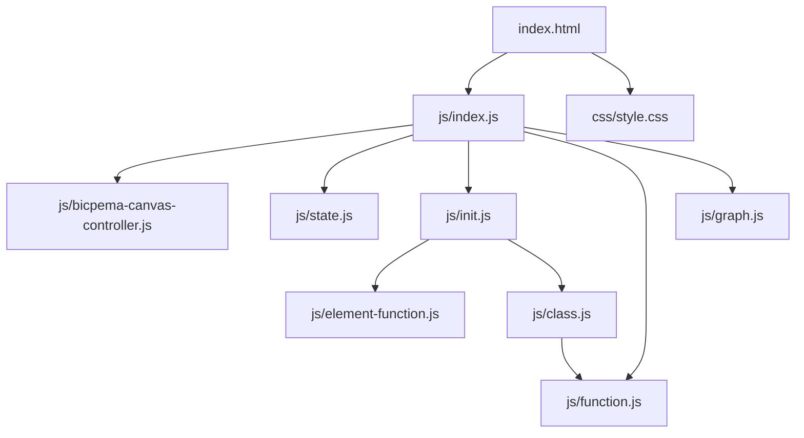
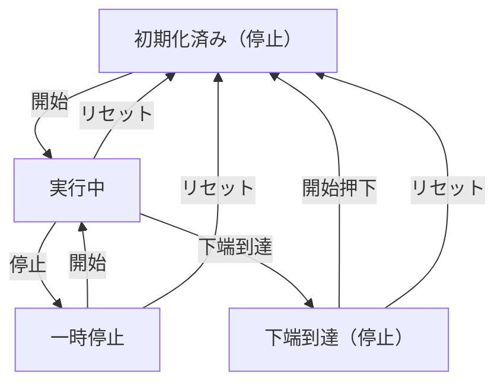

# 斜面をくだる力学台車の運動シミュレーション設計書

## 1. 概要

- 対象: 斜面をくだる力学台車の等加速度運動を可視化するp5.jsシミュレーション。
- 想定利用者: 物理基礎の学習者（中学〜高校程度）。
- 確定事項:
  - 右上の設定ボタンで斜面の角度（10〜40°）と記録間隔（0.05/0.1/0.2 s）を変更できる。
  - 左下の操作ボタンで開始・一時停止・リセットができる。
  - v-tグラフ表示ボタンでChart.jsグラフを開閉できる。
  - 記録テープに台車の記録点を描画する。
- 推定事項:
  - 加速度は `a = g * sin(θ)` で計算（g=9.8 m/s²）。
  - 台車が斜面下端に到達すると自動停止する。

## 2. 画面設計

- 画面構成:
  - 上部バー（タイトル "斜面をくだる力学台車の運動"、ホームリンク）。
  - p5キャンバス（16:9固定比率）に斜面・台車・記録テープ・情報パネルを描画。
  - 左下に操作ボタン群（🔄 リセット、▶ 開始）。
  - 右上に設定ボタン（⚙ 設定）。
  - キャンバス下にv-tグラフ表示トグルボタンとChart.jsグラフ（任意表示）。
- UI要素:
  - 数値入力: 斜面の角度 (°)、min=10, max=40, step=1。
  - 選択: 記録間隔 (s) — 0.05 / 0.1 / 0.2。
  - 操作: リセット、開始/停止/再開。
  - グラフ: v-tグラフ（速度 vs 時間）、理論値（破線）と記録テープデータ（赤点）を表示。
- 確定事項:
  - bodyは固定レイアウトでスクロール不可。
  - 情報パネル（左上）: t, s, v, a, θ を表示。

## 3. 機能仕様

- 開始/一時停止/再開:
  - 「▶ 開始」押下で `state.isPlaying=true`。
  - 「⏸ 停止」押下で `state.isPlaying=false`。
  - 台車が下端に到達すると自動的に `state.isPlaying=false`。
  - 下端到達後に押下するとリセット後再開（`onPlayPause` 内の `cart.isAtBottom` 判定）。
- リセット:
  - 「🔄 リセット」ボタンで `state.cart.reset()`、`tapeMarks=[]`、`vtData=[]`、`isPlaying=false`、グラフ更新。
- 設定反映:
  - 角度変更・閉じるボタンで `cart.setAngle(newAngle)` を呼び物理量を再計算 + リセット。
  - 記録間隔変更: `state.recInterval` を更新 + リセット。
- 記録テープ:
  - 実行中、`(tapeMarks.length + 1) * recInterval <= cart.time` の間ループし、変位をtapeMarksに追記。
  - 同時に `vtData` に {x: t, y: v} を追記。
- v-tグラフ:
  - 「v-tグラフを表示」ボタンで `state.graphVisible=true`、グラフdivを表示し `updateGraph()` を呼ぶ。
  - 実行中 `isPlaying && graphVisible` のときも毎フレーム `updateGraph()` を呼ぶ。
- 境界条件:
  - 斜面角度: HTMLのmin=10, max=40で制限。applySettings内でも `newAngle >= 10 && newAngle <= 40` を検証。

## 4. ロジック仕様

- 実行モデル:
  - p5.jsインスタンスモード（preload/setup/draw/windowResized）を利用。
  - ESModule（`import`）ベースで実装。
- 座標系:
  - 仮想キャンバス幅 V_W=1000px、V_H=562px（16:9）。
  - PX_PER_M=400（1m = 400仮想px）。
  - SLOPE_LENGTH_M=1.1m（斜面の物理長）。
  - 斜面下端: SLOPE_BX=190, SLOPE_BY=340。
  - 記録テープ: TAPE_CY=460, TAPE_LX=25, TAPE_RX=975。
  - draw() 冒頭で `p.scale(p.width / V_W)` を適用。
- 状態管理:
  - `state.isPlaying`: アニメーション進行ON/OFF。
  - `state.slopeDeg`: 斜面角度 (度)。
  - `state.recInterval`: 記録間隔 (s)。
  - `state.tapeMarks`: 記録変位配列 (m)。
  - `state.vtData`: v-tグラフデータ [{x, y}]。
  - `state.graphVisible`: v-tグラフ表示状態。
  - `state.cart`: SlopeCartオブジェクト。
- SlopeCartクラス（`class.js`）:
  - `update(dt)`: `s = 0.5*a*t²`、`v = a*t` の運動学式で更新。
  - `setAngle(deg)`: 角度変更と `a = g*sin(θ)` の再計算 + reset。
  - `reset()`: time, s, v, isAtBottom を初期化。
- 描画処理:
  - `drawSlope(p, angleDeg)`: 斜面板・支持台・ストッパー。
  - `drawCartOnSlope(p, cart, angleDeg)`: `push/translate/rotate` で斜面上に台車を描画。
  - `drawRecordingTape(p, marks, interval)`: テープ背景・縦線・点を描画。
  - `drawInfoPanel(p, cart)`: t, s, v, a, θ を左上パネルに表示。
- FPS: 30。

## 5. ファイル構成と責務

- `vite/simulations/slope-cart-motion/index.html`
  - 画面DOM（ナビバー、設定モーダル、操作ボタン）と `js/index.js` / `css/style.css` の参照を保持。
- `vite/simulations/slope-cart-motion/css/style.css`
  - 全体レイアウト、キャンバス配置、グラフエリア、ボタンUIをスタイリング。
- `vite/simulations/slope-cart-motion/js/index.js`
  - p5インスタンス起動（`new p5(sketch)`）と各ライフサイクル（preload/setup/draw/windowResized）を紐付け。
  - `BicpemaCanvasController`（fixed=true, 9:16比率）でキャンバス領域を制御。
  - フォントをpreload内で読込。
- `vite/simulations/slope-cart-motion/js/state.js`
  - `state`オブジェクト（isPlaying, tapeMarks, vtData, slopeDeg, recInterval, graphVisible, graphChart, cart, DOM要素参照群, font）。
- `vite/simulations/slope-cart-motion/js/class.js`
  - `SlopeCart`クラス: 物理更新・リセット・角度変更。`PX_PER_M`をfunction.jsからimport。
- `vite/simulations/slope-cart-motion/js/init.js`
  - 定数（FPS）をexport。
  - `settingInit(p, canvasController)`: キャンバス生成・frameRate設定。
  - `elementSelectInit(p)`: DOM要素取得・イベント登録・グラフトグルボタン/グラフdiv動的生成。
  - `elementPositionInit(p)`: グラフ位置・サイズ設定（リサイズ時も呼ばれる）。
  - `valueInit()`: cart・tapeMarks・vtDataの初期化。
- `vite/simulations/slope-cart-motion/js/function.js`
  - 定数（V_W, V_H, PX_PER_M, SLOPE_LENGTH_M, SLOPE_BX, SLOPE_BY, TAPE_*）をexport。
  - 描画関数: `drawSlope`, `drawSupportStructure`, `drawStopper`, `drawCartOnSlope`, `drawRecordingTape`, `drawInfoPanel`, `getSlopeTop`。
- `vite/simulations/slope-cart-motion/js/graph.js`
  - `updateGraph()`: Chart.jsインスタンスを毎回再生成し、理論値と記録テープデータを描画。
- `vite/simulations/slope-cart-motion/js/element-function.js`
  - `onReset()`, `onPlayPause()`, `onToggleModal()`, `onCloseModal()`, `applySettings()`, `onToggleGraph()`。
- `vite/simulations/slope-cart-motion/js/bicpema-canvas-controller.js`
  - 9:16固定比率のキャンバスサイズ計算・生成・リサイズ処理。

## 6. 状態遷移

- 初期化済み（停止）: setup実行後。state.isPlaying=false、cart.isAtBottom=false。
- 実行中: 開始ボタン押下でstate.isPlaying=true。
- 一時停止: 停止ボタン押下でstate.isPlaying=false。
- 下端到達: cart.isAtBottom=trueになりstate.isPlaying=false。
- リセット: リセット押下または設定閉じるで初期化済み（停止）へ戻る。

## 7. 既知の制約

- v-tグラフは毎フレームChart.jsインスタンスを再生成するため、高頻度更新でパフォーマンス低下の可能性がある。
- リサイズ時は `elementPositionInit(p)` でグラフ位置のみ更新され、物理状態は保持される。
- グラフが表示された状態でリサイズすると、グラフサイズも自動調整される。
- 記録間隔が小さいほどtapeMarks・vtDataのデータ点数が増える。

## 8. 未確定事項

- 斜面の角度・記録間隔の教材的な推奨値。
- 記録テープ表示範囲（TAPE_RX - TAPE_LX）を超えるデータの扱い（現在は描画をスキップ）。
- 情報アイコンの挙動（リンクやモーダル）が未実装かどうか。
