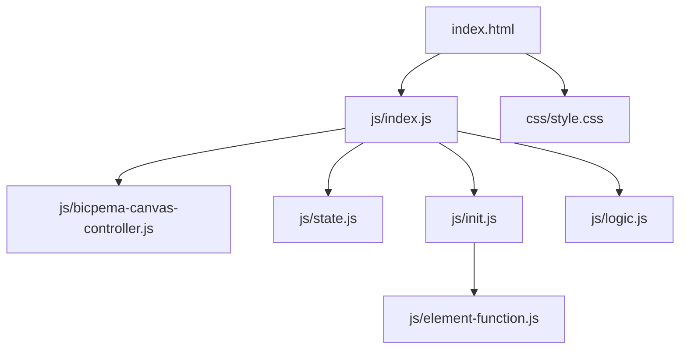
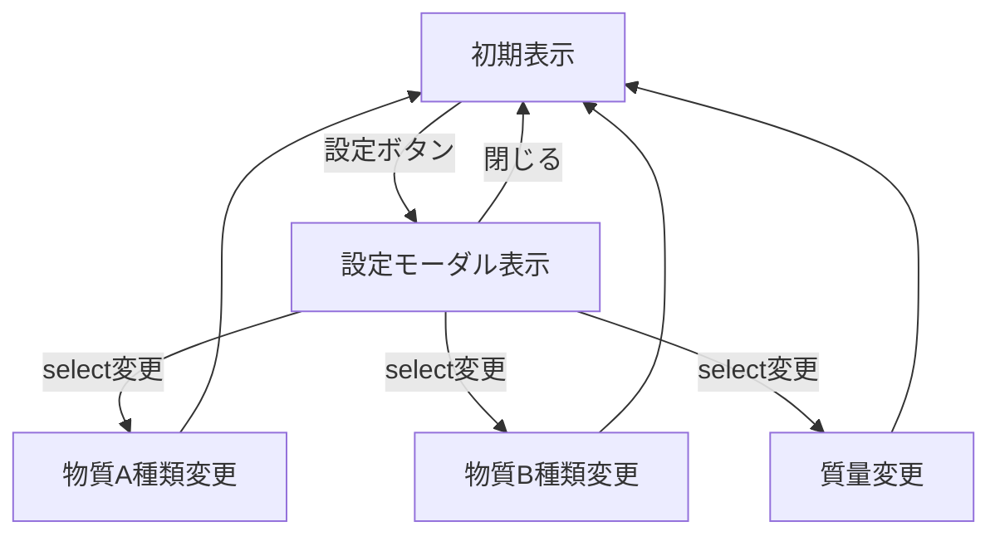

# 比熱と熱容量シミュレーション設計書

## 1. 概要

- 対象: 比熱と熱容量の概念を可視化するp5.jsシミュレーション。
- 想定利用者: 物理基礎の学習者（中学〜高校程度）。
- 確定事項:
  - 右上の設定ボタンで物質A・物質Bの種類（アルミニウム/鉄/銅/銀/水銀）と質量（大/小）を変更できる。
  - 設定変更は即時グラフに反映される（アニメーションなし、静的な比較表示）。
  - T-Qグラフで2種類の物質の温度上昇 vs 加えた熱量の傾きの違いを視覚化。
- 推定事項:
  - グラフの傾き ΔT/Q = 1/(m×c) で物質・質量ごとに異なる。

## 2. 画面設計

- 画面構成:
  - 上部バー（タイトル "比熱と熱容量"、ホームリンク）。
  - p5キャンバス（16:9固定比率）に物質A・物質B（球）、バーナー画像、T-Qグラフを描画。
  - 右上に設定ボタン（⚙ 設定）。
  - 設定モーダルに4つの `<select>` 要素（物質A種類、物質A質量、物質B種類、物質B質量）。
- UI要素:
  - 選択: 物質の種類 — アルミニウム(0) / 鉄(1) / 銅(2) / 銀(3) / 水銀(4)。
  - 選択: 質量 — 質量(大) 0.3kg(0) / 質量(小) 0.1kg(1)。
  - 操作: 設定モーダルの「閉じる」ボタン。
- 確定事項:
  - アニメーションなし（静的な状態を毎フレーム描画）。
  - bodyは固定レイアウトでスクロール不可。
  - 比熱の数値をキャンバス上に表示（例: 0.901 J/(g·K)）。

## 3. 機能仕様

- 設定反映:
  - 物質A/B種類変更: `state.materialA/B` を更新（即時描画に反映）。
  - 物質A/B質量変更: `state.massA/B` を更新（即時描画に反映）。
- T-Qグラフ表示:
  - 物質AとBそれぞれで `ΔT = Q / (m × c)` のグラフ線を描画。
  - 物質A: 赤い線、物質B: 青い線。
  - グラフ右端のQ=5000Jまでを表示。
- 比熱表示:
  - 各物質の比熱を `SPECIFIC_HEAT_LABELS[state.materialX] + " J/(g·K)"` で表示。
- 設定モーダル:
  - 「⚙ 設定」ボタンで表示/非表示をトグル。
  - 「閉じる」ボタンで非表示。
- 境界条件:
  - `<select>` の値はHTMLで定義された範囲内（0〜4）。

## 4. ロジック仕様

- 実行モデル:
  - p5.jsインスタンスモード（preload/setup/draw/windowResized）を利用。
  - ESModule（`import`）ベースで実装。
  - アニメーション更新なし（draw()は毎フレーム同じ状態を描画）。
- 物理モデル:
  - 比熱 c [J/(kg·K)]: SPECIFIC_HEAT = [901, 448, 386, 236, 140]。
  - 質量 m [kg]: MASS_VALUES = [0.3, 0.1]。
  - 温度上昇 ΔT = Q / (m × c)。
  - グラフY変位 = 5000 / (m × c) × スケール係数で線の傾きを表現。
- 座標系:
  - 仮想キャンバス幅 VW=1200px（logic.js内）。
  - draw() 冒頭で `p.scale(p.width / VW)` を適用。
- 状態管理:
  - `state.materialA/B`: 選択中の物質インデックス (0-4)。
  - `state.massA/B`: 選択中の質量インデックス (0=大, 1=小)。
  - `state.burnerImg`: バーナー画像。
  - `state.font`: ZenMaruGothicフォント。
  - `state.materialSelectA/B`, `state.massSelectA/B`: DOM要素参照。
- 描画処理（`logic.js`）:
  - `drawSimulation(p)`: drawBackground → drawHooksAndBalls → drawGraph → drawSpecificHeatLabels。
  - `drawMaterialBall(p, x, y, r, type)`: radialGradientで球を描画。
  - `drawGraph(p, VW, VH)`: グラフ背景・軸・物質A赤線・物質B青線・凡例を描画。
- FPS: 60（静的描画のため実質的にパフォーマンス影響なし）。

## 5. ファイル構成と責務

- `vite/simulations/specific-heat-and-heat-capacity/index.html`
  - 画面DOM（ナビバー、設定モーダル＋`<select>`要素4つ、設定ボタン）と `js/index.js` / `css/style.css` の参照を保持。
- `vite/simulations/specific-heat-and-heat-capacity/css/style.css`
  - 全体レイアウト、キャンバス配置、スクロール無効化、設定モーダル、ボタンUIをスタイリング。
- `vite/simulations/specific-heat-and-heat-capacity/js/index.js`
  - p5インスタンス起動（`new p5(sketch)`）と各ライフサイクル（preload/setup/draw/windowResized）を紐付け。
  - `BicpemaCanvasController`（fixed=true, 9:16比率）でキャンバス領域を制御。
  - preload内でバーナー画像・フォントを読込。
- `vite/simulations/specific-heat-and-heat-capacity/js/state.js`
  - `state`オブジェクト（materialA/B, massA/B, burnerImg, font, materialSelectA/B, massSelectA/B）。
- `vite/simulations/specific-heat-and-heat-capacity/js/init.js`
  - 定数（FPS, SPECIFIC_HEAT, MATERIAL_NAMES, SPECIFIC_HEAT_LABELS, MASS_VALUES）をexport。
  - `settingInit(p, canvasController)`: キャンバス生成・frameRate設定。
  - `elCreate(p)`: DOM要素取得・changed/mousePressed イベント登録。
  - `initValue(p)`: `<select>` の初期値をstateに読込。
- `vite/simulations/specific-heat-and-heat-capacity/js/logic.js`
  - `drawSimulation(p)`: 全描画処理を統括。
  - 物質球・バーナー・グラフ・比熱ラベルの描画関数群。
- `vite/simulations/specific-heat-and-heat-capacity/js/element-function.js`
  - `onMaterialAChange()`, `onMaterialBChange()`, `onMassAChange()`, `onMassBChange()`, `onToggleModal()`, `onCloseModal()`。
- `vite/simulations/specific-heat-and-heat-capacity/js/bicpema-canvas-controller.js`
  - 9:16固定比率のキャンバスサイズ計算・生成・リサイズ処理。

## 6. 状態遷移

- この静的シミュレーションはアニメーション状態遷移がなく、設定変更が即時描画に反映される。

## 7. 既知の制約

- グラフのスケール係数は固定値（5000Jを基準）のため、質量・比熱の組み合わせによってはグラフが上限を超える場合がある（`Math.min(deltaYA, axH * 0.9)` でクランプ）。
- 元のsketch.jsはp5のcreateRadioを使用していたが、モダン化後はHTML `<select>` に変更。
- 動的更新なし（毎フレーム全画面再描画）のため、非常に多数の選択肢追加には不向き。

## 8. 未確定事項

- バーナー画像の表示位置が物質の質量選択（大/小）に応じて変化するかどうか。
- グラフのY軸（温度）の目盛りの教材的な意図（絶対温度か温度差か）。
- 情報アイコンの挙動（リンクやモーダル）が未実装かどうか。
