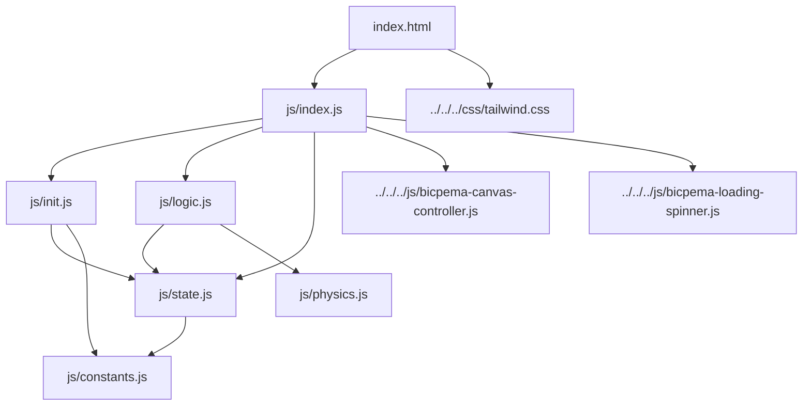
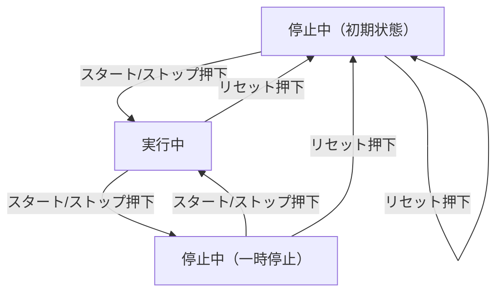

# 定在波シミュレーション設計書

## 1. 概要

- 対象: 固定端反射（描画領域の右端相当）による右進み波・左進み波の重ね合わせで生じる定在波を可視化するp5.jsシミュレーション。
- 想定利用者: 物理基礎の学習者（波の重ね合わせ・定在波の成立過程を学ぶ中学〜高校程度）。
- 確定事項:
    - 左下の「スタート/ストップ」ボタンで進行のON/OFFをトグルできる。
    - 左下の「リセット」ボタンで時刻・波面位置・実行状態を初期化できる。
    - 右上には設定モーダルではなく、右進み波（赤）・左進み波（青）・定在波（緑）の凡例のみが表示される。
    - 振幅・波長・周期・グリッド間隔はすべて `js/constants.js` の定数で固定されており、ユーザーが数値入力で変更する手段はない。
- 推定事項:
    - 可変パラメータが存在しないため、他シミュレーションで一般的な「右上の設定ボタン＋設定モーダル」は本シミュレーションでは意図的に省略されていると推定される。

## 2. 画面設計

- 画面構成:
    - 上部ナビバー（`#navBar`、高さ60px固定）: Bicpemaロゴリンクと「定在波」というタイトルラベル。
    - 中央にp5キャンバス（`#p5Canvas`、`BicpemaCanvasController(false, false, 1.0, 1.0)` によりウィンドウ幅・高さいっぱいに可変、16:9固定はしない）。
    - 画面右上に凡例（右進み波=赤バッジ、左進み波=青バッジ、定在波=緑バッジ）。
    - 画面左下に操作ボタン群（スタート/ストップ、リセット）。
    - 読み込み中はローディングスピナー（`#loadingSpinner`）を全画面表示し、p5の初回`draw()`実行時に非表示化。
- UI要素:
    - 操作: 進行の開始/停止（同一ボタンのラベル・色トグル）、リセット。
    - 数値入力・選択肢UIはなし（固定パラメータのみ）。
- 確定事項:
    - `<body oncontextmenu="return false;">` により右クリックのコンテキストメニューを無効化。
    - `#p5Container` は `mt-[60px]` でナビバー分オフセットしたレイアウトで、body全体はスクロール不可を前提としたデザイン（明示的な `overflow:hidden` の指定は本ディレクトリ内には見当たらず、共通CSS側での制御と推定）。
    - 設定モーダル・歯車ボタンは実装されていない。
- 推定事項:
    - スクロール禁止の具体的なCSSは `vite/css/tailwind.css` 等の共通資産側にある可能性が高いが、本シミュレーション配下のファイルのみでは確認できない。

## 3. 機能仕様

- 進行の開始/停止（トグル）:
    - 「スタート」ボタン押下で `state.running = true` にし、ボタンラベルを「ストップ」・配色を赤系（`bg-red-600`/`hover:bg-red-500`）に変更する。
    - 「ストップ」状態でボタン押下すると `state.running = false` にし、ラベル・配色を「スタート」・青系に戻す。ただし `state.t`・`state.rightFront`・`state.leftFront` は変化させない（一時停止として時刻・波面位置を保持する）。
    - 開始/停止を表す独立した2つのボタン（「一時停止」「再開」）はなく、単一の `moveBtn` がトグルとして機能する。
- リセット:
    - 「リセット」ボタン押下で `state.t = 0`、`state.rightFront = 0`、`state.leftFront = state.innerW`、`state.running = false` に戻し、ボタン表示も「スタート」・青系に戻す。実行中に押しても即座に停止＋初期化される。
- 設定反映:
    - ユーザーが変更できる数値・選択肢UIは存在しないため、設定反映に相当する機能はない。振幅・波長・周期・グリッド間隔は `settingInit(p)` 実行時（`p.setup()` 内、一度きり）に `constants.js` の値から計算される。
- 境界条件:
    - `computeWaveFronts` により `rightFront` は `min(v*t, innerW)` で `innerW` を超えない、`leftFront` は `max(innerW - v*t, 0)` で `0` を下回らない、という上下限が実装されている。
    - 数値入力欄がないため、HTML `min`/`max` 等の入力制限は存在しない。

## 4. ロジック仕様

- 実行モデル:
    - p5.jsインスタンスモード（`setup`/`draw`/`windowResized`）を利用。
    - ESModule（`import`/`export`）ベースで実装し、`window` グローバル公開は行わない。
- 状態管理（`js/state.js`）:
    - `t`: 経過時間（フレーム単位で `state.v` ずつ加算され続ける。周期での剰余処理はなし）。
    - `wavelength`, `A`, `k`, `omega`, `v`: 波の物理パラメータ（`settingInit` で算出、実行中は不変）。
    - `running`: 進行中フラグ（true=進行中、false=停止/一時停止中）。
    - `margin`, `innerW`, `innerH`: 描画領域のオフセットとサイズ（`elementPositionInit` で算出、リサイズ時に再計算）。
    - `rightFront`, `leftFront`: 右進み波・左進み波それぞれの可視区間の先端位置（px）。
- 描画処理（`js/logic.js` `drawSimulation(p)`）:
    - 背景を単色で塗りつぶし、`state.margin` 分平行移動した座標系で内側の矩形（`innerW × innerH`）に対して描画する。
    - グリッド線（中心から波長/8間隔で上下左右に配置）とx軸（中心線＋右端の矢印）を描画する。
    - 右進み波（赤）: `x < state.rightFront` の範囲のみ `computeRightWaveDisplacement` で変位を計算し折れ線描画。
    - 左進み波（青）: `x > state.leftFront` の範囲のみ `computeLeftWaveDisplacement` で変位を計算し折れ線描画。
    - 定在波（緑）: `state.leftFront <= x <= state.rightFront` の範囲のみ `computeStandingWaveDisplacement`（右進み波と、反射波として `k*(innerW-x) - ωt` を用いた波の重ね合わせ）で変位を計算し折れ線描画。
    - `state.running` が真のときのみ、1フレームにつき `state.t += state.v` を実行し、`computeWaveFronts` で `rightFront`/`leftFront` を再計算する（1フレーム1回、可変速度ループ等の複数回更新は行わない）。
- 計算モデル（`js/physics.js`）:
    - 右進み波: `y = A sin(kx - ωt)`。
    - 左進み波: `y = A sin(kx + ωt)`。
    - 定在波（重ね合わせ）: 右進み波の変位 `y1 = A sin(kx - ωt)` と、反射端（`innerW`）を基準にした波 `y2 = A sin(k(innerW-x) - ωt)` を加算 `y1 + y2`。
    - 波面位置: `rightFront = min(v*t, innerW)`（左端0から右へ進行）、`leftFront = max(innerW - v*t, 0)`（右端innerWから左へ進行）。両者が交差した後の区間で定在波（緑）が描画される。
- 推定事項:
    - `rightFront` が `innerW` に、`leftFront` が `0` に到達した後（十分時間が経過した後）も、赤（`x < rightFront`）・青（`x > leftFront`）は描画条件上ほぼ全域で描画され続け、緑の定在波と重なって表示される。これが教材上意図した最終状態（3波同時表示）なのか、反射後に赤・青を非表示にする設計漏れなのかはコードからは判断できない。
    - `computeStandingWaveDisplacement` の `y2` 項が「反射波」を表すという想定はコードコメントから読み取れるが、境界条件（固定端反射で位相が反転するか等）を厳密に反映しているかは物理的検証が別途必要。

## 5. ファイル構成と責務

- `vite/simulations/standing-wave/index.html`
    - 画面のDOM（ナビバー、凡例、p5キャンバスコンテナ、左下操作ボタン、ローディングスピナー）を定義し、`js/index.js` を読み込む。設定モーダルは持たない。
- `vite/simulations/standing-wave/js/index.js`
    - p5インスタンス起動 (`new p5(sketch)`) と各ライフサイクル（`setup`/`draw`/`windowResized`）の紐付け。
    - `BicpemaCanvasController(false, false, 1.0, 1.0)` でキャンバスサイズ制御（アスペクト比固定なし、幅・高さ比率とも100%）。
    - 初回`draw()`実行時にローディングスピナーを非表示化。
- `vite/simulations/standing-wave/js/constants.js`
    - `MARGIN`（描画余白）、`WAVELENGTH`（波長）、`PERIOD_FRAMES`（周期のフレーム数）、`GRID_LINES_PER_WAVELENGTH`（グリッド間隔の分割数）を定義。
- `vite/simulations/standing-wave/js/state.js`
    - `state` オブジェクト（時刻、波の物理パラメータ、実行フラグ、描画領域サイズ、波面位置）を定義。
- `vite/simulations/standing-wave/js/init.js`
    - `settingInit(p)`: 波長・波数・角振動数・速さ・振幅を算出し `state` に設定。
    - `elementSelectInit(p)`: 本シミュレーションはHTMLボタンのみでp5 DOM要素の生成が不要なため実質何もしない（コメントのみ）。
    - `elementPositionInit(p)`: `state.margin`/`innerW`/`innerH` を算出し、`moveBtn`/`resetBtn` のクリックハンドラを設定（トグル処理・リセット処理を内包、`element-function.js` 相当の責務も本ファイルに同居）。
    - `valueInit(p)`: `t`/`rightFront`/`leftFront`/`running` の初期値を設定。
- `vite/simulations/standing-wave/js/logic.js`
    - `drawSimulation(p)`: 背景・グリッド・x軸・3種の波形の描画と、`running`時の時刻・波面位置の更新ループ。
- `vite/simulations/standing-wave/js/physics.js`
    - `computeRightWaveDisplacement`/`computeLeftWaveDisplacement`/`computeStandingWaveDisplacement`/`computeWaveFronts`: 波の変位・波面位置を求める純粋関数群。
- 共通資産（対象外・参照のみ）:
    - `vite/js/bicpema-canvas-controller.js`（`BicpemaCanvasController`）: 利用可能領域に応じたキャンバスサイズ算出・生成・リサイズ。本シミュレーションでは `fixed=false` のためアスペクト比固定を行わず、ナビバー分を差し引いた全域をキャンバスにする。
    - `vite/js/bicpema-loading-spinner.js`（`hideLoadingSpinner`）: `#loadingSpinner` を非表示化する共通関数。
    - `vite/css/tailwind.css`: 共通のTailwindスタイル。本シミュレーション専用の `css/style.css` は存在せず、レイアウトはHTML上のTailwindユーティリティクラスのみで構成されている。

## 6. 状態遷移

- 停止中（初期状態を含む）: `setup()` 実行直後、または「スタート/ストップ」ボタンで停止させた状態、または「リセット」直後。`state.running = false`。時刻・波面位置は初期化状態か、停止直前の値を保持する（一時停止扱い）。
- 実行中: 「スタート/ストップ」ボタン押下で `state.running = true`。`drawSimulation` のループ内で毎フレーム `state.t` と波面位置が更新される。
- リセット: いずれの状態からも「リセット」ボタン押下で `t=0`・`rightFront=0`・`leftFront=innerW`・`running=false` の初期状態へ戻る。
- リサイズ（`windowResized`）: 状態そのもの（`running`/`t`/`rightFront`/`leftFront`）は変更されないが、`elementPositionInit` により `margin`/`innerW`/`innerH` が再計算される（既知の制約を参照）。

## 7. 既知の制約

- `rightFront` が `innerW` に、`leftFront` が `0` に到達した後（十分時間が経過した後）も、赤（右進み波）・青（左進み波）の描画条件（`x < rightFront`／`x > leftFront`）はほぼ画面全域を満たし続けるため、緑（定在波）と常に重なって表示される。反射端到達後に赤・青を消す等の処理はない。
- `state.t` は周期で剰余を取らずに無限に加算され続けるため、非常に長時間再生し続けると `Math.sin` への引数が大きくなり、浮動小数点誤差により波形がわずかに乱れる可能性がある。
- `windowResized` 時、`elementPositionInit` は `margin`/`innerW`/`innerH` を再計算するが、`state.rightFront`/`state.leftFront` はその場で新しい `innerW` に合わせて再計算されない。`running=true` の場合は次の `drawSimulation` ループで `computeWaveFronts` により更新されるが、`running=false`（停止中）の場合はリサイズ後も古い `innerW` を基準にした波面位置のまま表示され、次に「スタート」を押すまで補正されない。
- 振幅・波長・周期・グリッド間隔はすべて `constants.js` の定数であり、UIから変更する手段がない（他シミュレーションにあるような数値入力・プリセット切り替えは未実装）。
- 設定パネル（歯車ボタン・モーダル）が存在せず、右上には凡例のみが表示される。可変パラメータがないため現状は問題にならないが、将来パラメータを追加する場合はUI設計の見直しが必要になる。

## 8. 未確定事項

- 反射端到達後も赤・青の波形を全域表示し続ける挙動が、教材設計上意図されたもの（3波の最終的な重なりを見せる）か、実装上の考慮漏れかはコードのみからは判断できない。
- `computeStandingWaveDisplacement` の `y2 = A sin(k(innerW-x) - ωt)` が固定端反射（位相反転あり/なし）の物理的境界条件をどこまで厳密に反映する意図かは、コメント（「重ね合わせ（波の独立性）」）以上の情報がなく未確定。
- `windowResized` 時に `rightFront`/`leftFront` を即時再計算しない挙動が意図的（連続性を優先）か、修正すべき副作用かは不明。
- `content/post/定在波` 配下に関連記事が存在するが、本設計書は実装（`vite/simulations/standing-wave` 配下）のみを根拠に作成しており、記事側の説明文言との整合性は未確認。
