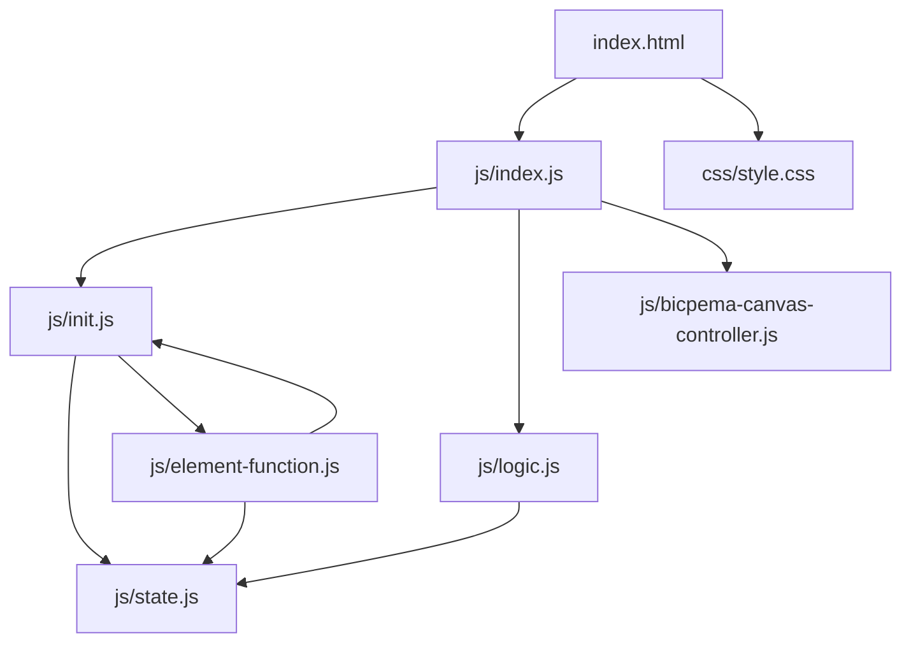
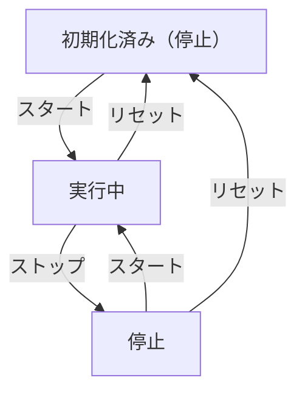

# 定常波シミュレーション設計書

## 1. 概要

- 対象: 定常波の形成過程（右向き進行波＋左向き進行波の重ね合わせ）を可視化するp5.jsシミュレーション。
- 想定利用者: 物理基礎の学習者（高校程度）。
- 確定事項:
  - 右向き進行波（赤）と左向き進行波（青）が画面端から発射され、重なった領域に合成波（緑・定常波）が形成される。
  - 左下の操作ボタン（スタート/ストップ、リセット）で操作する。
  - キャンバスは16:9固定比率でウィンドウサイズに追従する。
- 推定事項:
  - x軸は空間方向（ピクセル）、y軸は変位を示す教材意図。

## 2. 画面設計

- 画面構成:
  - 上部固定ナビバー（タイトル "Bicpema"、ページ名 "定常波"）。
  - 中央にp5キャンバス（16:9固定比率、ウィンドウサイズに追従）。
  - 左下に操作ボタン群。
- UI要素:
  - スタート/ストップボタン（青/赤で状態変化）。
  - リセットボタン（グレー）。
- 確定事項:
  - 右クリックのコンテキストメニューは無効化。
  - bodyは固定レイアウトでスクロール不可。

## 3. 機能仕様

- スタート/ストップ:
  - ボタン押下で `state.running` をトグルし、アニメーションの進行を切り替える。
  - 実行中はボタンが「ストップ」（赤）、停止中は「スタート」（青）に変化する。
- リセット:
  - `initValue(p)` を呼び、`t=0`、`rightFront=0`、`leftFront=innerW`、`running=false` に戻す。
  - ボタン表示もスタート（青）に戻す。
- 波の発射と重なり:
  - 右向き波は左端（x=0）から右へ進行し、先端 `rightFront` が右端 `innerW` に達すると停止。
  - 左向き波は右端（x=innerW）から左へ進行し、先端 `leftFront` が左端 0 に達すると停止。
  - 両波が重なる領域 `[leftFront, rightFront]` に合成波（定常波）が描画される。

## 4. ロジック仕様

- 実行モデル:
  - p5.jsインスタンスモード（setup/draw/windowResized）を利用。
  - ESModule（`import`）ベースで実装し、`window`グローバル公開は行わない。
- 波定数（initValueで設定）:
  - margin = 50（ピクセル）
  - innerW = width - margin * 2（有効幅）
  - innerH = height - margin * 2（有効高さ）
  - wavelength = 200（ピクセル）
  - A = 40（振幅）
  - k = TWO_PI / wavelength（波数）
  - omega = TWO_PI / 120（角周波数）
  - v = omega / k（位相速度）
- 状態管理（state.js）:
  - t: 時刻変数。毎フレーム `t += v` で更新。
  - rightFront: 右向き波の先端。`rightFront = min(v*t, innerW)`。
  - leftFront: 左向き波の先端。`leftFront = max(innerW - v*t, 0)`。
  - running: アニメーション進行フラグ。
- 描画処理（logic.js）:
  - 背景色：水色（rgb 211, 237, 244）、グリッド線（灰色）、x軸（黒）を描画。
  - 右向き進行波（赤実線）: x ∈ [0, rightFront) の範囲で `A*sin(k*x - omega*t)`。
  - 左向き進行波（青実線）: x ∈ (leftFront, innerW) の範囲で `A*sin(k*x + omega*t)`。
  - 合成波（緑実線）: x ∈ [leftFront, rightFront] で両波の和 `A*sin(k*x - omega*t) + A*sin(k*(innerW-x) - omega*t)`。

## 5. ファイル構成と責務

- `vite/simulations/standing-wave/index.html`
  - 画面のDOM（ナビバー、操作ボタン）と `js/index.js` / `css/style.css` の参照を保持。
- `vite/simulations/standing-wave/css/style.css`
  - キャンバスコンテナのレイアウト（margin-top, text-align）を定義。
- `vite/simulations/standing-wave/js/index.js`
  - p5インスタンスモードのエントリーポイント。setup/draw/windowResized を定義。
- `vite/simulations/standing-wave/js/state.js`
  - シミュレーションの共有可変状態（margin, innerW, innerH, wavelength, A, k, omega, v, running, t, rightFront, leftFront, ボタン参照）を管理。
- `vite/simulations/standing-wave/js/init.js`
  - `initValue(p)`: 寸法・波定数・状態の再計算と初期化。
  - `elCreate(p)`: DOM要素の選択とイベントハンドラーのバインド。
- `vite/simulations/standing-wave/js/logic.js`
  - `drawSimulation(p)`: 毎フレームの描画処理と状態更新。
  - `drawGrid(p)`: グリッド線描画。
  - `drawXAxis(p)`: x軸・矢印・ラベル描画。
  - `drawRightWave(p)`: 右向き進行波（赤）の描画。
  - `drawLeftWave(p)`: 左向き進行波（青）の描画。
  - `drawStandingWave(p)`: 合成波（定常波・緑）の描画。
- `vite/simulations/standing-wave/js/element-function.js`
  - `onStartStopClick(p)`: running トグルとボタン表示更新。
  - `onResetClick(p)`: initValue 呼び出しとボタン表示リセット。
- `vite/simulations/standing-wave/js/bicpema-canvas-controller.js`
  - キャンバスのフルスクリーン生成とリサイズ処理を担当するクラス。

## 6. 状態遷移

- 初期化済み（停止）
  - setup実行後。t=0、rightFront=0、leftFront=innerW、running=false。
- 実行中
  - スタートボタン押下でrunning=true。毎フレームt・rightFront・leftFrontが更新される。
- 停止
  - ストップボタン押下でrunning=false。波形は現在位置で静止。
- リセット
  - リセットボタン押下で初期化済み（停止）へ戻る。

## 7. 既知の制約

- リサイズ時は `initValue(p)` が呼ばれ、進行中の状態はリセットされる。
- キャンバスは16:9固定比率のため、ウィンドウの縦横比によってキャンバスサイズが変動する。

## 8. 未確定事項

- 特になし。
