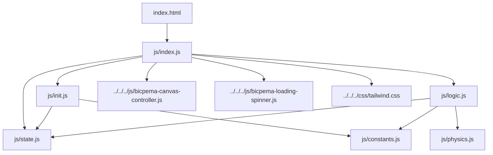
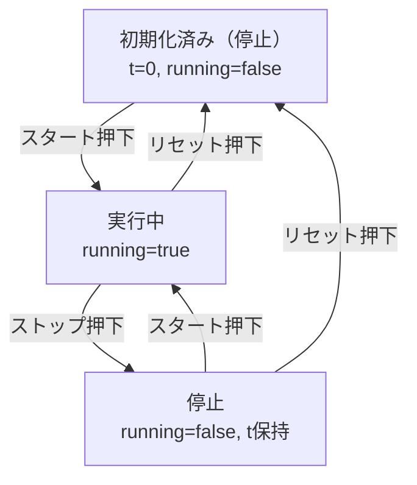

# 縦横波シミュレーション設計書

## 1. 概要

- 対象: 1つの正弦波源から伝わる波を「縦波（疎密波）」と「横波（変位グラフ）」の2つの表現で同時に可視化するp5.jsシミュレーション。同一の変位計算式を、上段では粒子のx方向振動として、下段では粒子のy方向変位・波形曲線として描画することで、縦波と横波（変換表現）の対応関係を示す。
- 想定利用者: 物理基礎における波動分野（縦波・横波の関係、疎密波の表現）を学ぶ学習者（中学〜高校程度）。（推定）
- 確定事項:
    - 左下の操作ボタン群で「スタート/ストップ」の切り替え、「リセット」、「速度」（フレームレート）スライダーの調整ができる。
    - 右上に設定ボタンや設定モーダルは存在しない。波の振幅・波長・角振動数・粒子数などのパラメータはUIから変更できず、`state.js`に固定値として定義されている。
    - キャンバス上段に縦波表現、下段に横波（変換）表現を上下2分割で常時同時描画する。
- 推定事項:
    - タイトル「縦横波」は、疎密波（縦波）とその変換表現である横波（変位グラフ）の対応関係を学習させる教材であることを示す（推定）。

## 2. 画面設計

画面構成は以下の通り（drawio図等は本ドキュメントには添付していません）。

- 画面構成:
    - 上部ナビバー（高さ60px、`#navBar`）: サイト名「Bicpema」リンクとシミュレーション名「縦横波」を表示。
    - ナビバー下、`#p5Container`内の`#p5Canvas`にp5キャンバスを配置。
    - 左下（`fixed bottom-0 start-0`）に操作ボタン群: 「スタート/ストップ」ボタン、「リセット」ボタン、「速度」ラベル付きスライダー（半透明の背景パネル内）。
    - 右上の設定ボタン・設定モーダルは無し（本シミュレーションには存在しない）。
    - 初回`draw()`実行まで全画面ローディングスピナー（`#loadingSpinner`）を表示。
- UI要素:
    - ボタン: 「スタート」/「ストップ」（`#moveBtn`、トグル式・同一ボタンでラベルと色が切り替わる）、「リセット」（`#resetBtn`）。
    - スライダー: 「速度」（`#speedSlider`、`min=10` `max=60` `step=1` `value=30`）。フレームレート（p.frameRate）に直接対応する値。
    - キャンバス内の設定用UI要素（波長、振幅、粒子数などの入力欄）は無い。
- 確定事項:
    - `<body oncontextmenu="return false;">`により右クリックのコンテキストメニューを無効化。
    - キャンバスは`BicpemaCanvasController(false, false, 1.0, 1.0)`で生成され、16:9固定アスペクトではなく、ウィンドウ幅・高さ（ナビバー分を除く）にそのまま追従する可変サイズ（`fixed=false`）。
    - `<body>`は`bg-neutral-900`のダーク基調だが、p5キャンバス背景は`p.background(255)`で白固定（ダークテーマとキャンバス内配色は独立）。

## 3. 機能仕様

- スタート/ストップ（トグル）:
    - 「スタート」ボタン押下で`state.running = true`にし、ボタンラベルを「ストップ」、色を青→赤に変更する。
    - 「ストップ」状態でボタン押下すると`state.running = false`に戻し、ラベルと色を「スタート」/青に戻す。
    - 一時停止と再開を分けた個別ボタンはなく、1つのボタンで開始・停止をトグルする。
- リセット:
    - 「リセット」ボタン押下で`state.t = 0`、`state.running = false`とし、モーションを初期状態に戻す。同時にボタンラベルを「スタート」/青に戻す。
    - `initValue(p)`のような粒子配置の再生成は行わない（粒子のx0座標は`setup`時に一度だけ計算され、リセット時も再利用される）。
- 速度（フレームレート）変更:
    - `speedSlider`の値（10〜60）を毎フレーム`drawSimulation(p)`内で読み取り、`p.frameRate(parseInt(value))`として即時反映する。
    - この値は波の物理パラメータ（振幅・波長・角振動数）ではなく、描画・時間更新（`state.t`のインクリメント頻度）の速さを変える。値が大きいほど`state.t`が単位時間あたり多く進み、波の伝播が速く見える。
- 波源パラメータ（振幅・波長・角振動数・粒子数）:
    - `state.js`にハードコードされており（`N=80`、`A=40`、`lambda=200`、`omega=0.1`）、UIからの変更手段はない。
    - `settingInit(p)`で`state.k = TWO_PI / state.lambda`を算出する（setup時の1回のみ）。
- 境界条件:
    - `speedSlider`はHTML属性で`min=10` `max=60` `step=1`により、フレームレートは10〜60の範囲に制限される。
    - `state.N`個の粒子は`p.map`により波源位置（`WAVE_ORIGIN_X=60`）からキャンバス右端手前（`p.width - WAVE_ORIGIN_X`）まで等間隔に配置される（setup時点の`p.width`基準）。
    - 波はまだ到達していない位置では変位0として描画される（`computeWaveDisplacement`内の到達時刻判定）。

## 4. ロジック仕様

- 実行モデル:
    - p5.jsインスタンスモード（`setup`/`draw`/`windowResized`）を利用。
    - ESModule（`import`/`export`）ベースで実装し、`window`グローバル公開は行わない。
- 状態管理（`state.js`）:
    - `particles`: 各粒子の初期x座標（`x0`）を持つオブジェクトの配列。
    - `N`: 粒子数（固定値80）。
    - `A`: 振幅（固定値40）。
    - `lambda`: 波長（固定値200）。
    - `k`: 波数（`setup`時に`lambda`から算出）。
    - `omega`: 角振動数（固定値0.1）。
    - `t`: 経過時間（フレームカウンタ。`running`時に`draw`毎に+1）。
    - `running`: シミュレーション進行ON/OFF。
    - `focusIndex`: 強調表示する「注目粒子」のインデックス（`setup`時に粒子数の中央付近＝`floor(N/2)`に設定）。
    - `xStart`: 波源のx座標（`WAVE_ORIGIN_X`と同値）。
- 描画処理（`logic.js` `drawSimulation(p)`）:
    - 毎フレーム`speedSlider`の値を読み取り`p.frameRate`に反映。
    - `p.background(255)`で白背景クリア。
    - `state.running`が真のとき`state.t += 1`。
    - `drawLongitudinal(p)`（上段、`translate(0, height/3)`）: 縦波表現。
        - `drawAxis(p, "縦波")`で水平の軸線・矢印・タイトルを描画。
        - 各粒子について変位量`dx = computeWaveDisplacement(...)`を求め、x座標`x0+dx`に短い縦線（振動の目安）と粒子（赤丸、`PARTICLE_SIZE`）を描画。
        - 注目粒子は、変位前の位置（青丸、`FOCUS_ORIGIN_COLOR`）と変位後の位置（赤丸、`FOCUS_PARTICLE_SIZE`）を重ねて描画し、波が到達済み（`state.t > 到達時刻`）であれば両者を結ぶ矢印（緑、`ARROW_COLOR`）を描画。
    - `drawConvertedTransverse(p)`（下段、`translate(0, height*2/3)`）: 縦波を横波（変位グラフ）に変換した表現。
        - `drawAxis(p, "横波")`で軸線を描画。
        - `xStart`から`p.width - WAVE_ORIGIN_X`まで1px刻みで変位`dy`を計算し、`beginShape`/`vertex`で連続的な波形曲線（正弦波）を描画。
        - 各粒子位置`x0`について変位`dy`を求め、粒子（赤丸）と原点からの縦線を描画。
        - 注目粒子は縦波側と同様に原点位置（青丸）・変位後位置（赤丸）・到達後の矢印（緑、垂直方向）を描画。
    - 縦波側・横波側とも、変位計算は共通の`displacement(p, x0)`（内部で`computeWaveDisplacement`を呼ぶ）を使用しており、同一の物理量を2通りの図で表現している。
- 計算モデル（`physics.js`）:
    - `computeArrivalTime(k, omega, x0, xStart)`: 波速`v = omega / k`とし、到達時刻`(x0 - xStart) / v`を返す。
    - `computeWaveDisplacement(amplitude, k, omega, x0, xStart, t)`: `t`が到達時刻以下なら変位0（未到達）。到達後は`-amplitude * sin(k*(x0-xStart) - omega*t)`（進行波の式）を返す。
- 推定事項:
    - `elementPositionInit(p)`という関数名だが、実装内容は粒子等の「位置」計算ではなく、`moveBtn`/`resetBtn`のクリックハンドラ登録のみである。命名と実装内容が一致しておらず、他シミュレーションの命名慣習（要素の位置初期化）を踏襲した名残と推定される。
    - `elementSelectInit(p)`は空実装（コメントのみ）であり、他シミュレーションとのファイル構成（`init.js`の関数一覧）を揃えるための互換目的の空関数と推定される。
    - `windowResized`時は`canvasController.resizeScreen(p)`と`elementPositionInit(p)`のみが呼ばれ、`valueInit(p)`（粒子x0座標の再計算）は呼ばれない。そのため、リサイズ後は粒子座標が旧`p.width`基準のまま残り、軸線（新`p.width`基準）との相対位置がずれる可能性がある（実装上そう見えるが、意図した仕様か不具合かは未確定）。

## 5. ファイル構成と責務

- `vite/simulations/tate-yoko-wave/index.html`
    - 画面のDOM（ナビバー、左下操作ボタン群、速度スライダー、ローディングスピナー）と`js/index.js`の読み込みを保持。専用の`css/style.css`は存在せず、Tailwindユーティリティクラスのみでスタイリングしている。
- `vite/simulations/tate-yoko-wave/js/index.js`
    - p5インスタンス起動（`new p5(sketch)`）と`setup`/`draw`/`windowResized`のライフサイクル紐付け。
    - `BicpemaCanvasController(false, false, 1.0, 1.0)`により、16:9固定ではなくウィンドウサイズに追従する可変キャンバスを生成。
    - 初回`draw()`実行時に`hideLoadingSpinner()`を呼びローディングスピナーを非表示化。
- `vite/simulations/tate-yoko-wave/js/state.js`
    - `state`オブジェクト（粒子配列、波の物理パラメータ、経過時間、実行フラグ等）の定義。
- `vite/simulations/tate-yoko-wave/js/init.js`
    - `settingInit(p)`: 波数`k`の算出。
    - `elementSelectInit(p)`: 空実装（要素は各所で`document.getElementById`により直接参照）。
    - `elementPositionInit(p)`: `moveBtn`/`resetBtn`のクリックイベント登録（スタート/ストップのトグル、リセット処理）。
    - `valueInit(p)`: `state.xStart`設定、`state.N`個の粒子（`x0`座標）の生成、`state.focusIndex`の設定。
- `vite/simulations/tate-yoko-wave/js/logic.js`
    - `drawSimulation(p)`: 速度スライダー反映、背景描画、`state.t`更新、縦波・横波の2図の描画統括（`drawLongitudinal`/`drawConvertedTransverse`/`drawAxis`/`drawArrow`を内包）。
- `vite/simulations/tate-yoko-wave/js/physics.js`
    - `computeWaveDisplacement`/`computeArrivalTime`: 波の変位・到達時刻を計算する純粋関数。UI・p5に依存しない。
- `vite/simulations/tate-yoko-wave/js/constants.js`
    - 波源x座標、軸右余白、矢印長さ、粒子サイズ、配色（波・注目粒子原点・変位矢印）などの定数。
- 共通資産依存（`js/index.js`からのimportパス表記。実体は`vite/js/`・`vite/css/`配下）:
    - `../../../js/bicpema-canvas-controller.js`（`BicpemaCanvasController`）: キャンバスサイズ制御・リサイズ処理。
    - `../../../js/bicpema-loading-spinner.js`（`hideLoadingSpinner`）: 初期ローディング表示制御。
    - `../../../css/tailwind.css`: 共通スタイル基盤（Tailwindユーティリティ）。

## 6. 状態遷移

- 初期化済み（停止）: `setup`実行後。`state.t=0`、`state.running=false`、ボタンラベルは「スタート」。
- 実行中: 「スタート」ボタン押下で`state.running=true`（ボタンは「ストップ」表示）。`draw`毎に`state.t`が加算され、波が伝播する。
- 停止（トグルによる一時停止相当）: 「ストップ」ボタン押下で`state.running=false`（ボタンは「スタート」表示）。`state.t`は保持され、波形はその時点で静止する。
- リセット: 「リセット」ボタン押下で`state.t=0`、`state.running=false`に戻り、初期化済み（停止）と同じ表示状態になる（実行中・停止のどちらの状態からも遷移可能）。
- 速度変更: 上記いずれの状態でも`speedSlider`操作により即座に`p.frameRate`が変わる（状態遷移自体には影響しない）。

## 7. 既知の制約

- 波の振幅・波長・角振動数・粒子数はUIから変更できず、`state.js`のハードコード値に固定されている（教材として波形パターンを変えたい場合はコード修正が必要）。
- ウィンドウリサイズ時、キャンバスサイズ自体は`resizeScreen`で追従するが、粒子のx0座標は再計算されない（`valueInit`が`windowResized`から呼ばれない）ため、リサイズ後に粒子群と軸線の位置関係がずれる可能性がある。
- 「速度」スライダーは物理的な波の伝播速度（`omega/k`）ではなく描画フレームレートを変更するものであり、`state.t`の増分頻度を通じて間接的に見た目の速さを変える。フレームレート変更が波の物理的挙動（波長・振幅）自体を変えるわけではない。
- 縦波表現の粒子は`N=80`個、横波側の連続曲線は1px刻みでループ計算しており、粒子数や描画範囲を増やすとフレームごとの計算量が増える（現状の固定値では大きな負荷は想定されないが、将来的にNを可変にする場合は考慮が必要）。
- 右上の設定ボタン・設定モーダルというAGENTS.mdの標準UI構成に対し、本シミュレーションはその構成を採用しておらず、左下の操作パネルに速度調整を統合した独自レイアウトになっている。

## 8. 未確定事項

- `elementPositionInit`という関数名と実装内容（ボタンイベント登録のみ）の不一致が意図的な命名踏襲か、リファクタリング残骸かは未確定。
- `windowResized`時に粒子座標（`valueInit`相当の処理）が再計算されない挙動が仕様として意図されたものか、見落としによるものかは未確定。
- 想定利用者・学習目的（縦波と横波の変換表現の理解、疎密波の可視化）は実装のみからの推定であり、対応する記事コンテンツ（`content/`配下）との突き合わせは本調査の対象外としたため未確認。
- 「速度」スライダーの推奨範囲（10〜60）が教材設計上どのような意図（体感速度の調整幅）で決められたかは未確定。
- キャンバスが16:9固定ではなくウィンドウ全体に追従する設計（`BicpemaCanvasController(false, false, 1.0, 1.0)`）が、本シミュレーション特有の意図（横方向に長い波形表示のため）によるものかは未確定（推定はできるが実装コメント等の裏付けはない）。
