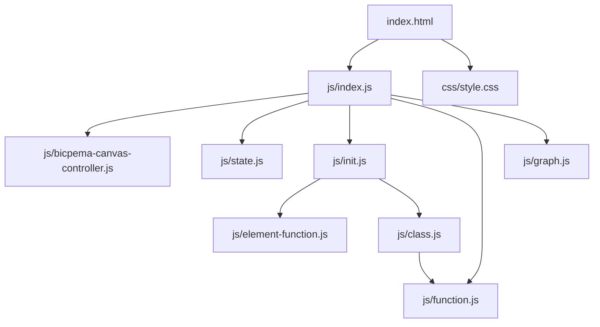
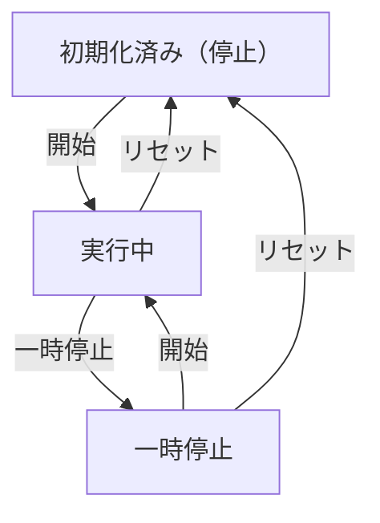

# 電車の加速と減速シミュレーション設計書

## 1. 概要

- 対象: 電車の等加速度運動（加速・減速）を可視化するp5.jsシミュレーション。
- 想定利用者: 物理基礎の学習者（中学〜高校程度）。
- 確定事項:
  - 右上の設定ボタンで加速度 a (m/s²) を変更できる（-10〜+10、ステップ0.5）。
  - 左下の操作ボタンで開始・一時停止ができる。
  - 画面下半分にv-tグラフをリアルタイム表示する（Chart.js使用）。
- 推定事項:
  - 電車は画面右端を超えると左端から折り返す（ラップアラウンド）。
  - 加速度が負値の場合、速度は0以下にならない（後退しない）。

## 2. 画面設計

- 画面構成:
  - 上部バー（タイトル "電車の加速と減速"、ホームリンク）。
  - 上半分にp5キャンバス（空・地面・線路・電車・情報パネルを描画）。
  - 下半分にChart.jsのv-tグラフ（白背景）。
  - 左下に操作ボタン群（▶ 開始 / ⏸ 一時停止）。
  - 右上に設定ボタン。
- UI要素:
  - 数値入力: 加速度 a (m/s²)、min=-10, max=10, step=0.5。
  - 操作: 開始・一時停止（同一ボタン）、リセット（設定モーダル内）。
  - グラフ: v-tグラフ（速さ vs 経過時間）、0.1秒間隔でデータ追記。
- 確定事項:
  - bodyは固定レイアウトでスクロール不可（overflow: hidden）。
  - 情報パネル（左上）: 速さ v、経過時間 t、加速度 a を表示。

## 3. 機能仕様

- 開始/一時停止:
  - 「▶ 開始」ボタン押下で `state.isPlaying=true`。
  - 「⏸ 一時停止」ボタン押下で `state.isPlaying=false`。
- リセット:
  - 設定モーダル内「リセット」ボタンで `state.elapsedTime=0`、`state.train.reset()`、`state.vtData=[{x:0,y:0}]`、`state.isPlaying=false`。
- 設定反映:
  - 加速度入力変更時: `state.acceleration` を即時更新（入力中にリアルタイム反映）。
- v-tグラフ更新:
  - 0.1秒間隔で速さデータを `state.vtData` に追記し `updateChart()` を呼ぶ。
  - x軸上限は経過時間に応じて10秒刻みで自動拡張。
  - y軸上限は観測された最大速度 `state.maxObservedVelocity` に基づき5単位刻みで自動拡張。
- 境界条件:
  - 速度は `Math.max(0, velocity + acceleration * dt)` で0以上に制限。
  - 電車は `x > V_W + TRAIN_HALF_W` で左端にラップ。

## 4. ロジック仕様

- 実行モデル:
  - p5.jsインスタンスモード（setup/draw/windowResized）を利用。
  - ESModule（`import`）ベースで実装。
- 座標系:
  - 仮想キャンバス幅 V_W=1000px、縦は V_W * (height/width) で動的計算。
  - 地面Y = VH * 0.72。
  - PX_PER_METER=50（1m = 50仮想px）。
  - TRAIN_HALF_W=100（電車の半幅）。
  - draw() 冒頭で `p.scale(p.width / V_W)` を適用。
- 状態管理:
  - `state.isPlaying`: アニメーション進行ON/OFF。
  - `state.elapsedTime`: 経過時間 (s)。
  - `state.acceleration`: 加速度 (m/s²)。
  - `state.train`: Trainオブジェクト（x, velocity, trackOffset）。
  - `state.vtData`: v-tグラフ用データ配列 [{x: t, y: v}]。
  - `state.lastGraphUpdate`: グラフ更新カウンタ (s)。
  - `state.maxObservedVelocity`: y軸スケーリング用最大速度。
  - `state.graphChart`: Chart.jsインスタンス。
- 描画処理:
  - `isPlaying` が真のとき、Train.update() でdt=1/FPS秒の物理更新。
  - 背景（空色）→地面（緑）→線路（枕木+レール）→電車→情報パネルの順で描画。
- Trainクラス（`class.js`）:
  - `update(dt, acceleration, pxPerMeter, vw)`: 速度・位置・trackOffsetを更新。
  - `reset()`: 初期状態に戻す。
- グラフ（`graph.js`）:
  - `initChart()`: Chart.jsのscatterチャートを生成。
  - `updateChart()`: データと軸範囲を更新。
- FPS: 60。

## 5. ファイル構成と責務

- `vite/simulations/train-acceleration/index.html`
  - 画面DOM（ナビバー、グラフコンテナ、設定モーダル、操作ボタン）と `js/index.js` / `css/style.css` の参照を保持。
- `vite/simulations/train-acceleration/css/style.css`
  - 上下2分割レイアウト、キャンバス配置、グラフコンテナ、スクロール無効化、ボタンUIをスタイリング。
- `vite/simulations/train-acceleration/js/index.js`
  - p5インスタンス起動（`new p5(sketch)`）と各ライフサイクル（setup/draw/windowResized）を紐付け。
  - `BicpemaCanvasController` で上半分のキャンバス領域を制御（availH/2）。
- `vite/simulations/train-acceleration/js/state.js`
  - `state`オブジェクト（isPlaying, elapsedTime, acceleration, train, vtData, lastGraphUpdate, maxObservedVelocity, font, graphChart）。
- `vite/simulations/train-acceleration/js/class.js`
  - `Train`クラス: 物理更新・リセット・描画（ラップアラウンド対応）。
- `vite/simulations/train-acceleration/js/init.js`
  - 定数（FPS, V_W, PX_PER_METER）をexport。
  - `settingInit(p, canvasController)`: フォント非同期読込・キャンバス生成・frameRate設定。
  - `elCreate(p)`: DOM要素取得とイベント登録。
  - `initValue(p)`: state変数初期化。
- `vite/simulations/train-acceleration/js/function.js`
  - `TRAIN_HALF_W`をexport。
  - `drawTrack(p, groundY, trackOffset, vw)`: 線路（枕木・レール）描画。
  - `drawTrain(p, trainX, groundY)`: 電車描画。
  - `drawInfoPanel(p, v, t, a)`: 情報パネル描画。
- `vite/simulations/train-acceleration/js/graph.js`
  - `initChart()`: Chart.jsインスタンス生成。
  - `updateChart()`: データ・軸範囲更新。
- `vite/simulations/train-acceleration/js/element-function.js`
  - `onPlayPause()`, `onReset()`, `onToggleModal()`, `onCloseModal()`, `onAccelerationChange()`。
- `vite/simulations/train-acceleration/js/bicpema-canvas-controller.js`
  - キャンバスサイズ計算（上半分モード）・生成・リサイズ処理。

## 6. 状態遷移

- 初期化済み（停止）: setup実行後。state.isPlaying=false、速度=0。
- 実行中: 開始ボタン押下でstate.isPlaying=true。
- 一時停止: 一時停止ボタン押下でstate.isPlaying=false。
- リセット: リセット押下で初期化済み（停止）へ戻る。

## 7. 既知の制約

- 加速度が非常に大きい場合、v-tグラフのy軸スケールが大きくなり視認性が下がる。
- 電車のラップアラウンド時に位置がリセットされるが、速度・時間は継続する。
- リサイズ時は `canvasController.resizeScreen(p)` のみ呼ばれ、物理状態は保持される。
- v-tグラフのデータは累積し続けるため、長時間実行でメモリが増加する。

## 8. 未確定事項

- 加速度の推奨入力範囲（教材設計上の想定値）。
- 電車のラップアラウンド時に速度をリセットするかどうかの教材的な意図。
- 情報アイコンの挙動（リンクやモーダル）が未実装かどうか。
