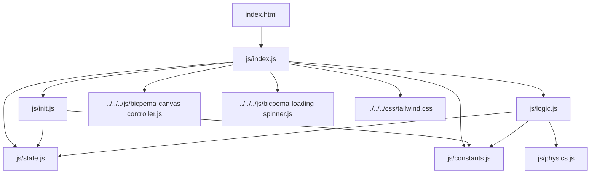
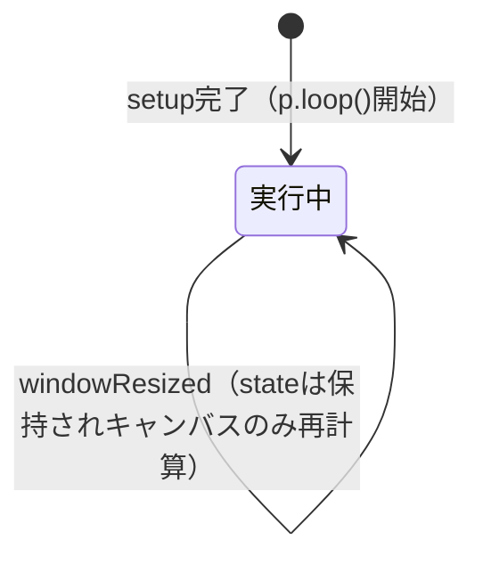

# 変圧器シミュレーション設計書

## 1. 概要

- 対象: 電磁誘導によって一次コイル・二次コイル間で電圧が変換される「変圧器」の仕組みを可視化するp5.jsシミュレーション。
- 想定利用者: 中学校・高校で物理（電磁気学）を学ぶ学習者（`content/post/変圧器/index.md` より）。
- 確定事項:
    - 下部の常設パネル（右上モーダルではない）で「位相」（同位相/逆位相）、「速度」（ゆっくり/はやい）、「一次コイル巻数」「二次コイル巻数」（＋/－ボタン）を変更できる。
    - シミュレーションは `setup()` 内で `p.loop()` が呼ばれた後、常時描画・更新され続ける。再生/一時停止/リセットのボタンは存在しない（`state.moveIs` に相当する状態変数もない）。
    - 変圧器コア・一次コイル・二次コイルの画像と、一次電圧・二次電圧のオシロスコープ波形、電流の向きを示す矢印が同一キャンバス上に描画される。
- 推定事項:
    - `state.angle = -20`（コイル曲がり部の傾き角）は初期値のまま更新されるコードが存在せず、将来アニメーション化する余地を残した定数的な値だと推定される。
    - `content/post/変圧器/index.md` の「使用方法」記述（▶開始 / ⚙設定 / 🔄リセットボタン）は他シミュレーション向けの定型文がそのまま残っており、本シミュレーションの実装（開始・設定モーダル・リセットボタンなし）とは一致しない（記事側が未更新と推定）。

## 2. 画面設計

- 画面構成:
    - 上部ナビバー（高さ60px、`#navBar`）: 「Bicpema」ロゴ・リンクと「変圧器」というタイトル表示のみ。ホームアイコンや情報アイコン、設定ボタンはない。
    - 中央: p5キャンバス（`#p5Container`。高さは `calc(100vh - 60px - 50px)`、幅いっぱい）。
    - 下部: 常時表示の設定パネル（`#settingsPanel`、`position: fixed; bottom: 0`）。位相ラジオボタン、速度ラジオボタン、一次/二次コイルの巻数＋/－ボタンを横並びで配置。
    - モーダルや折りたたみ式の設定パネルはなく、常に画面下部に表示されている（AGENTS.mdの標準パターン「右上に設定表示ボタン」とは異なる構成）。
- キャンバス内のUI要素（p5.js描画）:
    - 変圧器コア画像（`state.img1`）とその内部の磁力線ループ・矢印（電流の向きに応じて時計回り/反時計回りに切替）。
    - 一次コイル・二次コイルの巻き線画像（`state.img2`＝横線、`state.img3`＝曲がり部）。巻数は state.count1 / state.count2 に応じて縦方向にループ描画される。
    - 一次コイル・二次コイルそれぞれの下に巻数テキスト（「一次コイル 巻数：n」「二次コイル 巻数：n」）。
    - 左に一次電圧オシロスコープ、右に二次電圧オシロスコープ（グリッド付き矩形＋sin波形）。
    - 一次電流・二次電流を示す矢印（胴体＋矢じり）と赤色のラベル文字。
- HTML上のUI要素（下部パネル）:
    - 位相選択: ラジオボタン「同位相」（デフォルト選択）/「逆位相」。
    - 速度選択: ラジオボタン「ゆっくり」（デフォルト選択、value=1）/「はやい」（value=5）。
    - 一次コイル巻数: 「＋」「－」ボタン（`#coil1PlusBtn` / `#coil1MinusBtn`）。
    - 二次コイル巻数: 「＋」「－」ボタン（`#coil2PlusBtn` / `#coil2MinusBtn`）。
- 確定事項:
    - 右クリックのコンテキストメニューは無効化（`oncontextmenu="return false;"`）。
    - `body` は `overflow-hidden` でスクロール不可の固定レイアウト。
    - ローディングスピナー（`#loadingSpinner`）は初回 `draw()` 実行時に `hideLoadingSpinner()` で非表示化される。
    - 左下の再生/停止ボタン、右上の設定ボタンはいずれも存在しない（AGENTS.mdの標準UI配置とは異なる本シミュレーション固有の構成）。

## 3. 機能仕様

- 開始/一時停止/リセット:
    - 該当する操作ボタンは実装されていない。`p.setup()` 内で `p.loop()` が呼ばれ、以降 `draw()` が継続的に実行される。ページを開いた時点から常時アニメーションが進行する。
- 位相の切り替え:
    - ラジオボタン「同位相」/「逆位相」を選択すると、`drawSimulation(p)` 内で毎フレーム `document.querySelector('input[name="phase"]:checked')` を参照し `state.phase` を即時更新する。
    - `state.phase` は二次コイルの端線接続方向（`coil2` 関数内の分岐）、二次電圧波形の符号、二次電流の向きに影響する。
- 速度の切り替え:
    - ラジオボタン「ゆっくり」(value=1)/「はやい」(value=5) を選択すると、毎フレーム `state.omega` に反映される。`state.omega` は磁力線の向き判定、電流の瞬時値、オシロスコープ波形の位相速度に使われる。
- 一次コイル巻数の増減:
    - 「＋」ボタン: `state.count1 = p.constrain(state.count1 + TURNS_STEP, state.minCount, state.maxCount)`（`TURNS_STEP = 5`）。
    - 「－」ボタン: 同様に `TURNS_STEP` を減算。
    - 表示巻数は `state.count1 + 1`（初期値20巻、`count1 = TURNS_MAX = 19`）。
- 二次コイル巻数の増減:
    - 「＋」「－」ボタンで `state.count2` を同様に `TURNS_STEP` 単位で増減。表示巻数は `state.count2 + 1`（初期値5巻、`count2 = TURNS_MIN = 4`）。
- 巻数変更の即時反映:
    - 巻数変更は次フレームの描画（コイル巻き線本数、巻数テキスト、二次電圧振幅 `V2 = V1 × (N2/N1)`、二次電流振幅 `I2 = I1 × (N1/N2)`）に即時反映される。
- 境界条件:
    - 巻数インデックスは `p.constrain()` により `TURNS_MIN(4)` 〜 `TURNS_MAX(19)`（表示巻数5〜20）の範囲に制限される。上限/下限到達後にさらにボタンを押しても値は変化しない。
    - 増減幅は常に `TURNS_STEP = 5` 固定（HTML側に数値入力欄はなく、`min`/`max`属性による制御は行われていない。制限はJS側の `p.constrain()` のみ）。
    - 位相・速度はラジオボタンによる二択のみで、中間値や数値入力は存在しない。

## 4. ロジック仕様

- 実行モデル:
    - p5.jsインスタンスモード（`setup`/`draw`/`windowResized`、`preload`も使用）。
    - ESModule（`import`/`export`）ベースで実装され、`window`グローバル公開は行われていない。
    - 仮想キャンバス幅 `V_W = 1000` を基準に `p.scale(p.width / V_W)` でスケーリングし、以降の描画座標はすべて仮想座標系（1000×562.5相当、16:9比率）で記述される。
- 状態管理（`state`、`js/state.js`）:
    - `img1`/`img2`/`img3`: `preload()` でロードする変圧器コア・コイル画像。
    - `count1`/`count2`: 一次/二次コイルの巻き線インデックス（表示巻数は+1）。
    - `waveK`: オシロスコープ波形の空間周波数（固定値5、UIからの変更なし）。
    - `omega`: 角速度（速度ラジオボタンで1または5）。
    - `t`: フレームカウント（`drawSimulation`の最後で毎フレーム`+1`、時間変数として波形・電流計算に使用）。
    - `phase`: 位相フラグ（true=同位相/false=逆位相）。
    - `topY1`/`topY2`: 描画ループ内で更新される一次/二次コイル最上端のY座標（他所からの参照は確認できず、描画補助のローカル記録用途と推定）。
    - `minCount`/`maxCount`: 巻数インデックスの制限値（`TURNS_MIN`/`TURNS_MAX`を代入）。
    - `angle`: コイル曲がり部の傾き角（度、固定値-20。UIや処理での更新箇所なし）。
    - 本シミュレーションには「moveIs」に相当する再生/停止フラグは存在せず、常時実行される点が他の多くのシミュレーションと異なる。
- 描画処理（`js/logic.js` `drawSimulation(p)`）:
    1. 毎フレーム、下部パネルのラジオボタンから `state.phase` と `state.omega` を読み取り即時反映。
    2. 背景を白で塗りつぶし。
    3. 一次/二次コイルの巻数テキストを描画。
    4. `p.translate(308, 0)` した座標系でコア画像・磁力線（`magline`）・一次コイル（`coil1`）・二次コイル（`coil2`）を描画。
    5. 左側 (`translate(25, 150)`) に一次電圧オシロスコープ（`oscillo1`）、右側 (`translate(775, 150)`) に二次電圧オシロスコープ（`oscillo2`）を描画。
    6. `state.t++` でフレームカウントを進める。
    - 一時停止中の描画抑制は実装されていない（常時描画・更新）。
- 計算モデル:
    - 磁力線の向き: `p.sin(-state.omega * state.t)` の符号で時計回り/反時計回りの矢印を切り替え。
    - 一次電流: `I = PRIMARY_CURRENT_AMPLITUDE(15) × sin(state.omega × state.t)`。矢印の胴体長・矢じり突出量に反映。
    - 二次電圧振幅: `computeSecondaryVoltage(V1, N1, N2) = V1 × (N2/N1)`（`js/physics.js`）。理想変圧器の関係式 `V2/V1 = N2/N1` を実装したもの。
    - 二次電流振幅: `computeSecondaryCurrentAmplitude(I1, N1, N2, inPhase) = ±I1 × (N1/N2)`（逆位相時に符号反転）。理想変圧器の関係式 `I2/I1 = N1/N2` を実装したもの。
    - オシロスコープ波形: `y = h/2 + V × sin(waveK × x − omega × t)` の進行波として描画（一次側は常に+、二次側は同位相なら+、逆位相なら−）。
    - コイルの曲がり部の変位 `d = sin(-state.angle) × w2` は `state.angle` が定数のため実質固定値。
- 推定事項:
    - `topY1`/`topY2` は現状コード内での読み出し箇所が見当たらず、デバッグ用途または将来拡張（電流ラベル位置の動的調整など）のための残置と推定される。
    - `state.angle` が定数運用である点から、当初はコイル巻き線の傾きをアニメーションさせる設計だった可能性があるが、現状は静的表示に留まっていると推定される。

## 5. ファイル構成と責務

- `vite/simulations/transformer/index.html`
    - 画面のDOM（ナビバー、下部設定パネル、ローディングスピナー）と `js/index.js` の参照を保持。専用の `css/style.css` は存在せず、共通の `tailwind.css`（`js/index.js`からimport）とTailwindユーティリティクラスのみでスタイリングされる。
- `vite/simulations/transformer/js/index.js`
    - p5インスタンス起動（`new p5(sketch)`）と `preload`/`setup`/`draw`/`windowResized` の紐付け。
    - `BicpemaCanvasController`（下部設定パネル分の高さを差し引く `bottomBarSelector` オプション付き）で16:9固定アスペクトの表示領域を制御。
    - `p.scale(p.width / V_W)` による仮想座標系スケーリング。
    - 初回`draw()`実行時に`hideLoadingSpinner()`でスピナーを非表示化。
- `vite/simulations/transformer/js/state.js`
    - `state` オブジェクト（画像参照、巻数、角速度、位相、時間、描画補助変数の定義）。
- `vite/simulations/transformer/js/constants.js`
    - 巻数の最小/最大/増減ステップ、ラベルフォントサイズ、電流色、電流振幅、矢じりスケール、オシロスコープの寸法・背景色・波形色・線幅などの定数を集約。
- `vite/simulations/transformer/js/init.js`
    - `elCreate(p)` で巻数＋/－ボタンのクリックイベントを`state`に紐付け（`p.constrain()`で範囲制限）。
    - `initValue()` で`state`の初期値（巻数・速度・時間・位相）を設定。
    - `FPS`（60）を定義しエクスポート。
- `vite/simulations/transformer/js/logic.js`
    - `drawSimulation(p)` で毎フレームUI状態（位相・速度）を`state`へ反映し、変圧器本体・磁力線・コイル・オシロスコープ・電流矢印を描画。
    - 内部関数 `magline`/`coil1`/`coil2`/`oscillo1`/`oscillo2`/`current1`/`current2` を保持（モジュール非公開）。
- `vite/simulations/transformer/js/physics.js`
    - `computeSecondaryVoltage`、`computeSecondaryCurrentAmplitude` の2つの純粋計算関数（変圧比に基づく理想変圧器の電圧・電流変換式）。
- 共通資産（対象外・依存のみ）:
    - `vite/js/bicpema-canvas-controller.js`（16:9固定比率のキャンバスサイズ制御、下部バー分の高さ差し引きに対応）。
    - `vite/js/bicpema-loading-spinner.js`（ローディングスピナーの非表示化）。
    - `vite/css/tailwind.css`（共通スタイル基盤、Tailwindユーティリティ）。

- 改修時の影響範囲:
    - 巻数の範囲・刻み幅を変える場合: `js/constants.js`（`TURNS_MIN`/`TURNS_MAX`/`TURNS_STEP`）と`js/init.js`の初期値、`js/logic.js`の巻き線描画ループ・巻数テキスト表示に影響。
    - 変圧比の計算式を変える場合: `js/physics.js` の2関数と、それらを呼び出す `js/logic.js` の `oscillo2`/`current2`。
    - UI配置（下部パネル→右上モーダル化など）を変える場合: `index.html` のDOM構成、`js/index.js` の `BicpemaCanvasController` オプション（`bottomBarSelector`）、`js/init.js` の `elCreate`、`js/logic.js` の `document.querySelector` 参照箇所。
    - 再生/一時停止機能を新規追加する場合: `js/state.js`（状態変数追加）、`js/logic.js`（`drawSimulation`冒頭のガード追加）、`index.html`・`js/init.js`（ボタン追加とイベント登録）が影響範囲。

## 6. 状態遷移

- 本シミュレーションには再生/一時停止/リセットの概念がなく、`setup()`後は常に「実行中」状態が継続する。状態遷移は主にパラメータ設定（位相・速度・巻数）の変更として現れる。
- 起動時（初期化済み・実行中）: `initValue()`により `count1=19`（表示20）, `count2=4`（表示5）, `omega=1`（ゆっくり）, `phase=true`（同位相）, `t=0` に設定され、直後から`draw()`ループが開始する。
- 実行中（唯一の稼働状態）: 位相ラジオボタン、速度ラジオボタン、巻数＋/－ボタンの操作により、対応する`state`値が次フレームから即時反映される。稼働状態自体は変化しない（一時停止状態への遷移は存在しない）。
- ウィンドウリサイズ時: `windowResized`は`canvasController.resizeScreen(p)`のみを呼び出し、`initValue()`は呼ばれないため、巻数・位相・速度・時間`t`などの状態は保持されたままキャンバスサイズのみ再計算される。

## 7. 既知の制約

- 再生/一時停止/リセットのUIが存在しないため、ページを開いている間は常時アニメーションが進行し続け、途中で状態を止めたり初期状態に戻したりする手段がない。
- 巻数の増減幅は`TURNS_STEP=5`固定で、任意の細かい値への調整はできない。
- `state.waveK`（波数）と`state.angle`（コイル曲がり部の傾き角）はUIから変更する手段がなく、コード変更でのみ調整可能な固定値。
- 下部設定パネルは`position: fixed`かつ`flex-wrap: wrap`のため、極端に狭い画面幅では折り返され、`BicpemaCanvasController`の`bottomBarSelector`計算に使う高さ（`offsetHeight`）が変化し、キャンバス高さの再計算結果に影響し得る。
- 描画座標（コア・コイル・オシロスコープの位置やサイズ）はほぼ全て`js/logic.js`内にハードコードされた数値であり、レイアウト変更時は該当箇所を個別に調整する必要がある。
- AGENTS.mdが定める標準UI配置（左下に再生・停止ボタン、右上に設定表示ボタン）とは異なる独自レイアウト（下部常設パネルのみ）となっている。

## 8. 未確定事項

- `content/post/変圧器/index.md`の「使用方法」に記載された「▶ 開始」「⚙ 設定」「🔄 リセット」ボタンが、記事作成時点のテンプレート文言の残存なのか、今後実装追加を予定しているものかは実装からは判断できない。
- `state.topY1`/`state.topY2`は描画ループ内で更新されるのみで読み出し箇所が確認できず、意図された用途（未実装の機能の準備か、単なる残存コードか）は未確定。
- `state.angle`が定数のまま置かれている理由（将来のアニメーション用の設計残置か、現状で確定仕様か）は未確定。
- 一次コイル・二次コイルの巻数上限（表示20巻）・下限（表示5巻）、増減幅5巻という数値が教材設計上どのような意図（学習段階に応じた推奨範囲など）で選ばれたかは実装からは不明。
