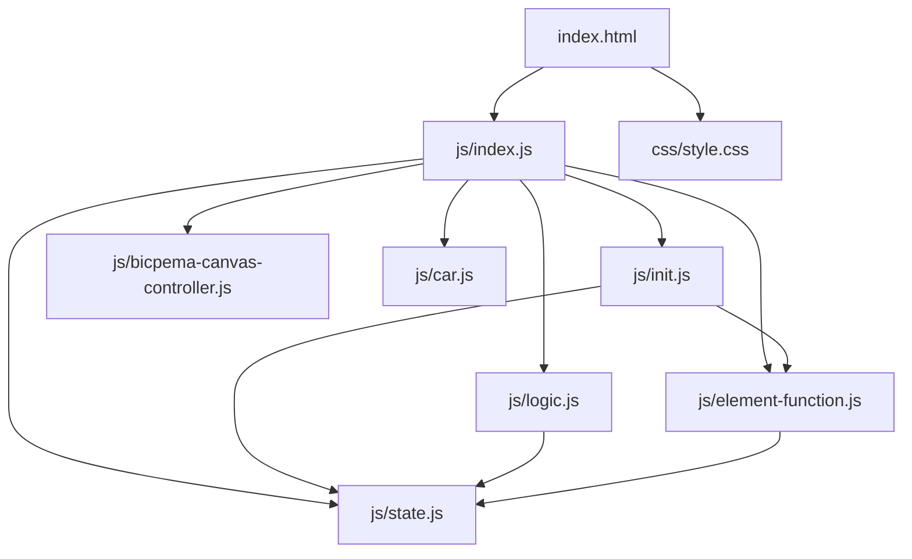
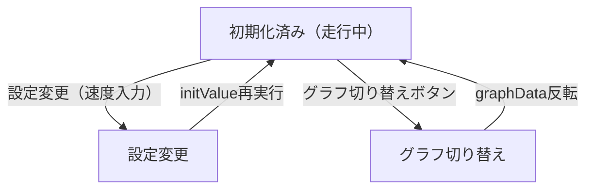

# 等速直線運動シミュレーション設計書

## 1. 概要

- 対象: 等速直線運動をする模型自動車の様子を可視化する p5.js シミュレーション。黄色い車と赤い車が異なる速度で走り、X-T グラフ / V-T グラフをリアルタイムで表示する。
- 想定利用者: 物理基礎の学習者（中学〜高校程度）。
- 確定事項:
  - 右上の設定モーダルで黄色い車・赤い車の速度 (cm/s) を変更できる。
  - 左下の操作ボタン（グラフ切り替え）でグラフの種類を変更できる。
  - キャンバス下にグラフ（Chart.js）と操作ボタン、設定モーダルボタンが配置される。
  - スケール（距離の目盛り）の表示/非表示を設定で切り替えできる。
- 推定事項:
  - Chart.js は現行 CDN で読み込んでいるが、ES Modules 移行後は npm パッケージを使用する。

## 2. 画面設計

- 画面構成:
  - 上部バー（タイトル「等速直線運動をする模型自動車のようす」、ホームリンク）。
  - 中央にp5キャンバス（16:9比率）。
  - キャンバス下部にグラフエリア（Chart.js 描画）。
  - キャンバス下部に「グラフの切り替え」ボタン。
  - キャンバス下部に「シミュレーション設定」モーダル起動ボタン。
- UI要素:
  - チェックボックス: スケールの表示/非表示。
  - 数値入力: 黄色い車の速度 (cm/s)、赤い車の速度 (cm/s)。
  - 操作: グラフ切り替え（X-Tグラフ/V-Tグラフ）。
- 確定事項:
  - body は固定レイアウトでスクロール不可（推定。現行 CSS 要確認）。
  - グラフ（Chart.js）はキャンバス外の DOM 要素に描画される。

## 3. 機能仕様

- 等速直線運動:
  - 各フレームで `car.posx += (50 * car.speed) / 60` をリアルタイム更新（停止機能なし）。
- グラフ切り替え:
  - 「グラフの切り替え」ボタンで `graphData` (boolean) を反転し、X-T グラフ / V-T グラフを切り替え。
- 設定変更:
  - 車の速度入力変更時に `initValue()` を再実行してグラフデータを再計算。
- スケール表示:
  - チェックボックスの状態に応じて `drawScale()` を呼び出す。
- 境界条件:
  - 車の速度は `min=1` (cm/s)。

## 4. ロジック仕様

- 実行モデル:
  - p5.js インスタンスモード（`const sketch = (p) => {...}; new p5(sketch);`）を利用。
  - ESModule（`import`）ベースで実装し、`window` グローバル公開は行わない。
  - Chart.js は `import Chart from "chart.js/auto"` で利用。
- 状態管理:
  - `state.YELLOW_CAR`: CAR インスタンス（黄色い車）。
  - `state.RED_CAR`: CAR インスタンス（赤い車）。
  - `state.graphData`: グラフ切り替えフラグ（true: X-T / false: V-T）。
  - `state.graphChart`: Chart.js インスタンス（毎フレーム destroy & 再生成）。
  - `state.YELLOW_CAR_IMG`, `state.RED_CAR_IMAGE`: 車画像。
  - UI 要素参照（入力・ボタン・チェックボックス）。
- 描画処理:
  - `draw()` 内で `p.scale(p.width / CANVAS_WIDTH)` を適用。
  - 背景（黒）・地面（ダーク矩形）を描画。
  - スケールチェックボックスが ON の場合 `drawScale()` を呼ぶ。
  - `RED_CAR.update()`, `YELLOW_CAR.update()` で位置を更新。
  - 軌跡・車を描画する。
  - `graphDraw()` でグラフを Chart.js で毎フレーム再描画。
- 計算モデル:
  - 等速直線運動: `x = v * t`
  - グラフデータ: 各時刻 `t=0..carNum` における `{x: t, y: v*t}` または `{x: t, y: v}`。
- 推定事項:
  - `CANVAS_WIDTH=1000`、`CANVAS_HEIGHT=562.5`、`frameRate=60`。

## 5. ファイル構成と責務

- `vite/simulations/uniform-linear-motion/index.html`
  - 画面の DOM（ナビバー、p5Canvas）と `js/index.js` / `css/style.css` の参照を保持。
- `vite/simulations/uniform-linear-motion/css/style.css`
  - 全体レイアウト、キャンバス配置、スクロール無効化をスタイリング。
- `vite/simulations/uniform-linear-motion/js/index.js`
  - p5 インスタンス起動と各ライフサイクル（preload/setup/draw/windowResized）を紐付け。
- `vite/simulations/uniform-linear-motion/js/state.js`
  - `state` オブジェクト（CAR インスタンス、グラフ変数、UI 要素参照、画像参照）。
- `vite/simulations/uniform-linear-motion/js/car.js`
  - `CAR` クラス定義（位置更新・軌跡描画・車描画）。
- `vite/simulations/uniform-linear-motion/js/init.js`
  - `imgInit(p)`, `elCreate(p)`, `elSetting(p)`, `initValue(p)` の初期化関数群。
- `vite/simulations/uniform-linear-motion/js/logic.js`
  - `drawScale(p, ...)`, `graphDraw(p)` などの描画ロジック。
- `vite/simulations/uniform-linear-motion/js/element-function.js`
  - `graphButtonFunction()` などのイベントハンドラ。
- `vite/simulations/uniform-linear-motion/js/bicpema-canvas-controller.js`
  - 16:9 固定比率のキャンバスサイズ設定とリサイズ処理。

## 6. 状態遷移

- 本シミュレーションは停止機能を持たず、常に車が走り続ける（停止/再開なし）。
- 設定変更時に `initValue()` が再実行され、車の位置と速度がリセットされる。
- グラフ切り替えは `graphData` フラグの反転のみ。

## 7. 既知の制約

- 旧実装は複数 `<script vite-ignore>` タグと CDN（Chart.js）で構成されており、ES Modules への全面移行が必要。
- Chart.js を `graphDraw()` で毎フレーム `destroy()` & 再生成しており、パフォーマンスが低い。
- `elSetting()` が `elInit()` 内で生成した DOM 要素の位置を算術演算で設定しており、レスポンシブ対応が脆弱。
- モーダルは p5.js の `createDiv()` で動的に生成しており、HTML 側に静的定義が望ましい。

## 8. 未確定事項

- 情報アイコンの挙動（記事リンクかモーダルか）が未実装かどうか。
- 車の速度の教材上の推奨範囲（現行は 1〜10 cm/s 程度）。
- グラフの x 軸最大値（現行は固定 10 s）の変更可否。
- 等速直線運動なので停止/再開ボタンが不要かどうか（教材設計による）。
