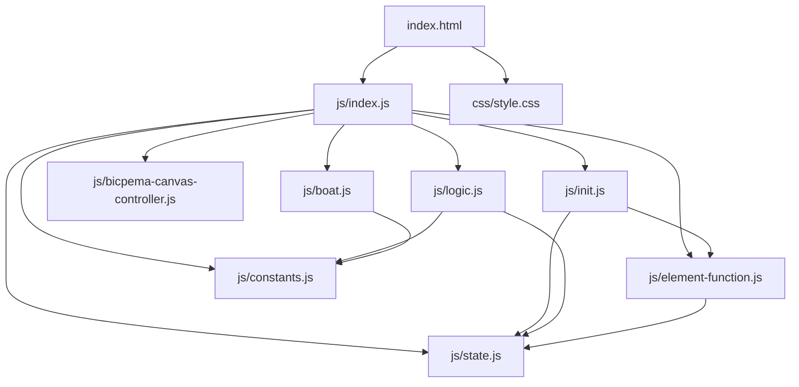
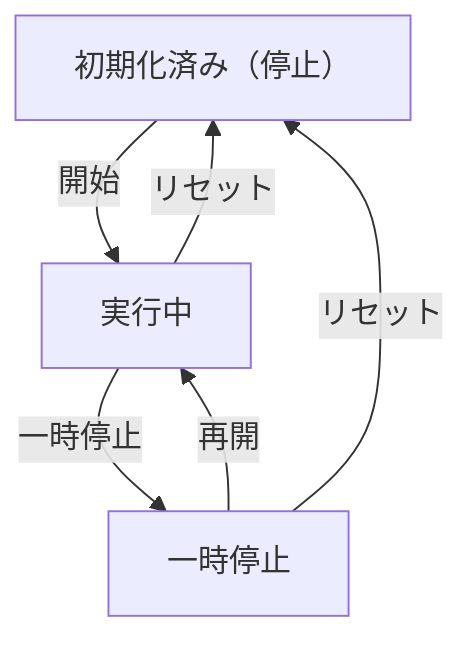

# 速度の合成シミュレーション設計書

## 1. 概要

- 対象: 川を進む船を題材に、速度の合成（v合 = v川 + v船）を可視化する p5.js シミュレーション。
- 想定利用者: 物理基礎の学習者（高校物理程度）。
- 確定事項:
  - 右上の設定パネルで川の速度・船の速度（水に対して）をスライダーで変更できる。
  - 左下の操作ボタン（リセット・開始/一時停止）でシミュレーションを制御できる。
  - 船の上に3本の速度矢印（v川・v船・v合）を表示する。
  - 川の流れを水の粒子（波紋）で視覚化する。
  - 右岸に観測者（スティックフィギュア）を配置する。
  - 速度情報パネルを右下に表示する。
- 推定事項:
  - フォントは ZenMaruGothic-Regular.ttf を Firebase Storage から読み込む（現行は preload でロード）。

## 2. 画面設計

- 画面構成:
  - 上部バー（タイトル「速度の合成」、ホームリンク）。
  - 中央にp5キャンバス（16:9比率）。
  - 左下に操作ボタン群（リセット、開始/一時停止）。
  - 右上に設定モーダル起動ボタン。
- UI要素:
  - スライダー: 川の速度（0〜10 m/s、デフォルト 3）、船の速度（-10〜10 m/s、デフォルト 5）。
  - 操作: 開始、一時停止、再開、リセット。
- 確定事項:
  - 右クリックのコンテキストメニューは無効化。
  - body は固定レイアウトでスクロール不可。

## 3. 機能仕様

- 開始:
  - 「開始」ボタン押下で `boat.isMoving=true`、船と水粒子の更新を開始。
- 一時停止/再開:
  - 「一時停止」で `boat.isMoving=false`、「再開」で `boat.isMoving=true`。
  - 水の粒子は常に更新を継続する（推定）。
- リセット:
  - 「リセット」で `boat.reset(boatSpeed, riverSpeed)` を呼ぶ。ボタン表示を「開始」に戻す。
- 速度スライダー変更:
  - 川の速度スライダー変更: `boat.riverSpeed = val` をリアルタイムで反映。
  - 船の速度スライダー変更: `boat.boatSpeed = val` をリアルタイムで反映。
- 船の折り返し:
  - 船が画面外 (`x > 1100` または `x < -100`) に出ると反対側から再登場。
- 境界条件:
  - 川の速度は 0 以上（スライダー min=0）。

## 4. ロジック仕様

- 実行モデル:
  - p5.js インスタンスモード（`const sketch = (p) => {...}; new p5(sketch);`）を利用。
  - ESModule（`import`）ベースで実装し、`window` グローバル公開は行わない。
- 状態管理:
  - `state.boat`: Boat インスタンス（x・速度・isMoving）。
  - `state.waterParticles`: WaterParticle インスタンス配列（40個）。
  - `state.person`: Person インスタンス（観測者）。
  - `state.boatSpeedInput`, `state.riverSpeedInput`, `state.boatSpeedValue`, `state.riverSpeedValue`, `state.resetButton`, `state.playPauseButton`, `state.toggleModal`, `state.closeModal`, `state.settingsModal`: UI 要素参照。
- 描画処理:
  - `draw()` 内で `p.scale(p.width / V_W)` を適用して `V_W=1000`、`V_H=562` 仮想座標系を使用。
  - `drawScene(p)` で背景（川・岸・ラベル・凡例）を描画。
  - 水粒子の更新・描画を毎フレーム実施。
  - `boat.update(dt)` と `boat.draw(p)` で船を更新・描画。
  - `person.draw(p)` で観測者を描画。
  - `drawInfoPanel(p)` で速度情報パネルを右下に描画。
- 計算モデル:
  - `v合 = v川 + v船`（左向き正）
  - `dx = -compositeSpeed * PX_PER_MPS * dt`（`PX_PER_MPS=20`）
- 推定事項:
  - `FPS=30`、`V_W=1000`、`V_H=562`、`RIVER_BOTTOM=320`、`BOAT_Y=160`。

## 5. ファイル構成と責務

- `vite/simulations/velocity-composition/index.html`
  - 画面の DOM（ナビバー、設定モーダル、操作ボタン）と `js/index.js` / `css/style.css` の参照を保持。
- `vite/simulations/velocity-composition/css/style.css`
  - 全体レイアウト、キャンバス配置、スクロール無効化、ボタン UI をスタイリング。
- `vite/simulations/velocity-composition/js/index.js`
  - p5 インスタンス起動と各ライフサイクル（preload/setup/draw/windowResized）を紐付け。
- `vite/simulations/velocity-composition/js/state.js`
  - `state` オブジェクト（Boat・WaterParticle 配列・Person、UI 要素参照）。
- `vite/simulations/velocity-composition/js/constants.js`
  - `V_W`, `V_H`, `RIVER_BOTTOM`, `BOAT_Y` などの定数。
- `vite/simulations/velocity-composition/js/boat.js`
  - `Boat`、`WaterParticle`、`Person` クラス定義。
- `vite/simulations/velocity-composition/js/init.js`
  - `initValue(p)` でオブジェクト生成・状態初期化。`elCreate(p)` で UI 要素を state に紐付け。
- `vite/simulations/velocity-composition/js/logic.js`
  - `drawScene(p)`, `drawLegend(p)`, `drawInfoPanel(p)`, `drawArrow(p,...)`, `drawArrowWithLabel(p,...)` などの描画関数。
- `vite/simulations/velocity-composition/js/element-function.js`
  - ボタン・スライダーのイベントハンドラ。
- `vite/simulations/velocity-composition/js/bicpema-canvas-controller.js`
  - 16:9 固定比率のキャンバスサイズ設定とリサイズ処理。

## 6. 状態遷移

- 初期化済み（停止）: setup 実行後。`boat.isMoving=false`、船は初期位置。
- 実行中: 開始ボタン押下で `boat.isMoving=true`。
- 一時停止: 一時停止ボタン押下で `boat.isMoving=false`、水粒子は継続。
- 再開: 再開ボタン押下で `boat.isMoving=true`。
- リセット: リセット押下で初期化済み（停止）へ戻る。

## 7. 既知の制約

- 旧実装はグローバル関数と複数 `<script vite-ignore>` タグで構成されており、ES Modules への全面移行が必要。
- 水の粒子数 (40) は固定であり、パフォーマンス上の上限となる。
- 速度スライダーの変更はリアルタイムで反映されるが、リセットは位置のみ初期化する。
- 矢印描画関数はクラス内で参照しており、function.js から分離されていない（現行）。

## 8. 未確定事項

- 水の粒子が一時停止中も更新されるかどうか（現行コードでは一時停止中も `update()` が呼ばれる可能性あり）。
- 情報アイコンの挙動（記事リンクかモーダルか）が未実装かどうか。
- 船の速度の教材上の推奨範囲。
