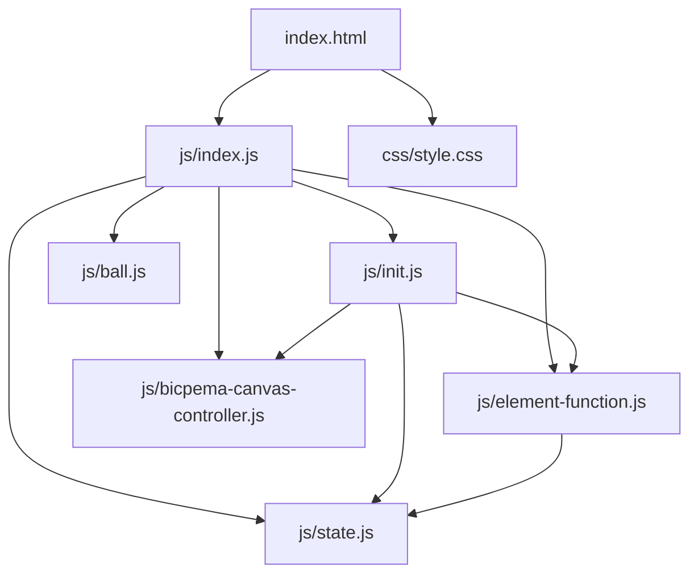
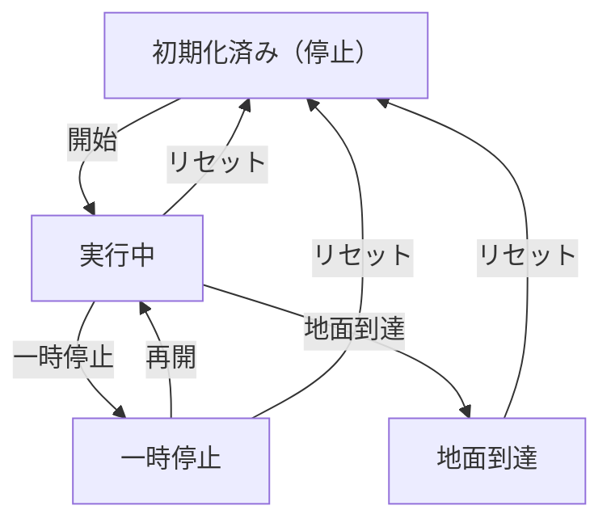

# 鉛直投げ上げ運動シミュレーション設計書

## 1. 概要

- 対象: 鉛直投げ上げ運動をする物体の軌跡・高さ・速度を可視化する p5.js シミュレーション。
- 想定利用者: 物理基礎の学習者（高校物理程度）。
- 確定事項:
  - 右上の設定モーダルで初速度 (m/s) を変更できる。
  - 左下の操作ボタン（リセット・開始/一時停止）でシミュレーションを制御できる。
  - ボールの画像・地面画像を Firebase Storage から読み込む。
  - 最高到達点に点線と高さラベルを表示する。
  - キャンバス右上に時間・高さ・速度・初速の情報パネルを表示する。
- 推定事項:
  - フォントは ZenMaruGothic-Regular.ttf を Firebase Storage から読み込む。

## 2. 画面設計

- 画面構成:
  - 上部バー（タイトル「鉛直投げ上げ運動」、ホームリンク）。
  - 中央にp5キャンバス（16:9比率）。
  - 左下に操作ボタン群（リセット、開始/一時停止）。
  - 右上に設定モーダル起動ボタン。
- UI要素:
  - 数値入力: 初速度 (m/s)、範囲 5〜50、デフォルト 30。
  - 操作: 開始、一時停止、再開、リセット。
- 確定事項:
  - body は固定レイアウトでスクロール不可。

## 3. 機能仕様

- 開始:
  - 「開始」ボタン押下で `ball.isMoving=true`、ボールの運動を開始。
- 一時停止/再開:
  - 「一時停止」で `ball.isMoving=false`、「再開」で `ball.isMoving=true`。
- リセット:
  - 「リセット」で `ball.reset(velocity)` を呼び、状態を初期化。ボタン表示を「開始」に戻す。
- 初速度変更:
  - velocityInput の変更時に `ball.reset(newVelocity)` を呼ぶ（運動中は無効）。
- 地面到達で自動停止:
  - `ball.height <= 0` になると `ball.isMoving=false`。
- 境界条件:
  - 初速度は HTML `min=5`、`max=50` で制限、JS 側でもバリデーション。

## 4. ロジック仕様

- 実行モデル:
  - p5.js インスタンスモード（`const sketch = (p) => {...}; new p5(sketch);`）を利用。
  - ESModule（`import`）ベースで実装し、`window` グローバル公開は行わない。
- 状態管理:
  - `state.ball`: Ball インスタンス（高さ・速度・時間・isMoving）。
  - `state.font`, `state.ballImage`, `state.groundImage`: プリロードされたアセット。
  - `state.velocityInput`, `state.resetButton`, `state.playPauseButton`, `state.toggleModal`, `state.closeModal`, `state.settingsModal`: UI 要素参照。
- 描画処理:
  - `draw()` 内で `p.scale(p.width / 1000)` を適用して 1000×562 仮想座標系を使用。
  - `ball.update(1/FPS)` で物理量を更新。
  - `ball.display(canvasHeight)` で描画（地面、最高到達点点線、ボール、速度ラベル）。
- 計算モデル:
  - `velocity = v0 - g * t`（上向き正）
  - `height = v0 * t - 0.5 * g * t^2`
  - `maxHeight = v0^2 / (2 * g)`
- 推定事項:
  - `FPS=30`、`g=9.8`、スケール `8 px/m`。

## 5. ファイル構成と責務

- `vite/simulations/vertical-throw-up/index.html`
  - 画面の DOM（ナビバー、設定モーダル、操作ボタン）と `js/index.js` / `css/style.css` の参照を保持。
- `vite/simulations/vertical-throw-up/css/style.css`
  - 全体レイアウト、キャンバス配置、スクロール無効化、ボタン UI をスタイリング。
- `vite/simulations/vertical-throw-up/js/index.js`
  - p5 インスタンス起動と各ライフサイクル（preload/setup/draw/windowResized）を紐付け。
- `vite/simulations/vertical-throw-up/js/state.js`
  - `state` オブジェクト（Ball インスタンス、UI 要素参照、アセット参照）。
- `vite/simulations/vertical-throw-up/js/ball.js`
  - `Ball` クラス（物理計算・描画）。
- `vite/simulations/vertical-throw-up/js/init.js`
  - `initValue(p)` で Ball 生成・状態初期化。`elCreate(p)` で UI 要素を state に紐付け。
- `vite/simulations/vertical-throw-up/js/element-function.js`
  - ボタンクリック処理（onReset/onPlayPause/onToggleModal/onCloseModal/onVelocityChange）。
- `vite/simulations/vertical-throw-up/js/bicpema-canvas-controller.js`
  - 16:9 固定比率のキャンバスサイズ設定とリサイズ処理。

## 6. 状態遷移

- 初期化済み（停止）: setup 実行後。`ball.height=0`、`ball.isMoving=false`。
- 実行中: 開始ボタン押下で `ball.isMoving=true`。
- 一時停止: 一時停止ボタン押下で `ball.isMoving=false`。
- 再開: 再開ボタン押下で `ball.isMoving=true`。
- 地面到達（自動停止）: `ball.height<=0` で `ball.isMoving=false`。
- リセット: リセット押下で初期化済み（停止）へ戻る。

## 7. 既知の制約

- Firebase Storage からのアセット読み込みに外部ネットワークアクセスが必要。
- リサイズ時は `elementPositionInit()` が再実行されるが、ボールの状態は保持される。
- `scale(width/1000)` を draw() で毎回適用するため、UI 要素（HTML ボタン等）の座標と p5 キャンバス座標系が一致しない。
- 旧実装はグローバル関数 (`function setup()` など) と複数 `<script vite-ignore>` タグで構成されており、ES Modules への全面移行が必要。

## 8. 未確定事項

- 情報アイコンの挙動（記事リンクかモーダルか）が未実装かどうか。
- 初速度の教材上の推奨範囲（現行は 5〜50 m/s）。
- ボール・地面の画像読み込み失敗時のフォールバック表示の確認。
