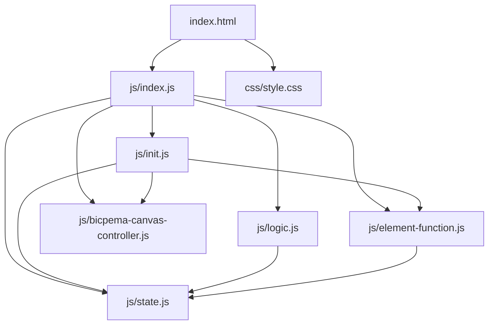
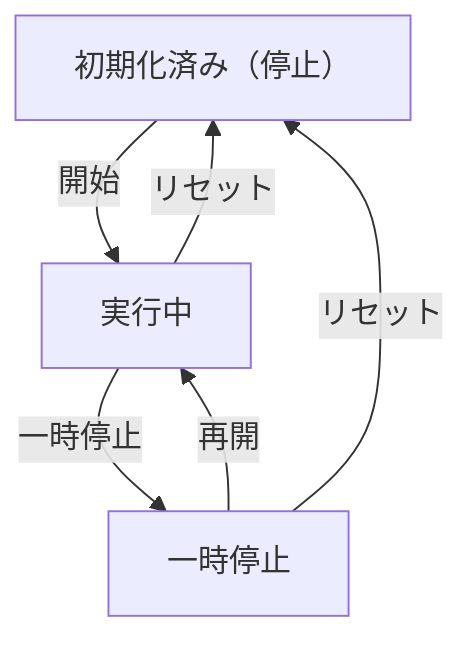

# 熱移動の可視化シミュレーション設計書

## 1. 概要

- 対象: 熱移動（熱平衡）現象を可視化する p5.js シミュレーション。高温・低温の物体を接触させたとき、指数関数的に温度が平衡温度へ収束していく様子と、分子の振動を視覚的に示す。
- 想定利用者: 熱力学の学習者（高校物理程度）。
- 確定事項:
  - ラジオボタンで「接触させる」「接触前に戻す」を切り替えできる（現行実装）。
  - 左側に接触前の高温・低温ブロック、右側に接触後の温度変化ブロックを描画する。
  - 温度変化をグラフ（X軸：時間、Y軸：温度）でリアルタイム表示する。
  - 分子の振動振幅を温度の平方根に比例させて視覚化する。
  - モダン化後は右上の設定ボタン、左下の操作ボタンを配置する。
- 推定事項:
  - 初速度・熱容量・冷却定数の設定 UI は現行では固定値であり、設定モーダルで変更可能にすることが望ましい。

## 2. 画面設計

- 画面構成:
  - 上部バー（タイトル「熱移動の可視化」、ホームリンク、設定ボタン）。
  - 中央にp5キャンバス（16:9比率）。
  - 左下に操作ボタン群（リセット、開始/一時停止）。
  - 右上に設定モーダル起動ボタン。
- UI要素:
  - 選択肢: 「接触させる」「接触前に戻す」の2択（設定モーダル内のラジオボタン）。
  - 数値入力（設定モーダル）: 高温側初期温度 (K)、低温側初期温度 (K)、冷却定数。
  - 操作: リセット、開始/一時停止。
- 確定事項:
  - 右クリックのコンテキストメニューは無効化（`oncontextmenu="return false;"`）。
  - body は固定レイアウトでスクロール不可。

## 3. 機能仕様

- 接触モード切替:
  - 設定モーダルの選択肢で `state.contactMode` を更新し、描画ロジックを切り替える。
- 開始:
  - 「開始」ボタン押下で `state.moveIs=true`、アニメーションを進行させる。
- 一時停止/再開:
  - 「一時停止」で `state.moveIs=false`、「再開」で `state.moveIs=true`。
- リセット:
  - 「リセット」で `state.t=0`、`state.Thot=Thot0`、`state.Tcold=Tcold0`、`state.moveIs=false`。
- 設定反映:
  - 高温側温度・低温側温度・冷却定数の変更: `Teq` を再計算、リセット。
- 境界条件:
  - 温度は 0K 以上に制限。
  - 冷却定数 k は 0 より大きい値。

## 4. ロジック仕様

- 実行モデル:
  - p5.js インスタンスモード（`const sketch = (p) => {...}; new p5(sketch);`）を利用。
  - ESModule（`import`）ベースで実装し、`window` グローバル公開は行わない。
- 状態管理:
  - `moveIs`: シミュレーション進行 ON/OFF。
  - `t`: 経過時間ステップ。
  - `Thot`: 高温側現在温度。
  - `Tcold`: 低温側現在温度。
  - `Teq`: 平衡温度 `(C_hot * Thot0 + C_cold * Tcold0) / (C_hot + C_cold)`。
  - `contactMode`: 接触中かどうかのフラグ。
- 描画処理:
  - 左側エリア: 接触前の高温・低温ブロックを固定温度で描画。
  - 右側エリア: 接触後の現在温度で高温・低温ブロックを描画。
  - 分子振動: 各ブロック内に格子状に配置した円を `√T` に比例した振幅でランダムにずらして描画。
  - グラフ: 温度変化の指数曲線と現在地点のマーカーを描画。
  - `moveIs` が真のとき `state.t` をインクリメントし、温度を指数関数で更新。
- 計算モデル:
  - `Thot(t) = Teq + (Thot0 - Teq) * exp(-k * t)`
  - `Tcold(t) = Teq + (Tcold0 - Teq) * exp(-k * t)`
- 推定事項:
  - `frameRate(20)` で呼ばれており、経過時間ステップ `t` はフレーム数に相当。

## 5. ファイル構成と責務

- `vite/simulations/visualization-of-heat-transfer/index.html`
  - 画面の DOM（ナビバー、設定モーダル、操作ボタン）と `js/index.js` / `css/style.css` の参照を保持。
- `vite/simulations/visualization-of-heat-transfer/css/style.css`
  - 全体レイアウト、キャンバス配置、スクロール無効化、ボタン UI をスタイリング。
- `vite/simulations/visualization-of-heat-transfer/js/index.js`
  - p5 インスタンス起動（`new p5(sketch)`）と各ライフサイクル（setup/draw/windowResized）を紐付け。
- `vite/simulations/visualization-of-heat-transfer/js/state.js`
  - `state` オブジェクト（温度・時間・UI要素参照・フラグ）。
- `vite/simulations/visualization-of-heat-transfer/js/init.js`
  - `initValue(p)` で状態初期化。
  - `elCreate(p)` で UI 要素を `state` に紐付けし、ボタンイベントをセット。
- `vite/simulations/visualization-of-heat-transfer/js/logic.js`
  - `drawSimulation(p)` で温度更新・ブロック・グラフ描画を行う。
- `vite/simulations/visualization-of-heat-transfer/js/element-function.js`
  - ボタンクリック処理（start/pause/reset）。
- `vite/simulations/visualization-of-heat-transfer/js/bicpema-canvas-controller.js`
  - 16:9 固定比率のキャンバスサイズ設定とリサイズ処理。

## 6. 状態遷移

- 初期化済み（停止）: setup 実行後。`t=0`、`Thot=Thot0`、`Tcold=Tcold0`、`moveIs=false`。
- 実行中（接触あり）: 開始ボタン押下で `moveIs=true`、毎フレームt増加・温度更新。
- 一時停止: 一時停止ボタンで `moveIs=false`、温度保持。
- 再開: 再開ボタンで `moveIs=true`。
- リセット: リセット押下で初期化済み（停止）へ戻る。

## 7. 既知の制約

- 旧実装は p5.js を CDN から読み込む全域モードで実装されており、ES Modules 形式へ全面移行が必要。
- 旧実装にはナビバー・設定モーダルなどの Bootstrap UI がなく、新たに追加する必要がある。
- `random()` を `draw()` 内で毎フレーム呼ぶため、分子振動がちらつく（意図的挙動）。
- グラフ描画は p5.js の `drawingContext` を使用した独自実装であり、Chart.js は使用しない。

## 8. 未確定事項

- 設定モーダルで変更可能にするパラメータの範囲（高温・低温初期温度の入力上下限）。
- 情報アイコンの挙動（記事リンクかモーダルか）。
- 分子描画のアニメーション速度（`frameRate`）の最終値。
