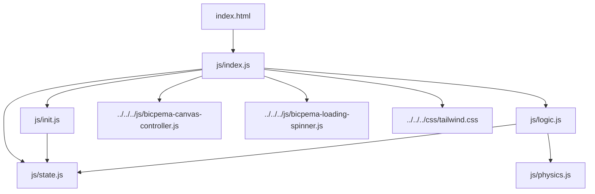
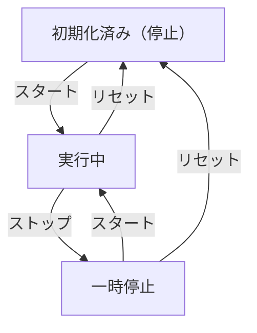

# 波の反射シミュレーション設計書

## 1. 概要

- 対象: 弦を伝わる横波が壁（境界）で反射する現象（固定端反射・自由端反射）を可視化するp5.jsシミュレーション。
- 想定利用者: 高校物理・大学初年次で波動を学ぶ学習者（`content/post/波の反射/index.md` の「対象」記述より）。
- 確定事項:
    - 左下の「スタート/ストップ」ボタンで波の進行をON/OFF切替できる。
    - 左下の「自由端/固定端」ボタンで反射条件（`state.mode`）を切り替えられる。
    - 左下の「リセット」ボタンで経過時間・波の先端位置・進行状態を初期化できる（反射条件は保持される）。
    - 画面右上に色凡例（入射波=青、反射波=赤、合成波=緑）を常時表示する。
    - 設定モーダルや数値入力UIは存在しない（振幅・波長・角振動数はコード内の固定値）。
- 推定事項:
    - 振幅・波長・角振動数を学習者が変更できないのは、固定端/自由端の位相の違いという単一トピックに絞った教材設計のためと推定される。

## 2. 画面設計

- 画面構成:
    - 上部固定ナビバー（高さ60px、"Bicpema" ロゴ＋シミュレーション名「波の反射」）。
    - ナビバー直下にp5キャンバス（`#p5Canvas` にセンタリング配置、`BicpemaCanvasController(false, false, 1.0, 1.0)` によりウィンドウ幅×利用可能高さいっぱいのサイズ、アスペクト比固定なし）。
    - 画面右上に色凡例バッジ（入射波=青丸、反射波=赤丸、合成波=緑丸のラベル）。
    - 画面左下に操作ボタン3つ（スタート/ストップ、自由端/固定端、リセット）を横並び配置。
    - 初回描画までのローディングスピナー（`#loadingSpinner`）をオーバーレイ表示し、`p.draw()` の初回実行時に非表示化。
- UI要素:
    - ボタン「スタート/ストップ」（`#moveBtn`）: 押下のたびにラベルと配色（青⇔赤）がトグルする。
    - ボタン「自由端/固定端」（`#modeBtn`）: 押下のたびにラベルと配色（琥珀色/自由端⇔緑/固定端）がトグルする。
    - ボタン「リセット」（`#resetBtn`）: 押下で時間経過をゼロに戻す。
    - 数値入力UIやモーダル設定パネルは無し（本シミュレーション固有仕様）。
- 確定事項:
    - `<body oncontextmenu="return false;">` により右クリックのコンテキストメニューを無効化。
    - レイアウトは固定配置（`fixed`/`absolute`）中心で、body自体はスクロール不可（明示的な `overflow:hidden` の記述は本ディレクトリ内に無く、共通CSS側の可能性がある。後述「未確定事項」参照）。
    - AGENTS.mdの慣例（左下に再生系ボタン、右上に設定ボタン）とは異なり、本シミュレーションには右上の「設定表示ボタン」は無く、代わりに凡例を配置している。

## 3. 機能仕様

- 波の進行開始/一時停止:
    - 「スタート」ボタン押下で `state.running` を `true` にトグルし、ボタンラベルを「ストップ」・配色を赤系に変更する（`toggleMove()`）。
    - 再度押下すると `state.running=false` に戻り、ラベル「スタート」・配色を青系に戻す。
    - `state.running=true` の間、`drawSimulation(p)` の末尾で毎フレーム `state.t += state.v` と `state.front` の再計算が行われる。
- 反射条件（端の種類）切替:
    - 「自由端」⇔「固定端」ボタン押下で `state.mode` を `"free"`⇔`"fixed"` にトグルし、ラベル・配色を変更する（`toggleMode()`）。
    - 実行中・停止中を問わずいつでも切替可能。切替は即座に反映され、次フレームの反射波・合成波・壁の描画色に反映される（進行中に切り替えると、その時点の波形の位相が瞬時に変わる＝物理的な連続性は保証されない実装）。
- リセット:
    - 「リセット」ボタン押下で `state.t=0`、`state.front=0`、`state.running=false` に戻し、スタートボタンのラベル・配色を初期状態に戻す（`resetSim()`）。
    - `state.mode`（自由端/固定端の選択）と `state.reflectX`（壁位置）はリセット対象外で、選択中の値を保持する。
- リサイズ時の挙動:
    - `windowResized` で `canvasController.resizeScreen(p)` の後 `elementPositionInit(p)` を再実行し、`state.reflectX = p.width/2` を再設定（壁は常にキャンバス中央に追従）。ボタンのonclickハンドラも再バインドされる（`state.t`・`state.front`・`state.running` は再初期化されない＝進行状態は保持）。
- 境界条件:
    - `state.front` は `computeWaveFront()` により `2 * state.reflectX` を上限にクランプされる（波の先端がキャンバス左端（x=0）へ到達した時点で「表示上の先端」の伸長が止まる。ただし `state.running` が真の間は `state.t` は増加し続けるため、波形自体は振動を続ける）。
    - 振幅・波長・周波数の数値入力は無く、`settingInit(p)` 内の固定値（波長200px、振幅=波長/4=50px、周期=120フレーム）で決め打ちされている。

## 4. ロジック仕様

- 実行モデル:
    - p5.jsインスタンスモード（`setup`/`draw`/`windowResized`）を利用。
    - ESModule（`import`/`export`）ベースで実装し、`window` グローバル公開は行わない。
- 状態管理（`js/state.js`）:
    - `t`: 経過時間（フレーム単位で `v` ずつ加算される角度パラメータ的な時間量）。
    - `k`: 波数（`TWO_PI / wavelength`）。
    - `omega`: 角振動数（`TWO_PI / 120`、周期120フレーム固定）。
    - `v`: 波の伝播速度（`omega / k`、px/フレーム相当）。
    - `A`: 振幅（px）。
    - `running`: シミュレーション進行ON/OFFフラグ（テンプレートの `moveIs` に相当）。
    - `reflectX`: 壁（反射端）のx座標。`elementPositionInit` で `p.width/2` に設定され、常にキャンバス中央。
    - `front`: 入射波の先端x座標（時間経過に応じて右方向へ進み、`2*reflectX` で頭打ち）。
    - `mode`: `"free"`（自由端）または `"fixed"`（固定端）。初期値は `"free"`。
- 描画処理（`js/logic.js` の `drawSimulation(p)`）:
    - 背景を白で塗りつぶし（`p.background(255)`）、`drawGrid(p)` で波長/8間隔の縦グリッド・振幅/2間隔の横グリッド・中央の太い水平基準線を描画。
    - `drawReflectWall(p)` で壁を縦線で描画（自由端=黄、固定端=緑がかった青）。
    - 入射波（青）: `x <= min(front, reflectX)` の範囲を実線、`reflectX <= x <= front` の範囲（壁到達後に生じる区間）を破線（`setLineDash`）で描画。
    - 反射波（赤）: `front > reflectX` のとき（波が壁に到達した後）のみ描画。壁位置を中心に入射波の位置を鏡映（`mirrorOrigin = 2*reflectX`）した位置に変位を計算し、固定端では位相反転（符号反転）。`reflectedFront <= x <= reflectX` を実線、固定端の場合のみ `reflectX <= x <= front` を破線で追加描画。
    - 合成波（緑）: `front > reflectX` のとき、入射波と反射波の変位を単純加算（重ね合わせの原理）して `reflectedFront <= x <= reflectX` の範囲に描画。壁位置には端点マーカー（自由端は変位2倍の腹の位置に点、固定端は中心線上＝節の位置に点）を描画。
    - フレーム末尾で `state.running` が真なら `state.t += state.v`、`state.front = computeWaveFront(state.v, state.t, 2*state.reflectX)` を更新（描画→更新の順で、当該フレームは更新前の値で描画される）。
- 計算モデル（`js/physics.js`）:
    - `computeIncidentDisplacement(A, k, x, omega, t)`: `y = A sin(kx − ωt)`（進行波）。
    - `computeReflectedDisplacement(A, k, mirrorOrigin, x, omega, t, mode)`: 位置を `mirrorOrigin - x` に鏡映した進行波の式を用い、`mode === "fixed"` のとき符号を反転（位相反転）。
    - `computeCombinedDisplacement(...)`: 入射波と反射波の変位の単純和（波の独立性・重ね合わせの原理）。
    - `computeWaveFront(v, t, maxFront)`: `min(v*t, maxFront)` で先端位置をクランプ。
- 推定事項:
    - `state.v`（波長200px・周期120フレームから算出、約1.67px/フレーム）や `state.A=50px` は表示上のバランスを優先した経験的な固定値と推定され、物理的な単位（m/sなど）との対応付けは意図されていない。
    - 反射波の描画開始条件を「`front > reflectX`」としている点は、波の先端が壁に到達した瞬間から反射波が生じるという直感的モデルの実装と推定される（実際の反射は境界条件による連続的な現象だが、本実装では先端位置の比較による離散的な描画分岐で表現している）。

## 5. ファイル構成と責務

- `vite/simulations/wave-reflection/index.html`
    - 画面のDOM（ナビバー、色凡例、操作ボタン3つ、ローディングスピナー）を保持し、`js/index.js` を `type="module"` で読み込む。個別の `css/style.css` は持たず、共通の `css/tailwind.css`（`js/index.js` 経由）とTailwindユーティリティクラスのみでスタイリングする。
- `vite/simulations/wave-reflection/js/index.js`
    - p5インスタンス起動（`new p5(sketch)`）と `setup`/`draw`/`windowResized` の紐付け。
    - `BicpemaCanvasController(false, false, 1.0, 1.0)` により、アスペクト比非固定（`fixed=false`）でウィンドウ幅・高さいっぱいのキャンバスを生成。
    - 初回 `draw()` 実行時に `hideLoadingSpinner()` を呼び出しスピナーを非表示化。
- `vite/simulations/wave-reflection/js/state.js`
    - `state` オブジェクト（`t`, `k`, `omega`, `v`, `A`, `running`, `reflectX`, `front`, `mode`）の定義のみを持つ。
- `vite/simulations/wave-reflection/js/init.js`
    - `settingInit(p)`: 波長・振幅・角振動数・速度の初期算出。
    - `elementSelectInit(p)`: p5 DOM選択なし（HTMLのボタン要素をそのまま利用するためのプレースホルダー）。
    - `elementPositionInit(p)`: 壁位置（`reflectX`）の算出とボタン3つのクリックハンドラ登録。
    - `valueInit(p)`: `t`/`front`/`running` の初期化。
    - 非公開関数 `toggleMove`, `toggleMode`, `resetSim`: ボタンのクリック処理本体（テンプレートでいう `element-function.js` 相当の役割をこのファイル内に同居させている）。
- `vite/simulations/wave-reflection/js/logic.js`
    - `drawSimulation(p)`: 背景・グリッド・壁・入射波/反射波/合成波の描画と、進行中の時間・先端位置の更新。
    - 非公開関数 `drawGrid`, `drawReflectWall`。
- `vite/simulations/wave-reflection/js/physics.js`
    - 波の変位・合成・先端位置を計算する純粋関数群（`computeIncidentDisplacement`, `computeReflectedDisplacement`, `computeCombinedDisplacement`, `computeWaveFront`）。UI・p5への依存なし。
- 共通資産依存:
    - `vite/js/bicpema-canvas-controller.js`（`BicpemaCanvasController`、キャンバスサイズ制御）。
    - `vite/js/bicpema-loading-spinner.js`（`hideLoadingSpinner`、初回描画完了検知）。
    - `vite/css/tailwind.css`（全体スタイル基盤）。

## 6. 状態遷移

- 初期化済み（停止）: `setup()` 実行後。`state.running=false`、`state.t=0`、`state.front=0`。`state.mode` は前回値を引き継がず常に `"free"`（モジュール初期値、リロード時のみリセットされる）。
- 実行中: 「スタート」ボタン押下で `state.running=true`。毎フレーム `t`/`front` が進行する。
- 一時停止: 「ストップ」ボタン押下（実行中の同一ボタン）で `state.running=false`。`t`/`front` は現在値を保持。
- リセット: 「リセット」ボタン押下で `t=0`・`front=0`・`running=false` に戻る（実行中・一時停止中どちらからも遷移可能）。
- 反射条件切替（`mode`トグル）は上記の実行/一時停止/リセットの状態遷移とは独立した並行状態であり、いつでも切替可能（状態遷移図には含めない）。

## 7. 既知の制約

- `drawSimulation(p)` は毎フレーム、キャンバス幅ぶんの `for` ループを最大5回（入射波実線/破線、反射波実線/破線、合成波）実行しており、`p.frameRate()` の明示指定はない（p5.js既定の約60fpsで動作）。キャンバス幅が広いほど1フレームあたりの計算量が線形に増える。
- `state.front` は `2*state.reflectX` で頭打ちになるが、`state.running=true` のまま `state.t` は際限なく加算され続けるため、長時間再生し続けると `state.t` が非常に大きな値になる（`Math.sin` の演算自体には実用上問題ないが、値としては無制限に増加する）。
- 実行中（`front > reflectX`）に自由端/固定端を切り替えると、反射波・合成波の位相がその場で瞬時に反転し、物理的には不連続な見た目になる（一時停止して切り替える運用を暗黙に想定していると推定されるが、UI上の制限は無い）。
- リサイズ時（`windowResized`）は `reflectX` のみ再計算され、`t`/`front`/`running`/`mode` は保持される。壁位置がキャンバス中央に追従するため、リサイズ直後は波形と壁の相対位置が変化する（進行中の波の見た目が飛ぶ可能性がある）。
- 振幅・波長・周波数を変更するUIが無いため、教材として提示できる現象は「固定端/自由端による反射波の位相の違い」に限定される。

## 8. 未確定事項

- body/htmlのスクロール無効化がTailwind共通クラスや `vite/css/tailwind.css` 側の基盤スタイルで担保されているか、本シミュレーション固有のCSSが無いことが仕様として意図的か（`vite/simulations/wave-reflection/css/` ディレクトリ自体が存在しない）は、共通CSSの中身を精査していないため未確認。
- 「情報アイコン」やヘルプ表示など、他シミュレーションで見られる補助UIが本シミュレーションに無いのが仕様なのか未実装なのかは、要件からは判断できない。
- 波長200px・振幅50px・周期120フレームという固定値の教材設計上の根拠（なぜこの数値なのか）は実装から読み取れず、確認が必要。
- 実行中の自由端/固定端切替を許可し続ける挙動（既知の制約参照）が意図的な仕様か、UI制限を入れ忘れた未対応事項かは未確定。
