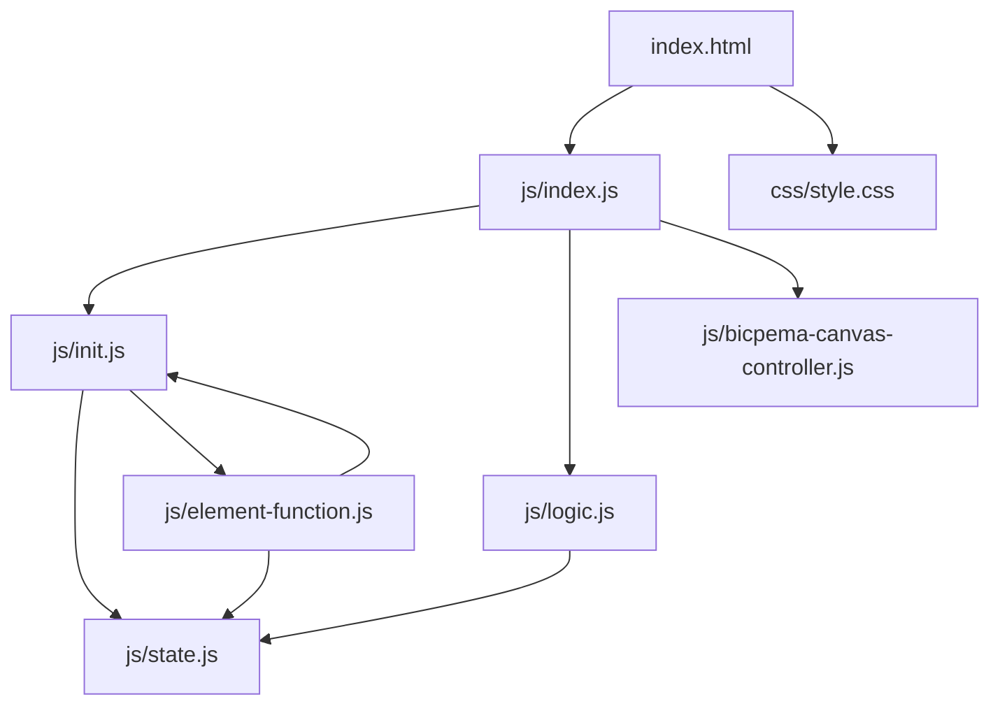
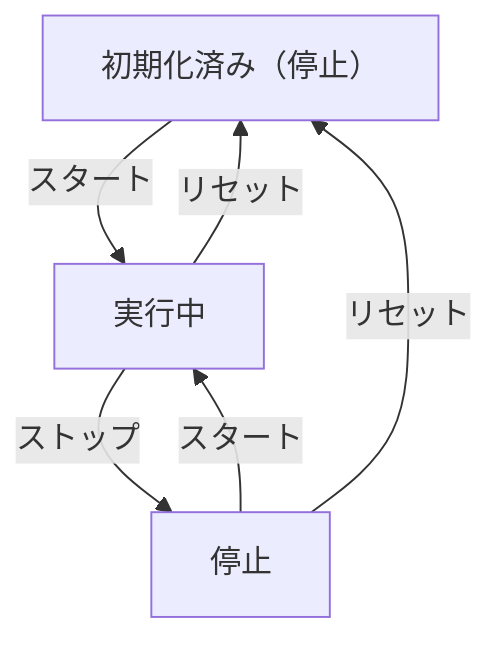

# 波の反射シミュレーション設計書

## 1. 概要

- 対象: 波の反射（固定端反射 / 自由端反射）を可視化するp5.jsシミュレーション。
- 想定利用者: 物理基礎の学習者（中学〜高校程度）。
- 確定事項:
  - 入射波（青）、反射波（赤）、合成波（緑）を同一キャンバス上に描画する。
  - 左下の操作ボタン（スタート/ストップ、リセット、自由端/固定端）で操作する。
  - 反射位置は画面中央の垂直線。
- 推定事項:
  - x軸は空間方向（ピクセル）、y軸は変位を示す教材意図。

## 2. 画面設計

画面の概要は以下です。

- 画面構成:
  - 上部固定ナビバー（タイトル "Bicpema"、ページ名 "波の反射"）。
  - 中央にp5キャンバス（16:9固定比率、ウィンドウサイズに追従）。
  - 左下に操作ボタン群。
- UI要素:
  - スタート/ストップボタン（青/赤で状態変化）。
  - リセットボタン（グレー）。
  - 自由端/固定端トグルボタン（橙/緑で状態変化）。
- 確定事項:
  - 右クリックのコンテキストメニューは無効化。
  - bodyは固定レイアウトでスクロール不可。

## 3. 機能仕様

- スタート/ストップ:
  - ボタン押下で `state.running` をトグルし、アニメーションの進行を切り替える。
  - 実行中はボタンが「ストップ」（赤）、停止中は「スタート」（青）に変化する。
- リセット:
  - `initValue(p)` を呼び、`t=0`、`front=0`、`running=false`、`mode="free"` に戻す。
  - ボタン表示もスタート（青）・自由端（橙）に戻す。
- モード切り替え:
  - 自由端（free）: 反射波は位相維持。反射壁は橙色。
  - 固定端（fixed）: 反射波は位相反転（y *= -1）。反射壁は青緑色。
- 境界条件:
  - 入射波は `front` が `reflectX` を超えると反射波・合成波の描画が始まる。
  - `front` の上限は `2 * reflectX`（入射波が画面右端に到達後は拡張しない）。

## 4. ロジック仕様

- 実行モデル:
  - p5.jsインスタンスモード（setup/draw/windowResized）を利用。
  - ESModule（`import`）ベースで実装し、`window`グローバル公開は行わない。
- 波定数（initValueで設定）:
  - wavelength = 200（ピクセル）
  - A = wavelength / 4 = 50（振幅）
  - k = TWO_PI / wavelength（波数）
  - omega = TWO_PI / 120（角周波数）
  - v = omega / k（位相速度）
  - reflectX = width / 2（反射位置）
- 状態管理（state.js）:
  - t: 時刻変数。毎フレーム `t += v` で更新。
  - front: 波の先端位置。`front = min(v*t, 2*reflectX)`。
  - running: アニメーション進行フラグ。
  - mode: "free" または "fixed"。
- 描画処理（logic.js）:
  - 背景白色、格子線（水色）、中心軸（黒）を描画。
  - 入射波（青実線）: x ∈ [0, min(front, reflectX)] の範囲で `A*sin(k*x - omega*t)`。
  - 入射波仮想域（青点線）: front > reflectX のとき x ∈ [reflectX, front]。
  - 反射波（赤実線）: front > reflectX のとき x ∈ [reflectedFront, reflectX]。
    - reflectedFront = max(0, 2*reflectX - front)
    - 自由端: `A*sin(k*(2*reflectX-x) - omega*t)`
    - 固定端: `-A*sin(k*(2*reflectX-x) - omega*t)`
  - 仮想反射波（赤点線）: 固定端モードで x ∈ [reflectX, front]。
  - 合成波（緑実線）: x ∈ [reflectedFront, reflectX] で入射波+反射波の重ね合わせ。
  - 反射点マーカー（緑点）: 自由端は変位あり、固定端は y=height/2（変位0）。

## 5. ファイル構成と責務

- vite/simulations/wave-reflection/index.html
  - 画面のDOM（ナビバー、操作ボタン）と `js/index.js` / `css/style.css` の参照を保持。
- vite/simulations/wave-reflection/css/style.css
  - キャンバスコンテナのレイアウト（ナビバー分のマージン調整）。
- vite/simulations/wave-reflection/js/index.js
  - p5 インスタンス起動 (`new p5(sketch)`) と各ライフサイクル（setup/draw/windowResized）を紐付け。
  - `BicpemaCanvasController` で16:9固定アスペクトの表示領域を制御。
- vite/simulations/wave-reflection/js/bicpema-canvas-controller.js
  - キャンバスサイズ計算・生成・リサイズロジック。
- vite/simulations/wave-reflection/js/state.js
  - `state` オブジェクト（t, k, omega, v, A, running, reflectX, front, mode, ボタン参照）。
- vite/simulations/wave-reflection/js/init.js
  - `initValue(p)` で波定数・状態変数を初期化。
  - `elCreate(p)` でUI要素を `state` に紐付けし、ボタンイベントをセット。
- vite/simulations/wave-reflection/js/logic.js
  - `drawSimulation(p)` でグリッド・波形・合成波を描画し、runningなら状態を更新。
- vite/simulations/wave-reflection/js/element-function.js
  - `onStartStopClick()`: running トグルとボタン表示更新。
  - `onResetClick(p)`: initValue 呼び出しとボタン表示リセット。
  - `onModeClick()`: mode トグルとボタン表示更新。

## 6. 状態遷移

- 初期化済み（停止）
  - setup実行後。t=0、front=0、running=false、mode="free"。
- 実行中
  - スタートボタン押下でrunning=true。毎フレームt・frontが更新される。
- 停止
  - ストップボタン押下でrunning=false。波形は現在位置で静止。
- リセット
  - リセットボタン押下で初期化済み（停止）へ戻る。

## 7. 既知の制約

- リサイズ時は `initValue(p)` が呼ばれ、進行中の状態はリセットされる。
- `reflectX = width/2` のため、反射位置は常に画面中央に固定。
- モード切り替えは実行中も即時反映される。

## 8. 未確定事項

- 特になし。
