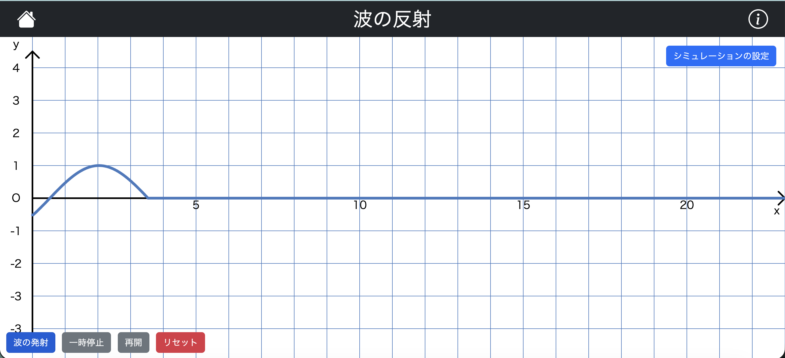
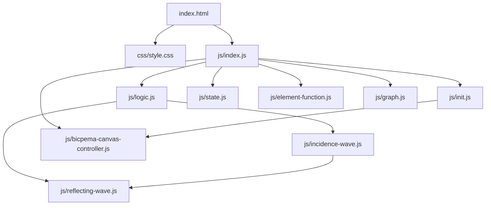
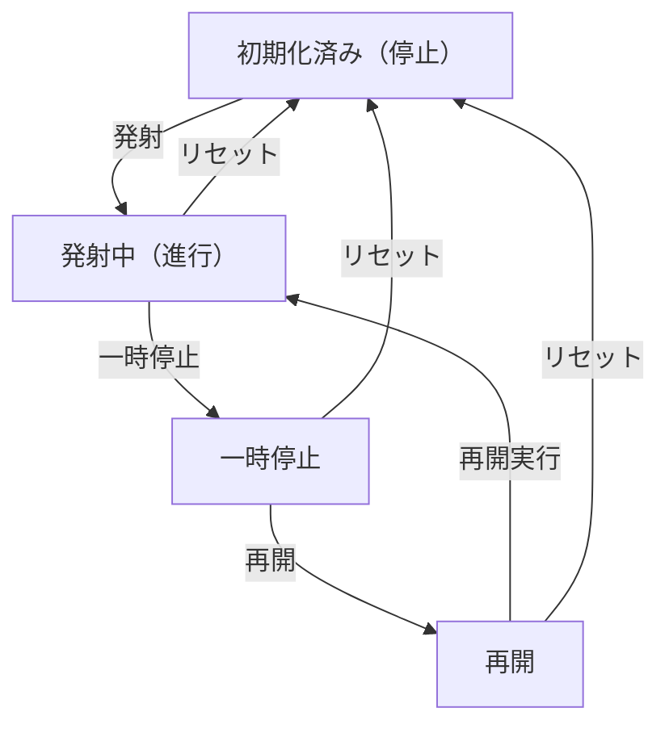

# 波の反射シミュレーション設計書

## 1. 概要

- 対象: 波の反射（固定端反射 / 自由端反射）を可視化するp5.jsシミュレーション。
- 想定利用者: 物理基礎の学習者（中学〜高校程度）。
- 確定事項:
  - 右上のモーダルで反射条件、波の種類、速度、振幅を変更できる。
  - 左下の操作ボタンで発射・一時停止・再開・リセットができる。
- 推定事項:
  - x軸は格子単位ベースで時間方向、y軸は変位を示す教材意図。

## 2. 画面設計

画面の概要は以下です。

- 画面構成:
  - 上部バー（タイトル、ホーム、情報アイコン、設定ボタン）。
  - 中央〜下部にp5キャンバス（ウィンドウ幅、画面高の約90%）。
  - 左下に操作ボタン群。
  - 右上に設定モーダル起動ボタン。
- UI要素:
  - 反射選択: 固定端反射 / 自由端反射。
  - 波形選択: sin波 / -sin波。
  - 数値入力: 波の速度、波の振幅。
  - 操作: 波の発射、一時停止、再開、リセット。
- 確定事項:
  - 右クリックのコンテキストメニューは無効化。
  - bodyは固定レイアウトでスクロール不可。

## 3. 機能仕様

- 波の発射:
  - 「波の発射」ボタン押下で `state.waveArr` に `new IncidenceWave(60*振幅, 波種, p)` を追加し、`state.moveIs=true` にする。
- 一時停止/再開:
  - 「一時停止」ボタンで `state.moveIs=false`、`再開` ボタンで `state.moveIs=true`。
- リセット:
  - 「リセット」ボタンで `initValue(p)` を呼び、`state.mediumWave` および `state.waveArr` を空にし、`state.moveIs=false` とする。
- 設定反映:
  - 反射方式: `reflectSelect` が `固定端反射` の場合 `ReflectingWave` は位相反転（-1）、`自由端反射` は位相維持（+1）。
  - 波の種類: `waveSelect` が `sin波` の場合 `IncidenceWave.waveType=-1`、`-sin波` の場合 `1`（符号切り替えにより位相が逆転した入射波）。
  - 速度: `speedInput` の値分だけ `state.waveArr[i]._draw()` を繰り返す。
  - 振幅: `amplitudeInput` の値に60を掛けて波高を計算。
- 境界条件:
  - `speedInput` はHTML `min=0`。
  - `amplitudeInput` の負値はUIでは制限なしだが、そのまま振幅として利用される。

## 4. ロジック仕様

- 実行モデル:
  - p5.jsインスタンスモード（setup/draw/windowResized）を利用。
  - ESModule（`import`）ベースで実装し、`window`グローバル公開は行わない。
- 状態管理:
  - moveIs: シミュレーション進行ON/OFF。
  - waveArr: 波オブジェクト配列（入射波と反射波を同一配列で合成）。
  - mediumWave: 画面幅に合わせた0埋めベースライン配列（現在は初期化のみ、描画合成に直接利用されていない）。
  - 各波はarr配列に空間方向の変位を保持。
- 描画処理:
  - 背景で格子と軸を描画。
  - moveIsが真のとき、速度入力値ぶん更新ループを回す。
  - 全波の同一点変位を加算して合成波として折れ線描画。
- 反射モデル:
  - 入射波は右向きに伝搬。
  - 右端到達時に反射波を1回生成。
  - 反射波は左向きに伝搬。
  - 固定端は位相反転、自由端は位相維持。
- 推定事項:
  - 波形長は360ステップ相当で1周期を扱う実装意図。

## 5. ファイル構成と責務

- vite/simulations/wave-reflection/index.html
  - 画面のDOM（ナビバー、設定モーダル、操作ボタン）と `js/index.js` / `css/style.css` の参照を保持。
- vite/simulations/wave-reflection/css/style.css
  - 全体レイアウト、キャンバス配置、スクロール無効化、ボタン UI をスタイリング。
- vite/simulations/wave-reflection/js/index.js
  - p5 インスタンス起動 (`new p5(sketch)`) と各ライフサイクル（setup/draw/windowResized）を紐付け。
  - `BicpemaCanvasController` で16:9固定アスペクトの表示領域を制御。
- vite/simulations/wave-reflection/js/bicpema-canvas-controller.js
  - キャンバスサイズ計算・生成ロジック。
- vite/simulations/wave-reflection/js/init.js
  - `initValue(p)` で `state.mediumWave`/`state.waveArr` 初期化、`state.moveIs=false`。
  - `elCreate(p)` でUI要素を `state` に紐付けし、ボタンイベントをセット。
- vite/simulations/wave-reflection/js/logic.js
  - `drawSimulation(p)` で `state.moveIs` 判定後、`state.speedInput.value()`分更新ループを回す。
  - 各波の `arr` を重ね合わせて折れ線描画。
- vite/simulations/wave-reflection/js/state.js
  - `state` オブジェクト（reflectSelect, waveSelect, speedInput, amplitudeInput, mediumWave, waveArr, moveIs）。
- vite/simulations/wave-reflection/js/element-function.js
  - ボタンクリック処理（start/stop/restart/reset）と `new IncidenceWave(...)` 作成。
- vite/simulations/wave-reflection/js/incidence-wave.js
  - `IncidenceWave` クラス。sin波を360ステップで生成し、右端到達直後に `ReflectingWave` を一回追加。
- vite/simulations/wave-reflection/js/reflecting-wave.js
  - `ReflectingWave` クラス。`reflectSelect` に応じて符号反転または維持し、左向き波を生成。
- vite/simulations/wave-reflection/js/bicpema-canvas-controller.js
  - 16:9 固定比率のキャンバスサイズ設定とリサイズ処理を実装。

## 6. 状態遷移

- 初期化済み（停止）
  - setup実行後。波配列は空、moveIs=false。
- 発射中（進行）
  - 波の発射ボタン押下でmoveIs=true。
- 一時停止
  - 一時停止ボタン押下でmoveIs=false。
- 再開
  - 再開ボタン押下でmoveIs=true。
- リセット
  - リセット押下で初期化済み（停止）へ戻る。

## 7. 既知の制約

- 速度入力が非常に大きい場合、1フレーム内更新回数増加により負荷が上がる。
- 発射操作に上限がなく、波オブジェクト数増加で描画コストが増える。
- 反射選択の変更は既存反射波へ即時影響する（描画中に切り替わる）。
- リサイズ時は再初期化され、進行中の状態は保持されない。

## 8. 未確定事項

- 情報アイコンの挙動（リンクやモーダル）が未実装かどうか。
- 波の速度・振幅の推奨入力範囲（教材設計上の想定値）。
- 共通スクリプト側で注入されるライブラリや初期化順の厳密仕様。
